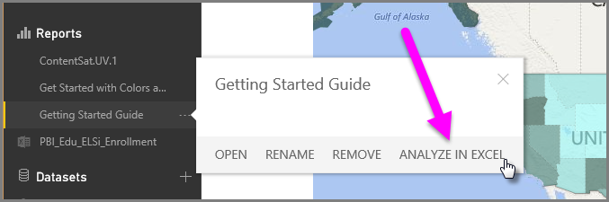
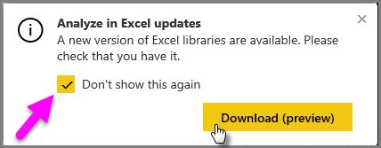
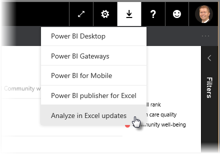
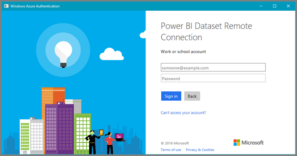
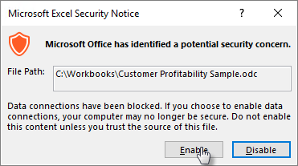

<properties
   pageTitle="在 Excel 中分析"
   description="深入了解如何分析 Power BI 資料集在 Excel 中"
   services="powerbi"
   documentationCenter=""
   authors="davidiseminger"
   manager="mblythe"
   backup=""
   editor=""
   tags=""
   qualityFocus="complete"
   qualityDate=""/>

<tags
   ms.service="powerbi"
   ms.devlang="NA"
   ms.topic="article"
   ms.tgt_pltfrm="NA"
   ms.workload="powerbi"
   ms.date="09/27/2016"
   ms.author="davidi"/>

# 在 Excel 中分析
使用 **在 Excel 中的進行分析**, ，您可以檢視和資料集，您可以存取 Power BI 中與互動並存取直接在 Excel 中，存在於 Power BI 資料集為基礎的樞紐分析表、 圖表和交叉分析篩選器功能，藉此。

## 需求
有幾項需求使用 **在 Excel 中的進行分析**:
- 
            **在 Excel 中分析** 支援 Microsoft Excel 2010 SP1 和更新版本。
- Excel 樞紐分析表不支援拖放的數值欄位的彙總。 您在 Power BI 中的資料集 *必須有預先定義的量值*。
- 某些組織可能會防止安裝所需的群組原則規則 **在 Excel 中的進行分析** 更新至 Excel。 如果您無法安裝更新，請洽詢您的系統管理員。

## 它如何運作？
當您選取 **在 Excel 中的進行分析** 橢圓形功能表 (...) 相關聯的資料集或報表中的 **Power BI**, ，Power BI 建立。ODC 檔案，可以從瀏覽器下載到您的電腦。

當您開啟此檔案在 Excel 中，空 **樞紐分析表** 和 **欄位** 清單會出現資料表欄位，以及從 Power BI 資料集之量值。 您可以建立樞紐分析表、 圖表和分析該資料集，您可能會使用本機的資料集在 Excel 中一樣。

。ODC 檔案已連接到您的資料集，在 Power BI 中的 MSOLAP 連接字串。 當您分析或處理資料時，Excel 查詢 Power BI 中的該資料集，並將結果傳回 Excel。 如果該資料集連接到即時資料來源使用 DirectQuery，Power BI 查詢資料來源，並將結果傳回至 Excel。

            **在 Excel 中分析** 很適合的資料集和報表，連接到 *Analysis Services 表格式* 或 *多維度* 資料庫，或從 Power BI Desktop 檔案或 Excel 活頁簿有明確使用 Data Analysis Expressions (DAX) 建立的量值的資料模型。

## 開始使用 [在 Excel 中進行分析

在 Power BI 中，選取報表或資料集旁邊的省略符號功能表 (報表或資料集名稱旁邊的 …)，然後從出現的功能表，選取 **在 Excel 中的進行分析**。

### 安裝 Excel 更新
當您第一次使用 **在 Excel 中的進行分析**, ，您需要將更新安裝至 Excel 文件庫。 您將會提示您下載並執行 Excel 更新 (這樣會起始安裝 *SQL_AS_OLEDDB.msi* Windows installer 套件)。 這個套件會安裝 **Microsoft AS OLE DB Provider for SQL Server 2016 RC0 （預覽）**。

> 
            **注意︰** 務必檢查 **不要再顯示** 中 **安裝 Excel 更新** ] 對話方塊。 您只需要一次安裝更新。

如果您需要安裝 Excel 更新 **在 Excel 中的進行分析** 同樣地，您可以下載更新的 **下載** 圖示在 Power BI 中，如下圖所示。

### 登入 Power BI
雖然您在瀏覽器來登入 Power BI，第一次您開啟新的。您必須登入 Power BI 與您的 Power BI 帳戶 Excel ODC 檔案。 這會驗證從 Excel 連接到 Power BI。

### 使用多個 Power BI 帳戶的使用者
某些使用者有多個的 Power BI 帳戶，以及這些使用者可能會遇到的情況下，有一個帳戶，登入 Power BI，但可用於在 Excel 中進行分析的資料集的存取帳戶是在不同的帳戶。 在這些情況下，您可能會收到 **禁止** 錯誤或登入失敗時嘗試存取的資料集，用於在 Excel 活頁簿中進行分析。

將提供您機會來登入同樣地，此時您可以使用登入 Power BI 帳戶具有存取在 Excel 中進行分析的資料集的存取權。

針對其他錯誤，您可能會遇到，看看 [疑難排解在 Excel 中分析](powerbi-desktop-troubleshooting-analyze-in-excel.md) 文件。

### 啟用資料連接
若要分析您的 Power BI 資料在 Excel 中，系統會提示您確認.odc 檔案的路徑與檔案名稱，然後選取 **啟用**。

您也可以連接到內部部署 Analysis Services (AS) 資料庫時使用 *DirectQuery*, ，並建立使用 [在 Excel 中進行分析報表中包含的資料。 您必須是相同的 Active Directory 網域，做為資料庫中，並必須在內部。 系統管理員的 Power BI 部署可以啟用或停用能夠連線到做為資料庫中 **系統管理入口網站**。

## 離開分析
現在已開啟 Excel，而且您有空白的樞紐分析表，您已準備好進行各種分析與 Power BI 資料集。 如同其他本機活頁簿，您可以建立從 excel 中進行分析與樞紐分析表、 圖表、 從其他來源中，加入資料等等。 當然，您可以使用各種檢視建立不同的工作表資料。

## 儲存
您可以儲存此 Power BI 資料集連接活頁簿就像任何其他活頁簿。 不過，您無法發行或活頁簿匯入 Power BI，因為您只可以發行或活頁簿匯入 Power BI，在資料表中有資料，或具有資料模型。 因為新的活頁簿只要有 Power BI 連接至資料集，發行或匯入至 Power BI 會將在圓圈中 ！

## 共用
儲存您的活頁簿後，您可以與其他 Power BI 使用者共用您的組織中。 為了與其他 Power BI 使用者共用您的活頁簿，您必須執行下列其中一項共用資料集 （活頁簿）︰

-   共用主控釘選的項目，從您的 Power BI 報表使用者 Power BI 儀表板
-   共用內容的組件，其中包含與使用者的資料集
-   使用您要共用群組擁有的資料集加入使用者

當的使用者與您已共用您的活頁簿開啟活頁簿時，就會看到您的樞紐分析表和資料，如上次儲存活頁簿，可能不會將資料的最新版本時出現。 若要取得最新的資料，使用者必須使用 **重新整理** 按鈕 **資料** 功能區。 而且因為活頁簿連接到 Power BI 中的資料集，嘗試重新整理活頁簿的使用者必須登入 Power BI 和安裝 Excel 更新第一次嘗試更新使用這個方法。

您也可以設定重新整理資料時開啟，重新整理的資料，只要任何人存取資料集的活頁簿檔案。 若要重新整理活頁簿每次開啟，在 Excel 中選取 **連線** 從 **資料** 功能區上，選取活頁簿時，所使用的連接，然後選取 [ **屬性** 並設定 *檔案開啟時自動重新整理資料* 到 **，則為 True**, ，然後選取 **[確定]**。

因為使用者必須重新整理資料集，然後重新整理的外部連線不支援在 Excel Online 中，我們建議使用者在其電腦上使用桌面版本的 Excel 開啟活頁簿。

## 另請參閱  

[疑難排解在 Excel 中分析](powerbi-desktop-troubleshooting-analyze-in-excel.md)

更多的問題嗎？ [試用 Power BI 社群](http://community.powerbi.com/)
