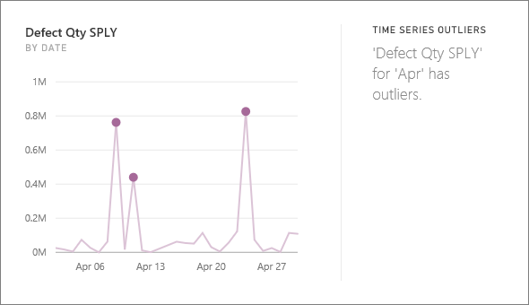
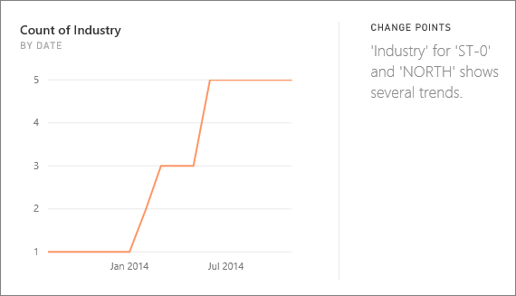

<properties
   pageTitle="快速了解 Power BI 所支援的類型"
   description="快速理解 Power BI。"
   services="powerbi"
   documentationCenter=""
   authors="mihart"
   manager="mblythe"
   backup=""
   editor=""
   tags=""
   qualityFocus="no"
   qualityDate=""/>

<tags
   ms.service="powerbi"
   ms.devlang="NA"
   ms.topic="article"
   ms.tgt_pltfrm="NA"
   ms.workload="powerbi"
   ms.date="10/09/2016"
   ms.author="mihart"/>

# 快速了解 Power BI 所支援的類型

## 快速了解如何運作？

Power BI 快速搜尋不同的資料集的子集，同時套用一組複雜的演算法，來探索可能有趣的見解。 Power BI 掃描的資料集做為可能在分配的時間內。

您可以針對資料集或並排顯示 (相關 Insights) 來執行即時掌握所有資訊。   

##  我們可以找到哪些類型的 insights？
以下是一些我們使用的演算法︰

### 多數 （主要因素）
尋找的案例總計值的大部分其中屬於其他維度細分時的一項因素。  

### 類別極端值 （上下）
反白顯示的情況下，在模型中的量值，一或兩個維度的成員有多較大的值與其他維度的成員。  

### 時間序列極端值
對於跨時間序列資料，會偵測有特定日期或時間值明顯不同於其他日期/時間值。

### 時間序列中的整體趨勢
時間序列資料中偵測向上或向下趨勢。

### 時間序列中的季節性
例如每週、 每月或每年季節性的時間序列資料中尋找週期性的模式。

### 穩定的共用
反白顯示的情況下沒有父系-子系之間的相互關聯的子系值相對於整體的值之間的連續變數父系的共用。

### 關聯
偵測到多個量值即顯示彼此當繪製資料集內的維度之間的相互關聯的情況。

### 變更時間序列中的點
當有重要變更趨勢資料的時間序列中，反白顯示。

## 請參閱

[Power BI 快速了解](powerbi-service-auto-insights.md)

[最佳化 Power BI 快速了解您的資料](powerbi-service-auto-insights-optimize.md)

[Power BI-基本概念](powerbi-service-basic-concepts.md)

[在 Power BI 儀表板](powerbi-service-dashboards.md)

更多的問題嗎？ [試用 Power BI 社群](http://community.powerbi.com/)
