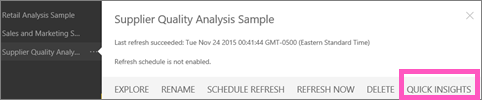
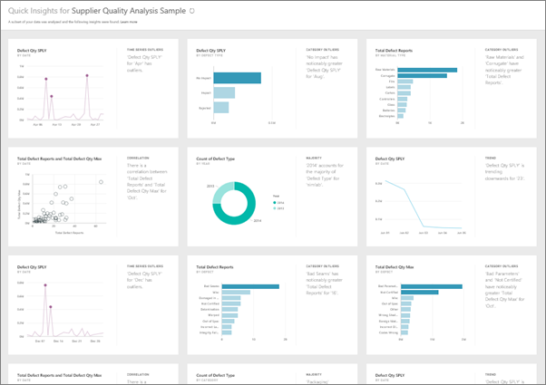

<properties
   pageTitle="在 Power BI 中的即時掌握所有資訊"
   description="檢視即時掌握所有資訊與 Power BI 服務文件。"
   services="powerbi"
   documentationCenter=""
   authors="mihart"
   manager="mblythe"
   backup=""
   editor=""
   tags=""
   featuredVideoId="EOASjs5mj6s"
   qualityFocus="no"
   qualityDate=""/>

<tags
   ms.service="powerbi"
   ms.devlang="NA"
   ms.topic="article"
   ms.tgt_pltfrm="NA"
   ms.workload="powerbi"
   ms.date="10/09/2016"
   ms.author="mihart"/>

# 快速理解 Power BI

有新的資料集並不是很確定從何處著手？  需要建置快速的儀表板嗎？  想要快速查詢，以了解您可能會遺失嗎？

執行快速的探討，以產生您的資料為基礎的有趣互動式視覺效果。 （即時掌握所有資訊） 的整個資料集或特定的儀表板] 磚 （範圍即時掌握所有資訊），可以執行即時掌握所有資訊。 您甚至可以快速深入了解在執行即時掌握所有資訊 ！

>
            **請注意**︰ 即時掌握所有資訊不適用於 Power BI Desktop，並不適用於直接查詢-它僅適用於資料上傳至 Power BI。

快速了解功能為基礎的成長 [組進階分析的演算法](powerbi-service-auto-insights-types.md) 與我們就會繼續使用，讓更多人以直覺的方式，其資料中尋找 insights 的 Microsoft Research 合作開發。

## 執行快速分析資料集

觀看 Amanda 範例資料集，為他的儀表板上的磚快速資訊的其中一個連接上執行即時掌握所有資訊和焦點模式開啟快速深入了解。
<iframe width="560" height="315" src="https://www.youtube.com/embed/EOASjs5mj6s" frameborder="0" allowfullscreen></iframe>

現在您了。 探索使用供應商品質分析範例即時掌握所有資訊。

1. 在左的導覽窗格中，在 **資料集** 選取省略符號 （...），然後選擇 **即時掌握所有資訊**。

    

2. Power BI 使用 [各種演算法](powerbi-service-auto-insights-types.md) 來搜尋您的資料集的趨勢。

    

3. 秒鐘內，您的見解準備。  選取 **檢視 Insights** 顯示視覺效果。

    

    或是在 leftnav 選取省略符號 （...），然後選擇 [ **檢視 Insights**。

    

    >
            **請注意**︰ 某些資料集無法產生深入資訊，因為資料不是統計上明顯。  若要深入了解，請參閱 [最佳化您的資料，以快速了解](powerbi-service-auto-insights-optimize.md)。

4. 在特殊的視覺效果顯示 **即時掌握所有資訊** 畫布與最多 32 個不同的深入了解卡。 每張卡片擁有圖表或圖形的簡短描述。

    

## 快速深入了解卡片的互動

  

1. 將滑鼠停留在卡片，然後選取要加入至儀表板的視覺效果釘選圖示。

2. 將滑鼠停留在卡片，然後選取要顯示卡全螢幕的焦點模式圖示。

3. 在焦點模式中，您可以︰
  - 
            [篩選](powerbi-service-interact-with-a-report-in-reading-view.md) 視覺效果。  若要顯示篩選，請在右上角中，選取箭頭。

  - 深入了解卡片的儀表板的 pin。

  - 智慧卡本身上執行即時掌握所有資訊。 這指 **範圍即時掌握所有資訊**。 在右上角，選取 [燈泡圖示或 **取得深入了解**。

    

    深入了解會顯示在左側和右側顯示的新深入了解卡，只會依據該單一深入了解中的資料。

    

4.  若要返回原始的即時掌握所有資訊畫布，左上角選取 **結束聚焦模式**。

## 執行即時掌握所有資訊的儀表板] 磚
不要搜尋以了解針對整個資料集，縮小搜尋範圍，以用來建立單一儀表板圖格的資料。 這指 **範圍即時掌握所有資訊**。

1. 
            [焦點模式開啟磚](/powerbi-service-display-dash-in-focus-mode.md)。
2. 在右下角的頂端，選取 **取得深入了解**。

    

3. Power BI 顯示方塊右邊的深入了解卡片。

    

4. 一個深入了解是否 pique 您感興趣？ 選取該進一步深入的見解卡。 所選的深入了解出現在左側和右側顯示的新深入了解卡，只會依據該單一深入了解中的資料。

5. 繼續栽進您的資料，然後當您發現有趣的見解，釘選其視覺效果，您的儀表板選取 **Pin visual** 從右上角。 此外，您可以傳送意見反應，讓資料集擁有者知道特定的深入了解是否是很有幫助。

    

## 請參閱

[最佳化 Power BI 快速了解您的資料](powerbi-service-auto-insights-optimize.md)

[Power BI-基本概念](powerbi-service-basic-concepts.md)

[在 Power BI 儀表板](powerbi-service-dashboards.md)

更多的問題嗎？ [試用 Power BI 社群](http://community.powerbi.com/)
