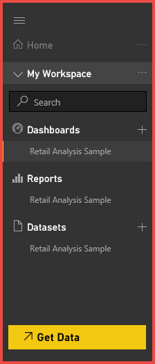
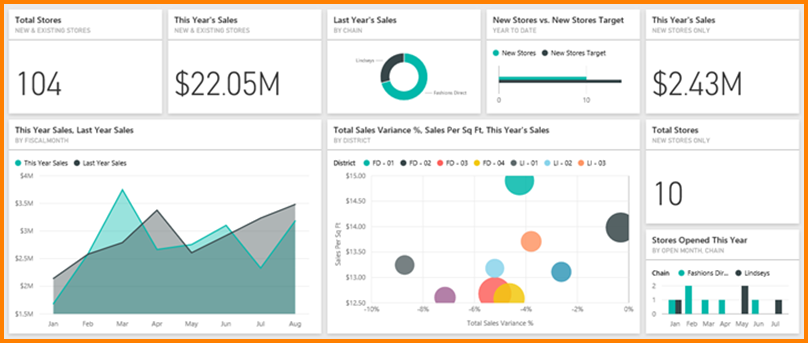

<properties
   pageTitle="Power BI-基本概念"
   description="Power BI-基本概念"
   services="powerbi"
   documentationCenter=""
   authors="mihart"
   manager="mblythe"
   backup=""
   editor=""
   tags=""
   featuredVideoId="Y4sRWbo8JcE"
   qualityFocus="no"
   qualityDate=""/>

<tags
   ms.service="powerbi"
   ms.devlang="NA"
   ms.topic="get-started-article"
   ms.tgt_pltfrm="NA"
   ms.workload="powerbi"
   ms.date="10/05/2016"
   ms.author="mihart"/>

# Power BI-Power BI 服務的基本概念

當您第一次開啟 Power BI 服務時，您會看到您的工作區。 會以醒目的方式顯示您 ***儀表板***, ，而這正是與不同之處 Power BI 服務 Power BI Desktop。

您的 Power BI 服務工作區所組成的︰

1.  導覽列
2.  磚與儀表板
3.  問與答問題方塊
4.  說明與意見反應按鈕
5.  儀表板標題
6.  Office 365 應用程式啟動程式
7.  Power BI 首頁按鈕
8. 其他儀表板] 動作

我們將深入探討這些更新的版本，但是首先讓我們檢閱 Power BI 的一些概念。

或者，您可能想要觀賞這段影片中之前先閱讀這篇文章的其餘部分。  在影片中，將會檢閱的基本概念，讓 Power BI 服務的導覽。

<iframe width="560" height="315" src="https://www.youtube.com/embed/Y4sRWbo8JcE?list=PL1N57mwBHtN0JFoKSR0n-tBkUJHeMP2cP" frameborder="0" allowfullscreen></iframe>

## Power BI 概念

Power BI 的 3 個主要建置組塊是︰ ***儀表板***, ，***報表***, ，和 ***資料集***。 您無法擁有儀表板或報告不含資料 （嗯，您可以有空白的儀表板和空的報表，但是它們並不很有幫助有資料之前），因此讓我們開始 **資料集**。

## 資料集

A *資料集* 是您 *匯入* 或 *連接* 來。 Power BI 可讓您連接至各種資料集，並使它的全部一起在同一個地方。  

在導覽列中，您已連接到資料集都會在 **資料集** 標題。 每個列出的資料集代表單一資料來源，例如 OneDrive、 或內部部署上 SSAS 表格式資料集，或 Salesforce 資料集的 Excel 活頁簿。 有許多不同的資料來源支援，而且我們會增加新的時間。 
            [請參閱適用於 Power BI 的資料集類型的清單](powerbi-service-get-data.md)。

            **一個** 資料集...
- 可重複。
- 可以用於許多不同的報表。
- 許多不同的儀表板可以顯示從該資料集的視覺效果。

  

若要 [連接到資料集](powerbi-service-get-data.md), ，請選取 **取得資料** （位於導覽列的底部），或選取旁邊的加號圖示 **資料集** 標題。 依照指示連接至特定的來源，並將資料集加入至您的工作區。 新的資料集加入至左側的導覽列和黃色星號標示。 您在 Power BI 中的工作不會變更基礎資料集。

資料集可以重新整理、 重新命名、 探索和移除。 若要瀏覽資料集，請選取它。 您在實際執行的動作，您可以真正開始深入資料的報表編輯器中開啟資料集並建立視覺效果。 因此，我們要移至下一個主題-報表。 

### 更深入發掘︰

-   [Power BI Pro 內容-它是什麼？](powerbi-power-bi-pro-content-what-is-it.md)
-   [取得 Power BI 中的資料](powerbi-service-get-data.md)
-   [Power bi 範例資料集和內容組件](powerbi-sample-datasets.md)

## 報告

Power BI 報表是一或多個頁面的視覺效果 （圖表、 圖形和影像）。 在報表中的視覺效果的所有來自單一資料集。 報表可以從頭 Power BI 中建立，可以匯入與同事分享您的儀表板或當您從 Excel、 Power BI Desktop、 資料庫、 SaaS 應用程式連接到資料集可以為您建立和 [內容組件](powerbi-service-organizational-content-packs-introduction.md)。  例如，當您連接到包含 Power View 工作表的 Excel 活頁簿，Power BI 會建立這些工作表為基礎的報表。 當您連接至 SaaS 應用程式，Power BI 會匯入預先建立的報表。

有 2 種模式來檢視和報表進行互動︰ [讀取檢視](powerbi-service-open-a-report-in-reading-view.md) 和 [編輯檢視](powerbi-service-interact-with-a-report-in-editing-view.md)。  建立報表，共同擁有者，以及授與權限，只有可存取所有的瀏覽、 設計、 建置和共用功能 ***編輯檢視*** 該報表。 和它們可以使用共用報表的人員探索和互動報表使用 ***讀取檢視***。   

在瀏覽窗格中，您的報表都會在 **報告標題**。 每個列出的報表代表 1 或更多的視覺效果的基礎資料集 1 為基礎的頁面。 此處所列的報表的所有可讀取檢視和編輯檢視中開啟。 若要開啟報表時，只需選取它。 根據預設，開啟此報表中讀取檢視第一次。  只要選取 **編輯報表** 編輯檢視中開啟它。  如果共用的儀表板的報表，將不會看到列出的導覽列中的報表。 相反地，共用的報表直接從共用的儀表板選取開啟儀表板] 磚 （更詳細的這些更新版本）。

            **一個** 報表...
-  可以與多個儀表板 （從該單一報表釘選的磚可以出現在多個儀表板） 產生關聯。
-  可以建立使用一個資料集的資料。 （有些微的例外是 Power BI Desktop，可以將 1 個以上的資料集合併成單一的報表和報表都可以匯入 Power BI）

  

## 儀表板

A *儀表板* 是指您建立或同事會建立並與您共用內容。 它是單一的畫布，其中包含零或多個磚和 widget。 每個方塊會顯示單一 [視覺化](powerbi-service-visualizations-for-reports.md) ，已建立從資料集，並釘選到儀表板。 有許多方法，將磚加入至您的儀表板。本概觀主題中涵蓋過多。 若要深入了解，請參閱 [Power BI 中並排顯示的儀表板](powerbi-service-dashboard-tiles.md)。 

底下列出的導覽列中，「 貴用戶 」 儀表板 **儀表板** 標題。 「 貴用戶 」 表示您必須存取它們，不一定是建立它們。 每個儀表板] 代表基礎資料集的一部分的自訂的檢視。  如果您擁有儀表板，您也可以存取基礎資料集和它們即會出現在瀏覽列中 **資料集**。  與您共用儀表板，是否有共用圖示  旁，以及每種共用方式，您可能會或可能看不到您的瀏覽列中列出的基礎資料集。

>
            **請注意**: Pin] 和 [磚會更詳細地討論以下標題下的 「 儀表板磚 」。

            **一個** 儀表板...
- 可以顯示來自許多不同的資料集的視覺效果
- 可以顯示視覺效果，從許多不同的報表

### 更深入發掘︰

            **儀表板可以 [從頭開始建立](powerbi-service-create-a-dashboard.md)** --建立新的空白儀表板，並接著取得一些資料。 

            **您或一位同事可以建立儀表板和 [共用](powerbi-service-share-unshare-dashboard.md)** -當您接受邀請，共用儀表板 （和任何相關聯的報表和資料集） 會新增至您的瀏覽列。 

            **有時候儀表板與資料集匯入或建立，則為您連接至資料集**。 例如， **取得資料** Salesforce 的精靈會要求您是否您想要的儀表板和/或報表來建立資料集。 

**人們為何要建立儀表板？**  以下是一些原因所造成︰

-   若要查看，在一個概觀，做出決策所需的所有資訊
-   若要監視其企業最重要的資訊
-   為了確保所有的同事都在相同頁面上，檢視和使用相同的資訊
-   若要監視的公司或產品或業務單位或行銷活動的健全狀況，等等。
-   若要建立較大儀表板-重要給我的所有度量資訊的個人化的檢視

## 我的工作區
我們已圈選起來，回到您的 Power BI 儀表板和工作區。 讓我們仔細看看 Power BI 服務; 最上層頁面所組成的片段我們稱之為 「 **我的工作區**。

### 1.**巡覽列** （瀏覽列）

使用 Power BI 的建置組塊之間移動瀏覽列︰ 儀表板、 報表和資料集。  

  

-   選取 **取得資料** 到 [將資料集加入至 Power BI](powerbi-service-get-data.md)。

- 展開和摺疊此圖示以瀏覽列 。

-   使用 **搜尋** 來瀏覽列中尋找特定的項目。

-   選取加號圖示  來建立新的儀表板，或取得新的資料集。

-   列出 **儀表板、 報告、** 和 **資料集** 可供您使用。  共用的儀表板處於唯讀狀態，並顯示 [共用] 圖示  。

-   儀表板、 報表和資料集的名稱通常與基礎的資料集檔案-名稱相符，不過您也可以 [加以重新命名](powerbi-service-rename-a-dashboard.md)。

-   以滑鼠右鍵按一下儀表板、 報表或資料集來顯示內容相關性功能表。 

    

按一下

-   摺疊或展開它的標題
-   若要顯示儀表板
-   若要在讀取檢視中開啟報表
-   資料集來瀏覽其內容

### 2.**磚與儀表板**

儀表板所組成 [磚](powerbi-service-dashboard-tiles.md)。  磚會建立其中一個在報表編輯的檢視或問與答。 並排顯示的一種特殊類型呼叫 [widget](powerbi-service-add-a-widget-to-a-dashboard.md) 加入直接拖曳至儀表板。 儀表板出現的方塊已特別放在此報表建立者擁有者。  將磚加入至儀表板的動作稱為 *固定*。

如需詳細資訊，請參閱 **[儀表板]** （如上所述）。

### 3.**問與答問題方塊**

瀏覽資料的一種方法是詢問的問題及讓 Power BI 問與答可讓您的解答，視覺效果的形式。 問與答不能將內容加入至報表，才能新增儀表板形式的圖格的內容。

問與答中的資料集的解答會尋找連接至儀表板。  連接的資料集是指具有一個以上的磚釘選到儀表板。

一旦您開始輸入您的問題，問與答帶您前往 < 問與答頁面。 當您輸入時，問與答可協助您提出正確的問題和尋找最佳的回答與 rephrasings、 自動填滿、 建議，以及更多。 當您要的視覺效果 （回應），請將它釘選到儀表板。 如需詳細資訊，請參閱 [問與答 Power BI 中](powerbi-service-q-and-a.md)。

### 4.**全螢幕、 說明與意見反應**

在右上角的圖示是您的資源設定，取得協助，並提供意見反應給 Power BI 小組的下載。 選取雙箭頭以開啟儀表板 **全螢幕** m。  

### 5.**儀表板標題** （也稱為哪些儀表板是作用中）？

您不一定容易找出使用中的儀表板。  儀表板標題會出現在儀表板檢視頁面上，問與答] 頁面上，在報表編輯檢視及報表讀取檢視和開啟資料集。   

### 6.**Office 365 應用程式啟動程式**

應用程式啟動程式被設計來協助您取得 Office 365 應用程式。

### 7.**Power BI 首頁**

選取這個會傳回您最近檢視過的儀表板。

   

### 8.**選項**

工作區的這個區域包含與儀表板互動的圖示。  除了 **加入 widget** 和 **共用儀表板** 選取省略符號顯示複製、 列印以及重新整理儀表板等等的選項。

   

## 請參閱

[開始使用 Power BI](powerbi-service-get-started.md)

[Power BI 影片](powerbi-videos.md)

更多的問題嗎？ [試用 Power BI 社群](http://community.powerbi.com/)
