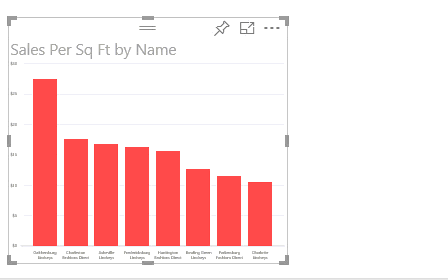

<properties
   pageTitle="變更圖表中的 Power BI 報表的排序方式"
   description="變更圖表中的 Power BI 報表的排序方式"
   services="powerbi"
   documentationCenter=""
   authors="mihart"
   manager="mblythe"
   backup=""
   editor=""
   tags=""
   qualityFocus="no"
   qualityDate=""/>

<tags
   ms.service="powerbi"
   ms.devlang="NA"
   ms.topic="article"
   ms.tgt_pltfrm="NA"
   ms.workload="powerbi"
   ms.date="10/05/2016"
   ms.author="mihart"/>

# 變更圖表中的 Power BI 報表的排序方式

在 Power BI，您可以排序圖表依字母順序在圖表中，類別目錄的名稱，或每個類別目錄之數字值。 比方說，這張圖表會依存放區名稱。

很容易排序它從最高到最低銷售額每平方英尺改為。

1.  選取省略符號 （...），然後選擇 **排序依據銷售每個 Sql 全文檢索**。

2.  如果有必要，請選取排序圖示  變成 **遞減**。

    

    
            **請注意**︰ 您可以排序並不是所有視覺效果。  無法排序下列視覺效果︰ Treemap、 對應、 填入對應、 散佈圖、 量測計、 卡片、 多重資料列卡、 瀑布。

##  使用其他準則排序

有時候，您會想要排序 visual studio 使用不同的資料行或其他準則。  例如，您可能想要依月份 （而非字母順序） 排序，或要排序的整個數字，而不是數字 (範例中，0、 1、 9、 20 和不 0、 1、 20、 9)。  以下是幾個解決方案︰

-   在 Power BI Desktop [使用資料模型化工具] 索引標籤的不同資料行來排序](powerbi-desktop-sort-by-column.md)。

-   在 Excel 中，如果您自己的資料集時，加入新的資料行，它會串連的月份和數字。 然後重新整理或重新匯入以查看新的資料行欄位] 區域中的資料集。

-   在 Excel 中，請確定您的數值資料行都會標示為 「 整數 」 或 「 十進位 」，而不是 「 文字 」。

## 請參閱

進一步了解 [Power BI 報表中的視覺效果](powerbi-service-visualizations-for-reports.md)。

[Power BI-基本概念](powerbi-service-basic-concepts.md)

更多的問題嗎？ [試用 Power BI 社群](http://community.powerbi.com/)
