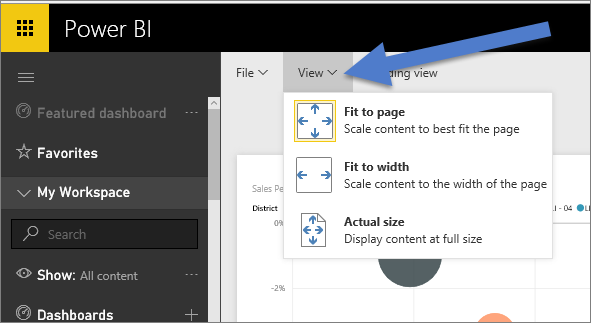

<properties
   pageTitle="頁面顯示 Power BI 報表中的設定"
   description="頁面顯示 Power BI 報表中的設定"
   services="powerbi"
   documentationCenter=""
   authors="mihart"
   manager="mblythe"
   backup=""
   editor=""
   tags=""
   featuredVideoId="5tg-OXzxe2g"
   qualityFocus="monitoring"
   qualityDate=""/>

<tags
   ms.service="powerbi"
   ms.devlang="NA"
   ms.topic="article"
   ms.tgt_pltfrm="NA"
   ms.workload="powerbi"
   ms.date="10/07/2016"
   ms.author="mihart"/>

# 頁面顯示 Power BI 報表中的設定

我們了解，請務必保留報表的版面配置像素完美。 某些情況下，可能不容易，因為您與同事檢視這些報告在不同的外觀比例和大小與螢幕上。 

預設顯示的檢視 **大小** ，而預設的顯示大小為 **16:9**。 如果您想要鎖定在不同的外觀比例，或想要以不同方式符合您的報表，有兩項工具可協助您︰ ***頁面檢視*** 設定和 ***頁面大小*** 設定。

<iframe width="560" height="315" src="https://www.youtube.com/embed/5tg-OXzxe2g" frameborder="0" allowfullscreen></iframe>

## 頁面檢視設定

 *頁面檢視* 設定可讓您控制報表頁面相對於瀏覽器視窗的顯示。  您可以選擇︰

-   
            **調整成一頁** （預設值）︰ 調整內容，以最符合頁面
-   
            **適合寬度**︰ 調整內容，以符合內頁面的寬度
-   
            **實際大小**︰ 以完整大小顯示內容

頁面檢視設定兩者都有提供 [讀取檢視](powerbi-service-interact-with-a-report-in-reading-view.md) 和 [編輯檢視](powerbi-service-interact-with-a-report-in-editing-view.md)。 在 [編輯] 檢視報表擁有者可以指派給個別報表頁面的頁面檢視設定，這些設定會與報表一起儲存。 當同事在讀取檢視中開啟該報表時，她會看到報表頁面顯示使用擁有者的設定。  不過，工作讀取檢視報表時，她可以暫時變更的頁面檢視設定。  她離開報表，一旦頁面檢視設定回復這些報表擁有者所設定。

## 頁面大小設定

 *頁面大小* 設定控制的顯示比例和實際大小 （以像素為單位）。  頁面大小設定僅可用於編輯的檢視。

-   4:3 比例

-   比例 16:9 （預設值）

-   Cortana

-   字母

-   自訂 （高度和寬度，單位為像素）

## 下一個步驟

            [了解如何使用 Power BI 報表中的頁面檢視和頁面大小設定](powerbi-service-tutorial-change-report-display-settings.md)。

## 請參閱

深入了解 [電源 B 中的報表](powerbi-service-reports.md)

[Power BI-基本概念](powerbi-service-basic-concepts.md)

更多的問題嗎？ [試用 Power BI 社群](http://community.powerbi.com/)
