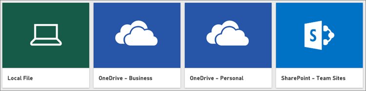

<properties
   pageTitle="取得資料從逗號分隔值 (。CSV) 檔案"
   description="了解如何從 CSV 檔案將資料送入 Power BI"
   services="powerbi"
   documentationCenter=""
   authors="davidiseminger"
   manager="mblythe"
   backup=""
   editor=""
   tags=""
   qualityFocus="monitoring"
   qualityDate="03/30/2016"/>

<tags
   ms.service="powerbi"
   ms.devlang="NA"
   ms.topic="article"
   ms.tgt_pltfrm="NA"
   ms.workload="powerbi"
   ms.date="10/12/2016"
   ms.author="davidi"/>

# 取得資料從逗號分隔值 (。CSV) 檔案

以逗號分隔值檔案，通常稱為。CSV 是簡單的文字檔案的資料列以逗號分隔每個值的位置。 這些類型的檔案可以包含非常大量的較小的檔案大小，使其理想的資料來源的 Power BI 中的資料。 您可以下載範例。CSV 檔案 [這裡](http://go.microsoft.com/fwlink/?LinkID=619356)。

如果您有。CSV，就能夠進入您的 Power BI 網站中做為資料集開始探索您的資料、 建立某些儀表板，並與其他人共用您的見解。

            **提示︰** 許多組織的輸出。更新的資料每天使用的 CSV。 若要確定您的資料集在 Power BI 會留在同步處理與更新的檔案，請務必檔案會儲存到 OneDrive，具有相同名稱。

## 儲存您的檔案差異

            **本機** -如果您儲存程式。CSV 檔案在本機磁碟機上您的電腦或另一個位置，在您的組織從 Power BI，您可以 *匯入* 到 Power BI 檔案。 讓整個檔案不真的匯入 Power BI，您的檔案實際上會保留在本機磁碟機。 真正發生的情況是 Power BI 和從資料中建立新的資料集。CSV 檔案載入至資料集。

            **OneDrive-商務** – 如果您有商務用 OneDrive 使用相同的帳戶登入 Power BI 與登入，這是由遠方最有效的方式將程式。CSV 檔案您資料集、 報表和儀表板中 Power BI 中同步處理。 因為 Power BI 和 OneDrive 位於定域機組，Power BI *連接* OneDrive 上的檔案，大約每個小時。 如果找不到任何變更，您的資料集、 報表和儀表板會自動更新，Power BI。

            **OneDrive-個人** – 如果您將檔案儲存到您自己的 OneDrive 帳戶，就會顯示許多相同的優點就與商務用 OneDrive。 最大的差異是當您第一次連接到您的檔案 (使用取得資料 > 檔案 > OneDrive-個人) 需要您的 OneDrive 與您通常不同於您用於登入 Power BI 的 Microsoft 帳戶登入。 當登入您的 OneDrive 與您的 Microsoft 帳戶，請務必選項中選取 [讓我保持登。 如此一來，Power BI 都能夠連接到每個小時的相關檔案，並確定您在 Power BI 中的資料集是在同步處理。

            **SharePoint 小組網站** – 將 Power BI Desktop 檔案儲存到 SharePoint – 小組網站時，就如同儲存至商務用 OneDrive。 最大的差別是如何連接至檔從 Power BI。 您可以指定 URL，或連線至根資料夾。

## 匯入或連接。CSV 檔案

            **重要事項︰** 您可以匯入 Power BI 的最大檔案大小是 1 gb。

1.  在 Power BI 中的導覽窗格中，按一下 **取得資料**。

    

2.  在 **檔案**, ，按一下 [ **取得**。

    

3.  尋找檔案。

    

## 新功能

            **瀏覽資料** -您可以從您的檔案將資料送入 Power BI 之後, 就可以瀏覽。 只要以滑鼠右鍵按一下新的資料集，然後按一下 [ **瀏覽**。

            **排程重新整理** -如果您的檔案儲存在本機磁碟機，您就可以設定排定的重新整理，讓您的資料集和報表，Power BI 中的保持最新狀態。 若要深入了解，請參閱 [Power BI 中的資料重新整理](articles/powerbi-refresh-data.md)。 如果您的檔案會儲存到 OneDrive，Power BI 會自動同步處理與其相關的每個小時。
