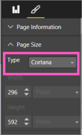

<properties
   pageTitle="建立自訂 Power BI 回應卡 Cortana"
   description="Cortana Power BI 中建立自訂回應卡"
   services="powerbi"
   documentationCenter=""
   authors="mihart"  
   manager="mblythe"
   backup=""
   editor=""
   tags=""
   qualityFocus="no"
   qualityDate=""/>

<tags
   ms.service="powerbi"
   ms.devlang="NA"
   ms.topic="article"
   ms.tgt_pltfrm="NA"
   ms.workload="powerbi"
   ms.date="09/30/2016"
   ms.author="mihart"/>

# 使用 Power BI 建立自訂的回應頁面 Cortana

若要建立報表，專門設計來解答 Cortana 使用 Power BI 的完整功能。

## 開始之前

您可以開始建立自訂回應頁面 Cortana，如之前 [Power bi 允許 Cortana](powerbi-service-cortana-enable.md)。  

## 建立 Cortana 回應頁面
 *回應頁面* 在報表中會調整大小，專為 Cortana 讓 Cortana 可以將其顯示為有問題的答案。  若要建立回應頁面 Cortana 的︰

1. 我們建議您從 [空白報表頁面](powerbi-service-add-a-page-to-a-report.md)。

2. 在 **視覺效果** ] 窗格中，選取 [小畫家] 圖示，然後選擇 [ **頁面大小 > Cortana**。

    

3. 建立視覺效果或一組您想要出現在 Cortana，以回應特定的問題 （或問題集） 的視覺效果。

4. 請確定所有視覺效果納入頁面框線。  （選擇性） 修改顯示設定、 資料標籤、 色彩和背景。  

    

5. 將頁面命名，並加入替代名稱。  搜尋結果時，Cortana 就會使用這些名稱。 在 **視覺效果** ] 窗格中，選取 [小畫家] 圖示，然後選擇 [ **頁面資訊**。 藉由移動滑桿，以啟用問與答此視覺 **上**。

    

    >[AZURE.TIP] 若要改善結果，請避免使用同時也資料行名稱。

6. （選擇性） 如果您的報表有頁面層級篩選，您可以設定 **需要單一選取**。 Cortana 只會顯示此報表為答案一樣，且只有其中一個，篩選項目問題中指定。

    

      例如，如果您問 Cortana:

      - 「 顯示銷售的存放區名稱 」，此回應頁面不會因為不包含任何項目中所需的頁面層級篩選。

      - 「 Cary Lindseys 和 Charlotte Lindseys 顯示銷售 」，此回應頁面不會因為指定一個以上的項目所需的頁面層級的篩選條件。

      - 「 顯示銷售的 Charlotte Lindseys 」，會顯示此回應頁面。

    現在，提出問題，包括 Cortana 大小的頁面名稱將會從傳回結果 Cortana。

    >[AZURE.IMPORTANT]  Cortana 可存取回應頁面之前，您必須 [啟用資料集的 Cortana](powerbi-service-cortana-enable.md)。

## Cortana 如何排序結果？

（例如完成的比對指定的頁面名稱） 的高評分解答的結果將會顯示為第一個 *最符合項目* Cortana 中。 如果 Power BI 中有多個解答，可以出現多個最佳的相符項目。 中或低評分解答，例如不具名的頁面基礎 Cortana 或問題字不了解 Power BI 的答案會列為 Cortana 的最佳相符項目下方的連結。

>[AZURE.NOTE] 新的資料集或自訂 Cortana 回應頁面會加入至 Power BI 並啟用 Cortana 時花費 30 分鐘的時間就會開始出現在 Cortana 的結果。 登入和移出 Windows 10，或在 Windows 10，否則重新啟動 Cortana 程序可讓新的內容會立即出現。

## 請參閱

[使用 Cortana 與 Power BI](powerbi-service-cortana-intro.md)

[開始使用 Power BI Desktop](powerbi-desktop-getting-started.md)

更多的問題嗎？ [試用 Power BI 社群](http://community.powerbi.com/)
