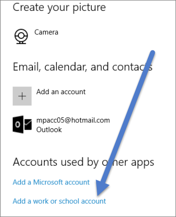

<properties
   pageTitle="允許 Cortana Power bi"
   description="使用 Power BI 的 Cortana 解答您的資料。 Cortana 啟動每個 Power BI 資料集，然後啟用 [Cortana 從行動裝置存取您的資料集。"
   services="powerbi"
   documentationCenter=""
   authors="mihart"  
   manager="mblythe"
   backup=""
   editor=""
   tags=""
   qualityFocus="no"
   qualityDate=""/>

<tags
   ms.service="powerbi"
   ms.devlang="NA"
   ms.topic="article"
   ms.tgt_pltfrm="NA"
   ms.workload="powerbi"
   ms.date="09/20/2016"
   ms.author="mihart"/>

# 允許 Cortana Power bi

詢問 Cortana 的自然語言問題並且尋找解答從 Power BI 中儲存的資料。

Cortana 可以尋找解答您的 Power BI 資料集和報表之前，您將需要︰

-  啟用 Cortana 存取 Power BI 中的資料集

-  若要將帳戶新增您使用與 Power BI for Windows。

  >[AZURE.NOTE] Cortana Power bi 是目前僅提供英文版本。 無法在行動裝置上目前可用 Cortana。

## 允許 Cortana 存取 Power BI 中的資料
在 Power BI 服務，您必須針對您想要能夠存取 Cortana 每個資料集重複上述步驟。

1.  登入 Power BI 服務。

2. 在右上角，選擇齒輪圖示，然後選擇 [ **設定**。

    

3. 選取 **資料集** 索引標籤，從左側清單中選取的資料集。

4.  選取 **問與答與 Cortana** > **允許 Cortana 存取此資料集** > **套用**。

    

    在此範例中，我們正在啟用 Cortana 零售分析範例資料集上。

    >[AZURE.NOTE] 當新的資料集或自訂 Cortana 回應頁面加入至 Power BI 並啟用 Cortana 時，它可能需要 30 分鐘的時間就會開始出現的結果。  登入和移出 Windows 10，或在 Windows 10，否則重新啟動 Cortana 程序可讓新的內容會立即出現。

    >[AZURE.IMPORTANT]如果您啟用 Cortana，資料集，而且該資料集內容的組件的一部分您自己，您必須重新發行您的同事也可以使用 Cortana。

5. 判斷您正在執行的 Windows 10 版本。 您可以選取哪一個版本的核取 **設定** > **系統** > **有關**。

   -  如果您有 [Windows 10 版本 （Windows 10 年 11 月更新） 1511年為止 1607年](http://blogs.windows.com/windowsexperience/2015/11/12/first-major-update-for-windows-10-available-today/), ，加入您的工作或學校帳戶和 Microsoft 帳戶 （完成步驟 6 和 7）。

   -  如果您有 [Windows 10 版本 1607年 （Windows 10 年 7 月 2016年更新） 或更新版本](https://support.microsoft.com/en-us/kb/3176929), 中，新增您的工作或學校帳戶 （完整只有步驟 6）。

6. 新增 Cortana 您工作或學校的帳戶。
   -  開啟 [Windows 設定] > 帳戶。

         

   -  捲動至底部，然後選取 **新增工作或學校帳戶**。

         

7. 在 **帳戶** ] 頁面上，捲動至底部，您會看到 **新增 Microsoft 帳戶**。
      

   -  您可以使用 Power BI 帳戶登入。

Cortana 將會使用這項工作或學校帳戶，來檢查潛在的 Power BI Cortana 您的問題的解答。

## 請參閱

            [使用 Cortana 與 Power BI](powerbi-service-cortana-intro.md)

            [建立 Cortana *回答頁面* Power BI 中](powerbi-service-cortana-desktop-entity-cards.md)

            [問與答 Power BI 中](powerbi-service-q-and-a.md)

            [Power BI 的基本概念](powerbi-service-basic-concepts.md)

更多的問題嗎？ 
            [試用 Power BI 社群](http://community.powerbi.com/)
