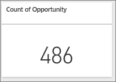

<properties
   pageTitle="提出問題，以建立大的數字磚 Power BI 儀表板"
   description="提出問題，以建立大的數字磚 Power BI 儀表板"
   services="powerbi"
   documentationCenter=""
   authors="mihart"
   manager="mblythe"
   backup=""
   editor=""
   tags=""
   qualityFocus="no"
   qualityDate=""/>

<tags
   ms.service="powerbi"
   ms.devlang="NA"
   ms.topic="article"
   ms.tgt_pltfrm="NA"
   ms.workload="powerbi"
   ms.date="10/07/2016"
   ms.author="mihart"/>

# 提出問題，以建立大的數字磚 Power BI 儀表板  

有時單一數字是最重要的是您想要追蹤 Power BI 儀表板，例如總銷售額、 市場共用年年份或總計的機會。 您可以 [Power BI 報表中建立大的數字磚](powerbi-service-create-a-big-number-tile-from-a-power-bi-report.md) 或問與答中提問。 這篇文章說明如何建立一個在問與答。

[問題] 方塊會是數字的並排顯示，就像這樣簡單的方法。

1.    建立 [儀表板](powerbi-service-dashboards.md) 和 [取得資料](powerbi-service-get-data.md)。

2.    在您的儀表板的頂端，開始輸入想要了解 [問題] 方塊中的資料。 此範例使用機會分析範例。

    

3.    例如，[問題] 方塊中輸入 「 數字的機會 」。
    

    [問題] 方塊所示，做為 restates **顯示商機計數**, ，並顯示的總數。  

4.  選取 [釘選圖示  將數字的磚加入儀表板右上角。 

    

5.  釘選磚至現有的儀表板或新的儀表板。 

    -   現有的儀表板︰ 從下拉式清單中選取的儀表板名稱。

    -   新的儀表板︰ 輸入新的儀表板的名稱。

6.  選取 **Pin**。

    成功的訊息 （靠近右上角） 可讓您知道已新增的視覺效果，做為您的儀表板] 的磚。  

    

7.  從 [瀏覽] 窗格中，選取 [儀表板與新的方塊。 您可以在這裡， [重新命名、 調整大小、 連結和移動](powerbi-service-edit-a-tile-in-a-dashboard.md) 釘選視覺效果。  
    

## 疑難排解
如果您不完全看到問題] 方塊，它可能您有問與答啟用此資料集。  

##  啟用問與答

1.  在 Power BI 的右上角，選擇齒輪圖示  選擇 **設定**。

    

2.  選取 **資料集** 選擇資料集，以啟用的問與答。

    

3. 展開 **問與答與 Cortana**, ，選取核取方塊， **開啟此資料集的問與答** 選擇 **套用**。

    

## 請參閱  

            [在 Power BI 儀表板] 磚](powerbi-service-dashboard-tiles.md)  

            [在 Power BI 儀表板](powerbi-service-dashboards.md)  

            [Power BI-基本概念](powerbi-service-basic-concepts.md)

更多的問題嗎？ 
            [試用 Power BI 社群](http://community.powerbi.com/)
