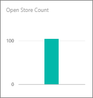
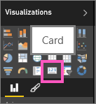
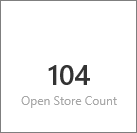

<properties
   pageTitle="從 Power BI 報表建立大的數字] 磚"
   description="從 Power BI 報表建立大的數字] 磚"
   services="powerbi"
   documentationCenter=""
   authors="mihart"
   manager="mblythe"
   backup=""
   editor=""
   tags=""
   qualityFocus="no"
   qualityDate=""/>

<tags
   ms.service="powerbi"
   ms.devlang="NA"
   ms.topic="article"
   ms.tgt_pltfrm="NA"
   ms.workload="powerbi"
   ms.date="10/07/2016"
   ms.author="mihart"/>
# 從 Power BI 報表建立大的數字] 磚

有時單一數字是最重要的是您想要追蹤 Power BI 儀表板，例如總銷售額、 市場共用年年份或總計的機會。 您可以建立大的數字並排顯示依據 [問與答中提問](powerbi-service-create-a-big-number-tile-for-a-dashboard.md), ，或在 Power BI 報表。 這篇文章說明如何在報表中建立一個。

1.  建立 [儀表板](powerbi-service-dashboards.md) 和 [取得資料](powerbi-service-get-data.md)。

    如果您想要練習的資料，請嘗試 [下載零售分析範例](powerbi-sample-retail-analysis-take-a-tour.md)。 

2.  在報表開啟 [編輯檢視](powerbi-service-go-from-reading-view-to-editing-view.md)。

4.  在報表中，尋找有一些空白頁面或 [報表中加入新的頁面](powerbi-service-add-a-page-to-a-report.md)。

5.  在 [欄位] 清單中，選取您想要顯示的數字欄位。

    在此範例中， **開啟存放區計數** 中 **存放區** 資料表。 Power BI 會建立一個數字與直條圖。

    

6.  在視覺效果] 窗格中，選取 [卡片] 圖示。

    

7.  選取 [釘選圖示  將磚加入至儀表板右上角。 

    

8.  釘選磚至現有的儀表板或新的儀表板。 

    -   現有的儀表板︰ 從下拉式清單中選取的儀表板名稱。

    -   新的儀表板︰ 輸入新的儀表板的名稱。

9.  選取 **Pin**。

    成功的訊息 （靠近右上角） 可讓您知道已新增的視覺效果，做為您的儀表板] 的磚。

    

10. 從 [瀏覽] 窗格中，選取 [儀表板與新的方塊。 您可以在這裡， [編輯並移動](powerbi-service-edit-a-tile-in-a-dashboard.md) 釘選視覺效果。

## 請參閱

[在 Power BI 儀表板] 磚](powerbi-service-dashboard-tiles.md)

[在 Power BI 儀表板](powerbi-service-dashboards.md)

[Power BI-基本概念](powerbi-service-basic-concepts.md)

更多的問題嗎？ [試用 Power BI 社群](http://community.powerbi.com/)
