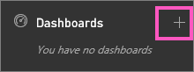
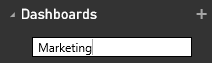

<properties
   pageTitle="建立 Power BI 儀表板"
   description="建立 Power BI 儀表板"
   services="powerbi"
   documentationCenter=""
   authors="mihart"
   manager="mblythe"
   backup=""
   editor=""
   tags=""
   featuredVideoId="lJKgWnvl6bQ"
   qualityFocus="monitoring"
   qualityDate="03/15/2016"/>

<tags
   ms.service="powerbi"
   ms.devlang="NA"
   ms.topic="article"
   ms.tgt_pltfrm="NA"
   ms.workload="powerbi"
   ms.date="10/07/2016"
   ms.author="mihart"/>

# 建立 Power BI 儀表板

您已閱讀 [在 Power BI 儀表板](powerbi-service-dashboards.md), ，而且您想要建立您自己的現在。 有許多不同的方式來建立儀表板。  影片將示範如何建立新的儀表板釘選視覺效果和從報表的影像。 和以下視訊的逐步指示說明如何建立使用 Power BI 服務的左方瀏覽窗格的空白儀表板。 空白儀表板並沒有什麼用處不過--依照下方和在頁面上，以了解如何將內容加入至您的儀表板底部的連結。

>
            **請注意**︰ 請記住，直到您將會是空白儀表板 [取得一些資料](powerbi-service-get-data.md) 和 [釘選一些磚](powerbi-service-dashboard-tiles.md)。

>
            **請注意**︰ 儀表板是 Power BI 服務，Power BI Desktop 的功能。

## 建立儀表板
### 釘選視覺效果和從報表的映像來建立儀表板

<iframe width="560" height="315" src="https://www.youtube.com/embed/lJKgWnvl6bQ" frameborder="0" allowfullscreen></iframe>

### 從頭開始建立空白的儀表板
這個方法會建立新的空白，儀表板]。

1. 從 Power BI 服務 (沒有 Power BI Desktop) 的左方瀏覽窗格，選取加號  旁 **儀表板** 標題。

    

2. 輸入新的儀表板的名稱，然後選取 [ENTER。

    

    建立新的儀表板。  看見它列示在 **儀表板** 左的導覽窗格中。

    

3. 選取新的儀表板，方便在使用中的儀表板。  請注意，它是空白-我們您尚未加入任何內容。

### 將某些內容加入至儀表板

有許多不同的方式，將內容加入至您的儀表板。

-  
            [連接至或匯入資料集至少一個](powerbi-service-get-data.md) 和 [釘選到儀表板從該資料集內容](powerbi-service-dashboard-tiles.md)。  

- 
            [將獨立內容加入至您的儀表板](powerbi-service-add-a-widget-to-a-dashboard.md)。 使用 **新增磚** 將影像、 文字方塊或標題、 視訊或 web 內容新增至您的儀表板。

>
            **秘訣**︰ 需要一些協助，使開始加入的內容？  簽出 [開始使用 Power BI 教學課程](powerbi-service-get-started.md)。

## 請參閱

[Power BI-基本概念](powerbi-service-basic-concepts.md)

[在 Power BI 儀表板](powerbi-service-dashboards.md)

[設計絕佳的儀表板的秘訣](powerbi-service-tips-for-designing-a-great-dashboard.md)

更多的問題嗎？ [試用 Power BI 社群](http://community.powerbi.com/)
