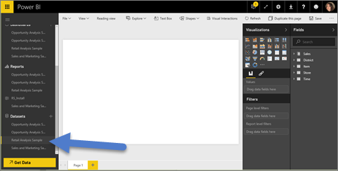
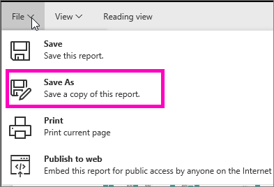

<properties
   pageTitle="建立新的 Power BI 報表"
   description="建立新的 Power BI 報表"
   services="powerbi"
   documentationCenter=""
   authors="mihart"
   manager="mblythe"
   backup=""
   editor=""
   tags=""
   qualityFocus="monitoring"
   qualityDate=""/>

<tags
   ms.service="powerbi"
   ms.devlang="NA"
   ms.topic="article"
   ms.tgt_pltfrm="NA"
   ms.workload="powerbi"
   ms.date="10/05/2016"
   ms.author="mihart"/>
# 建立新的 Power BI 報表

有許多不同方式來建立新的報表。 本主題將說明其中兩個。

-   從資料集

-   從現有的報表

## 從資料集建立新的報表

這個方法會從頭建立新的報表。 如果要跟著做， [下載零售分析範例](powerbi-sample-downloads.md)。

1.  啟動 Power BI 服務，並選取的資料集，以開啟它。 開啟資料集時，實際上會開啟報表編輯器。  您會看到空白畫布和報表編輯工具。

    

2.  瀏覽資料並 [加入視覺效果](powerbi-service-visualizations-for-reports.md)。 此報表，讓我們加入量測計視覺追蹤今年的銷售。

   -  在 **欄位** 窗格中，選取 **銷售** > **本年度銷售額** > 值。

        

   -  選取量測計的範本，將視覺效果轉換成量測計  從 **視覺效果** 窗格。

        

   -  拖放到 **銷售** > **本年度銷售額** > **目標** 至 **目標值** 良好。

        

3.  （選擇性） 要繼續加入視覺效果，然後 [儲存報表](powerbi-service-save-a-report.md)。

    

## 從現有的報表建立新的報表
或許您有一份已連接到您的資料集，且您想要重複使用或修改某些視覺效果。  為什麼不只是複製該報表做為新報表的基礎？  若要這麼做︰

1.  
            [開啟報表](powerbi-service-open-a-report-in-reading-view.md)。

2.  從 **檔案** 功能表上，選取 **另存新檔**。

    

3.  輸入新的報表的名稱，然後選取 **儲存**。

    

    成功的訊息可讓您知道新的報表已儲存至 Power BI。

    

4.  回到您 Power BI 瀏覽窗格中，選取新的報表，以開啟它。 選擇性地刪除您不想要保留、 修改其他視覺效果，並加入新的視覺效果。

    

5.  有有趣的更新和編輯新的報表。

## 後續步驟︰

[建立新的視覺效果](powerbi-service-add-visualizations-to-a-report-ii.md)

            [刪除視覺效果](powerbi-service-delete-a-visualization.md) 您不需要

## 請參閱

深入了解 [Power BI 中的報表](powerbi-service-reports.md)

[開始使用 Power BI](powerbi-service-get-started.md)

[Power BI-基本概念](powerbi-service-basic-concepts.md)

更多的問題嗎？ [試用 Power BI 社群](http://community.powerbi.com/)
