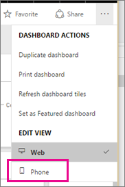
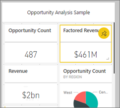
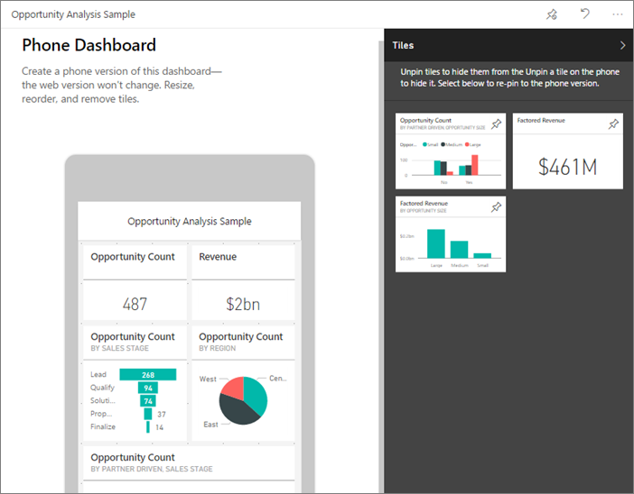

<properties
   pageTitle="在 Power BI 建立儀表板電話檢視"
   description="了解如何建立您自己，專為在電話上檢視任何 Power BI 儀表板的自訂的檢視。"
   services="powerbi"
   documentationCenter=""
   authors="maggiesMSFT"
   manager="mblythe"
   backup=""
   editor=""
   tags=""
   qualityFocus="no"
   qualityDate=""/>

<tags
   ms.service="powerbi"
   ms.devlang="NA"
   ms.topic="article"
   ms.tgt_pltfrm="NA"
   ms.workload="powerbi"
   ms.date="09/27/2016"
   ms.author="maggies"/>

# 在 Power BI 建立儀表板電話檢視

當您在電話上的 Power BI 行動應用程式中檢視儀表板時，您會注意到儀表板圖格配置一個之後另一個，而且它們是完全相同的大小。 在 Power BI 服務中，您可以建立您自己，專為手機任何儀表板的自訂的檢視。

當您在側邊開啟電話時，則您看到儀表板依照在服務中，配置不如針對電話。

> 
            **請注意**︰ 編輯電話檢視時，儀表板檢視在電話上的任何人都可以看到所做的變更即時。 
> 
> 比方說，如果您取消釘選儀表板電話檢視上的所有圖格，電話儀表板會突然有任何並排顯示。 

1. 在 Power BI 服務中，開啟 [儀表板。

2. 選取右上角中的省略符號 （...） > 下 **編輯檢視**, ，請選取 **電話**。

    >
            **請注意**︰ 如果您不是儀表板擁有者，您就不會看到此功能表上的選項。

    

    [編輯電話儀表板] 檢視隨即開啟。 這裡您可以取消釘選，調整大小，並重新安排成電話檢視方塊。 儀表板的 web 版本不會變更。

    

3. 選取要拖曳、 調整大小，或取消釘選磚。 您會注意到拖曳方塊的方式移動的並排顯示。

    

    已取消固定的牌放在並排顯示] 窗格中，存放它們的地方除非重新新增。

    

4. 如果您改變心意，選取 **重設磚** 若要將它們放回大小和之前的順序。

    >
            **請注意**︰ 在 Power BI 中開啟電話編輯檢視服務稍有變更的大小和形狀在電話上的方塊。 因此若要返回儀表板其精確狀態之前的電話編輯] 檢視中開啟它，選取 **重設電話檢視**。

5. 滿意電話儀表板版面配置時，請選取省略符號 （...） 在右上角 > 下 **編輯檢視**, ，請選取 **Web**。

### 請參閱

- [開始使用 Power BI](powerbi-service-get-started.md)
- [Power BI 行動應用程式中的儀表板](powerbi-mobile-create-dashboard.md)
- 更多的問題嗎？ [請嘗試詢問 Power BI 社群](http://community.powerbi.com/)