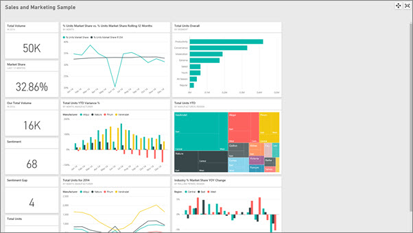
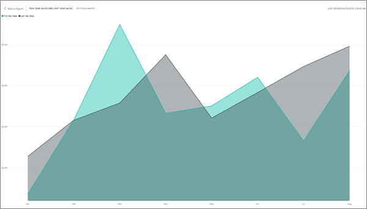

<properties
   pageTitle="在全螢幕模式 （電視模式） 中顯示儀表板和報表"
   description="電視模式，也就是全螢幕模式中顯示儀表板和報表。"
   services="powerbi"
   documentationCenter=""
   authors="mihart"
   manager="mblythe"
   backup=""
   editor=""
   tags=""
   featuredVideoId="c31gZkyvC54"
   qualityFocus="identified"
   qualityDate=""/>

<tags
   ms.service="powerbi"
   ms.devlang="NA"
   ms.topic="article"
   ms.tgt_pltfrm="NA"
   ms.workload="powerbi"
   ms.date="10/07/2016"
   ms.author="mihart"/>

# 在全螢幕模式 （電視模式） 中顯示儀表板和報表

## 什麼是全螢幕模式？

顯示儀表板、 報表、 圖格和視覺效果，而不受干擾的功能表和導覽按鈕。  您一眼隨時取得您企業的系統管理員權仗的完整檢視。 這有時候稱為電視模式。

全螢幕模式的一些用法如下︰

- 呈現您的儀表板，並排顯示視覺物件，或在會議或會議報告
- 在辦公室專用大螢幕或投影機上顯示
- 在小螢幕上檢視
- 檢閱在鎖定模式-您可以透過磚觸控螢幕或滑鼠，而不需要開啟基礎的報表或儀表板

>
>            **請注意**︰ 全螢幕模式是不同於 [焦點 (Pop 出) 模式](powerbi-service-display-dash-in-focus-mode.md)。

觀看 Amanda 開啟並巡覽她在全螢幕模式中的儀表板，然後再套用至控制項的預設顯示某些 URL 參數。 然後遵循以下視訊，試試看您自己的逐步指示。

<iframe width="560" height="315" src="https://www.youtube.com/embed/c31gZkyvC54" frameborder="0" allowfullscreen></iframe>

## 若要開啟 [儀表板或報表上 （或關閉） 的全螢幕模式

1. 從 Power BI 的功能表列上您的儀表板或報表，請選取 **全螢幕** 圖示。

      

2. 您的儀表板或報表頁面填滿整個螢幕。

      

3. 使用 **回** 按鈕瀏覽至您的瀏覽器中的上一頁。 如果前一頁 Power BI 服務] 頁面，它會顯示在全螢幕模式。  全螢幕模式會持續保留，直到您關閉全螢幕。

3. 若要結束全螢幕模式，請選取 **關閉全螢幕** 圖示。

      

## 以全螢幕模式上 （和關閉） 的儀表板磚或報表視覺化

1. 在報表或儀表板的全螢幕模式下，選取 [焦點模式圖示   特定方塊或特定 visual。 磚或視覺會顯示功能表或 chrome 的全螢幕。

    

2. 若要結束，請將滑鼠停留顯示選項] 功能表，然後選取 [結束] 圖示以返回儀表板 （方塊），或報表 （適用於視覺效果）。

    

## 儀表板以全螢幕模式

### 調整成螢幕大小
儀表板的全螢幕模式提供了一些不適用於報表的顯示選項。

有時候儀表板會顯示在全螢幕模式具有捲軸 （如上述）。 若要移除捲軸，將游標移至的空白區域，螢幕顯示全螢幕的 [選項] 功能表上。  

  選取 **調整成螢幕大小** 圖示。
    

### 適合寬度
有時候您不在意捲軸，但想儀表板或報表，以填滿可用空間的整個寬度。  選取 **適合寬度** 圖示。 

### 列印
若要從全螢幕模式列印儀表板，請選取 [列印] 圖示。

## 以全螢幕模式的報表
### 顯示報表頁面
完整的畫面報告沒有列印選項或選項 **調整成螢幕大小** 或 **適合寬度**。  不過，在全螢幕模式中報表時，您可以使用正向和反向箭號報告頁面間移動。

  。

## 請參閱  
[在 Power BI 儀表板](powerbi-service-dashboards.md)  
[Power BI-基本概念](powerbi-service-basic-concepts.md)

更多的問題嗎？ [試用 Power BI 社群](http://community.powerbi.com/)
