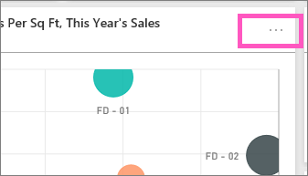

<properties
   pageTitle="在 Power BI 儀表板] 磚"
   description="關於在 Power BI 儀表板] 磚。 這包括從 SQL Server Reporting Services (SSRS) 建立的磚。"
   services="powerbi"
   documentationCenter=""
   authors="mihart"
   manager="mblythe"
   backup=""
   editor=""
   tags=""
   qualityFocus="monitoring"
   qualityDate="03/15/2016"/>

<tags
   ms.service="powerbi"
   ms.devlang="NA"
   ms.topic="article"
   ms.tgt_pltfrm="NA"
   ms.workload="powerbi"
   ms.date="10/24/2016"  
   ms.author="mihart"/>

# 在 Power BI 儀表板] 磚
## 儀表板] 磚

並排顯示是快照集的資料、 釘選到儀表板。 可以從報表、 資料集、 儀表板，從問與答] 方塊中，Excel，並從 SQL Server Reporting Services (SSRS) 中建立磚。  以下螢幕擷取畫面顯示許多不同的磚釘選到儀表板。

除了固定，可以建立獨立磚直接在儀表板使用 [新增磚](powerbi-service-add-a-widget-to-a-dashboard.md)。 獨立磚包含︰ 文字方塊、 影像、 視訊和 web 內容。

需要了解 Power BI 所組成的建置組塊的協助嗎？  請參閱 [Power BI-基本概念](powerbi-service-basic-concepts.md)。

>[AZURE.NOTE] 如果原始的視覺效果來建立並排顯示變更，不會變更磚。  例如，如果固定折線圖從報表，然後變更折線圖橫條圖，[儀表板] 磚會繼續顯示折線圖。 重新整理資料，但是視覺化類型並不會。

## 釘選磚，以從...

可從釘選磚︰

-   
            [Power BI 問與答](powerbi-service-pin-a-tile-to-a-dashboard-from-the-question-box.md)

-   
            [報表](powerbi-service-pin-a-tile-to-a-dashboard-from-a-report.md)

-   
            [另一個儀表板](powerbi-pin-a-tile-from-one-dashboard-to-another.md)

- 
            [商務用 onedrive 的 Excel 活頁簿](powerbi-service-pin-a-tile-to-a-dashboard-from-excel.md)

- 
            [適用於 Excel 的 power BI 發行者](powerbi-publisher-for-excel.md)

- 
            [即時掌握所有資訊](powerbi-service-auto-insights.md)

-   
            [SSRS](https://msdn.microsoft.com/library/mt604784.aspx)

獨立重疊顯示影像、 文字方塊、 視訊、 和 web 內容，可建立直接在儀表板使用 [新增磚](powerbi-service-add-a-widget-to-a-dashboard.md)。

  

## 互動儀表板上並排顯示

### 移動或調整大小方塊

抓取磚和 [儀表板上移動](powerbi-service-edit-a-tile-in-a-dashboard.md)。 將滑鼠停留，然後選取控點  調整方塊的大小。

### 將滑鼠停留在方塊，使其外觀和行為變更

1. 暫留在磚以顯示省略符號。

    
2. 選取省略符號以開啟 [並排顯示的 [動作] 功能表。

    

    您可以在這裡︰

  - 
            [編輯標題和副標題、 加入超連結、 顯示上次重新整理時間](powerbi-service-edit-a-tile-in-a-dashboard.md) 
  - 
            [並排顯示中所使用的資料匯出](powerbi-service-edit-a-tile-in-a-dashboard.md)

  - 
            [焦點模式中的檢視](powerbi-service-display-dash-in-focus-mode.md) 

  - 
             [釘選到另一個儀表板] 磚](powerbi-pin-a-tile-from-one-dashboard-to-another.md)

  - 
             [移除磚](powerbi-service-edit-a-tile-in-a-dashboard.md)

3. 若要關閉 [動作] 功能表，選取 [X 圖示 。

### 選取 （按一下） 磚
當您選取一張牌時，接下來取決於如何建立磚，以及它有 [自訂連結](powerbi-service-edit-a-tile-in-a-dashboard.md)。 如果是自訂的連結，選取 [] 磚帶您前往該連結。 否則，請選取該方塊會帶您前往報表、 線上 Excel 活頁簿、 SSRS 報表，會在內部或用來建立磚的問與答問題。

>[AZURE.NOTE] 這個例外狀況是視訊磚上直接建立儀表板使用 **新增磚**。 選取視訊的並排顯示 （也就建立這種方式） 會讓視訊播放直接出現在儀表板。   

## 秘訣與疑難排解  

- 如果未儲存的報表，用來建立視覺效果，然後選取該方塊會產生任何動作。

- 如果在 Excel Online 中的活頁簿中建立磚，而且您不需要至少讀取該活頁簿的權限，選取磚會開啟活頁簿在 Excel Online 中。

- 磚上直接建立儀表板使用 **新增磚**, ，如果尚未設定自訂的超連結，選取標題、 字幕、 和或磚會開啟該 URL。  否則，預設會選取其中一個影像，儀表板上直接建立這些動態方塊 web 程式碼或文字方塊中會產生執行任何動作。

- 如果您沒有權限 SSRS 時，選取從 SSRS 會建立一個方塊內的報表產生頁面，表示您沒有存取 (rsAccessDenied)。

- 如果您沒有存取網路的 SSRS 伺服器所在的位置，選取從 SSRS 建立磚將產品頁面，以指出找不到伺服器 (HTTP 404)。 您的裝置需要網路存取報表伺服器，以檢視報表。

- 如果原始的視覺效果來建立並排顯示變更，不會變更磚。  例如，如果固定折線圖從報表，然後變更折線圖橫條圖，[儀表板] 磚會繼續顯示折線圖。 重新整理資料，但是視覺化類型並不會。

## 請參閱  

            [從報表建立大的數字] 磚](powerbi-service-create-a-big-number-tile-from-a-power-bi-report.md)

            [從問與答建立大的數字] 磚](powerbi-service-create-a-big-number-tile-for-a-dashboard.md)

            [在 Power BI 儀表板](powerbi-service-dashboards.md)  

            [資料重新整理](powerbi-refresh-data.md)

            [Power BI-基本概念](powerbi-service-basic-concepts.md)

            [匯出至 Power Point 磚](http://blogs.msdn.com/b/powerbidev/archive/2015/09/28/integrating-power-bi-tiles-into-office-documents.aspx)

            [Power BI 儀表板的 pin Reporting Services 項目](https://msdn.microsoft.com/library/mt604784.aspx)

更多的問題嗎？ 
            [試用 Power BI 社群](http://community.powerbi.com/)
