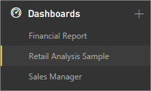

<properties
   pageTitle="在 Power BI 儀表板"
   description="在 Power BI 儀表板"
   services="powerbi"
   documentationCenter=""
   authors="mihart"
   manager="mblythe"
   backup=""
   editor=""
   tags=""
   qualityFocus="monitoring"
   qualityDate="03/15/2016"/>

<tags
   ms.service="powerbi"
   ms.devlang="NA"
   ms.topic="article"
   ms.tgt_pltfrm="NA"
   ms.workload="powerbi"
   ms.date="10/07/2016"
   ms.author="mihart"/>

# 在 Power BI 儀表板

儀表板、 報表和資料集是 Power BI 服務的核心。 建立個人化 ***儀表板*** 來監視您最重要的資料，一眼。  儀表板會結合內部部署與雲端架構資料在單一的半透明效果，不論資料所在的組織提供的彙總的檢視。 每個度量或深入了解，為儀表板上顯示 ***磚***。 

需要了解 Power BI 所組成的建置組塊的協助嗎？  請參閱 [Power BI-基本概念](powerbi-service-basic-concepts.md)。

有可供您使用 Power BI 的範例。 以下顯示零售分析範例。 如需此範例的詳細資訊，請參閱 [資料集取樣](powerbi-sample-datasets.md)。

每個方塊是資訊取自基礎的資料集的快照集。  了解如何 [將磚加入至儀表板](powerbi-service-dashboard-tiles.md)。 可以在儀表板磚 [調整大小、 移動、 刪除、 連結，及重新命名為](powerbi-service-edit-a-tile-in-a-dashboard.md)。 

### 建立儀表板

了解如何 [建立新的儀表板](powerbi-service-create-a-dashboard.md) 和新增磚。

### 將磚加入至儀表板

            [取得資料](powerbi-service-get-data.md) 和 [新增磚](powerbi-service-dashboard-tiles.md) 和 [影像、 視訊、 web 程式碼和文字方塊](powerbi-service-add-a-widget-to-a-dashboard.md) 儀表板的報表，問與答，SSRS 時，Excel 等等。

### 共用儀表板

了解如何 [與同事共用唯讀儀表板](powerbi-service-share-unshare-dashboard.md)。

了解如何 [共同擁有同事之間的儀表板](powerbi-service-organizational-content-packs-introduction.md)。

### 重新命名的儀表板

需要更具描述性的儀表板名稱嗎？  
            [將它重新命名](powerbi-service-rename-a-dashboard.md)。

### 列印 [儀表板

要進行的儀表板嗎？  
            [列印](powerbi-service-print.md)。

### 刪除儀表板

不再需要儀表板嗎？  
            [將它刪除](powerbi-service-delete-or-remove-a-dashboard.md)。

### 儀表板大小

顯示您的儀表板，而不需要的控制項和功能表使用 [全螢幕模式](powerbi-service-dash-and-reports-fullscreen.md)。

儀表板可能得較寬且超過瀏覽器視窗。 如果是的話，它們已捲軸。 因為您想要顯示重大一眼，建議您讓儀表板瀏覽器視窗大小。 如需更多秘訣，請參閱 [設計絕佳的儀表板的秘訣](powerbi-service-tips-for-designing-a-great-dashboard.md)。

### 在瀏覽窗格中使用的儀表板

Power BI 可以有多個儀表板-當您新增多個儀表板，其標題新增至清單下 **儀表板** 標題。  您目前正在檢視儀表板會反白顯示。 一次只能有一個儀表板可以開啟。

## 請參閱

[開始使用 Power BI](powerbi-service-get-started.md)

[Power BI-基本概念](powerbi-service-basic-concepts.md)

更多的問題嗎？ [試用 Power BI 社群](http://community.powerbi.com/)
