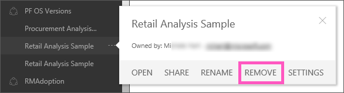

<properties
   pageTitle="移除儀表板"
   description="移除儀表板"
   services="powerbi"
   documentationCenter=""
   authors="mihart"
   manager="mblythe"
   backup=""
   editor=""
   tags=""
   qualityFocus="no"
   qualityDate=""/>

<tags
   ms.service="powerbi"
   ms.devlang="NA"
   ms.topic="article"
   ms.tgt_pltfrm="NA"
   ms.workload="powerbi"
   ms.date="10/01/2016"
   ms.author="mihart"/>

# 移除儀表板  

儀表板可以移除。 移除儀表板並不會刪除基礎資料集或是該儀表板與相關聯的任何報表。

-   如果您的儀表板擁有者，您可以將它移除。 如果您已經與同事共用儀表板，儀表板移除您的 Power BI 工作區不會移除儀表板從其 Power BI] 工作區。

-   如果已與您共用儀表板，您不再想要看到它，您可以將它移除。  移除儀表板並無法從其他人的 Power BI 工作區中移除。

-   如果儀表板屬於 [組織內容套件](powerbi-service-organizational-content-pack-delete.md), ，移除它的唯一方法是移除相關聯的資料集。

## 若要移除的儀表板  
1.  在瀏覽窗格中，以滑鼠右鍵按一下要移除的儀表板。  
    

2.  選取 **移除**。  移除儀表板並不會刪除基礎資料集或是該儀表板與相關聯的任何報表。

>[AZURE.NOTE] 儀表板的組織內容的一部分，組件已刪除的不同處理序。  請參閱 [刪除組織內容組件](powerbi-service-organizational-content-pack-delete.md)。

## 請參閱  

            [在 Power BI 儀表板](powerbi-service-dashboards.md)  

            [開始使用 Power BI](powerbi-service-get-started.md)  

            [Power BI-基本概念](powerbi-service-basic-concepts.md)

更多的問題嗎？ 
            [試用 Power BI 社群](http://community.powerbi.com/)
