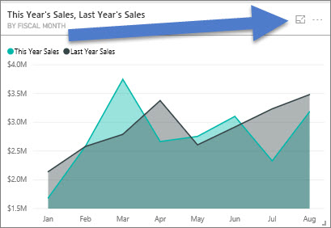
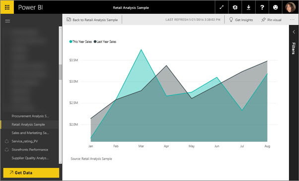

<properties
   pageTitle="儀表板並排顯示中聚焦模式"
   description="顯示的 Power BI 儀表板磚或焦點模式，亦即顯示出視覺化的報表文件。"
   services="powerbi"
   documentationCenter=""
   authors="mihart"
   manager="mblythe"
   backup=""
   editor=""
   tags=""
   featuredVideoId="dtdLul6otYE"
   qualityFocus="no"
   qualityDate=""/>

<tags
   ms.service="powerbi"
   ms.devlang="NA"
   ms.topic="article"
   ms.tgt_pltfrm="NA"
   ms.workload="powerbi"
   ms.date="08/29/2016"
   ms.author="mihart"/>

# 顯示儀表板磚或視覺焦點模式的報表

<iframe width="560" height="315" src="https://www.youtube.com/embed/dtdLul6otYE" frameborder="0" allowfullscreen></iframe>

## 什麼是焦點模式？  

            ***焦點*** 模式可讓您展開 （pop 外） 的儀表板] 磚或視覺化的報表，以查看詳細資料。  在 [儀表板圖格的焦點模式，您可以檢視和修改此視覺效果建立時已套用的篩選。  而在報表視覺焦點模式下，您可以檢視並修改視覺化層級和頁面層級篩選。

>[AZURE.NOTE] 目前，聚焦模式不是可從問答集建立的磚或地圖底圖。 

>[AZURE.NOTE]  > 重點是從全螢幕模式不同。  全螢幕模式適用於 [儀表板和報表 ](powerbi-service-dash-and-reports-fullscreen.md) 和 [磚](powerbi-service-display-tile-in-full-screen-mode.md)。

1.  將滑鼠停留在磚或視覺和選取 **聚焦模式** 圖示 。  

    

2.  它會開啟，並填滿整張畫布。 

    

3.  展開 [篩選] 窗格，以查看所有的篩選套用到此視覺化。  
    

4.  瀏覽進一步修改篩選條件，如果您發現一些有趣的東西，釘選視覺效果的儀表板。   

6.  離開焦點模式並返回儀表板選取 [焦點模式] 圖示 （在視覺效果的左上角）。

## 從模式焦點移至全螢幕模式
一旦在焦點模式中，磚或視覺接著可以 [檢視全螢幕 （電視模式）。](powerbi-service-display-tile-in-full-screen-mode.md)全螢幕模式顯示的功能表和瀏覽按鈕所干擾。

## 請參閱  
[在 Power BI 儀表板](powerbi-service-dashboards.md)  
[Power BI-基本概念](powerbi-service-basic-concepts.md)

更多的問題嗎？ [試用 Power BI 社群](http://community.powerbi.com/)
