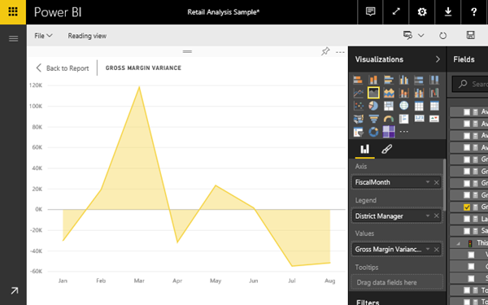
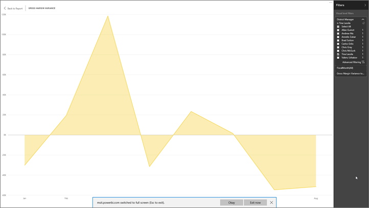

<properties
   pageTitle="儀表板並排顯示以全螢幕模式 （電視模式）"
   description="儀表板並排顯示以全螢幕電視"
   services="powerbi"
   documentationCenter=""
   authors="mihart"
   manager="mblythe"
   backup=""
   editor=""
   tags=""
   qualityFocus="no"
   qualityDate=""/>

<tags
   ms.service="powerbi"
   ms.devlang="NA"
   ms.topic="article"
   ms.tgt_pltfrm="NA"
   ms.workload="powerbi"
   ms.date="08/29/2016"
   ms.author="mihart"/>

# 在全螢幕模式中顯示儀表板] 磚

並排顯示，必須先 [彈出](powerbi-service-display-dash-in-focus-mode.md) 它們可以在全螢幕模式中顯示之前。

## 什麼是全螢幕模式？

顯示您 [儀表板、 報告](powerbi-service-dash-and-reports-fullscreen.md), ，和圖磚，而不受干擾的功能表和導覽按鈕。  您一眼隨時取得您企業的系統管理員權仗的完整檢視。 這有時候稱為電視模式。

全螢幕模式的一些用法如下︰

- 呈現您在會議或會議的標題
- 在辦公室專用大螢幕或投影機上顯示磚
- 查看小型螢幕上的磚
- 檢閱您的標題中的鎖定模式-您可以透過磚觸控螢幕或滑鼠，而不需要開啟基礎的報表

## 若要啟動全螢幕模式 （或關閉）

1. 
            [彈出磚，並顯示在聚焦模式](powerbi-service-display-dash-in-focus-mode.md)。

    

    您的並排顯示填滿報表畫布。

    

3. 從頂端功能表列中，選取此圖示     以全螢幕模式顯示磚。

4.  在全螢幕模式中，並排顯示填滿整個螢幕。

    

4. 若要結束全螢幕模式，請選取 **結束全螢幕** 位於螢幕的右下角的圖示。

    

## 請參閱

[在 Power BI 儀表板](powerbi-service-dashboards.md)

[Power BI-基本概念](powerbi-service-basic-concepts.md)

更多的問題嗎？ [試用 Power BI 社群](http://community.powerbi.com/)
