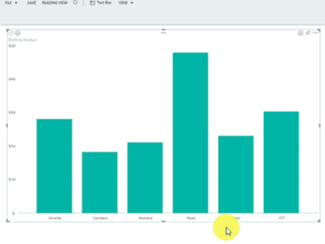
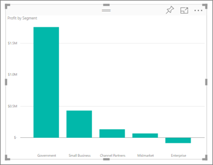
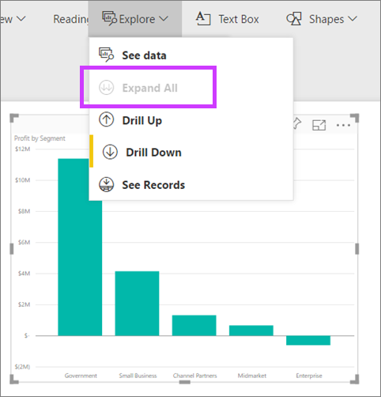
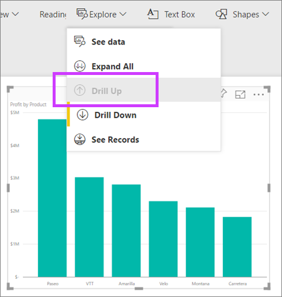

<properties
   pageTitle="在 Power BI 視覺效果，向下鑽研"
   description="本文件說明如何在 Microsoft Power BI 服務和 Power BI Desktop 視覺效果，向下鑽研。"
   services="powerbi"
   documentationCenter=""
   authors="mihart"
   manager="mblythe"
   backup=""
   editor=""
   tags=""
   qualityFocus="no"
   qualityDate=""/>

<tags
   ms.service="powerbi"
   ms.devlang="NA"
   ms.topic="article"
   ms.tgt_pltfrm="NA"
   ms.workload="powerbi"
   ms.date="10/08/2016"
   ms.author="mihart"/>

# 在 Power BI 視覺效果，向下鑽研

  <iframe width="560" height="315" src="https://www.youtube.com/embed/MNAaHw4PxzE?list=PL1N57mwBHtN0JFoKSR0n-tBkUJHeMP2cP" frameborder="0" allowfullscreen></iframe>

  >
            **請注意**︰ 若要了解如何建立使用 Power BI Desktop 的階層，請觀看影片 [如何建立和加入階層](https://youtu.be/q8WDUAiTGeU)

##  向下切入 2 方法
2 個不同方式來向下切入您視覺效果中的 [向下 （和向上）。  同時會在本文中所述。 這兩種方法來完成相同的事，因此，使用您最喜歡的其中一個。

## 向下鑽研的方法 1

1.  在 Power BI 中開啟報表 [讀取檢視](powerbi-service-open-a-report-in-reading-view.md) 或 [編輯檢視](powerbi-service-go-from-reading-view-to-editing-view.md)。 向下切入需要視覺效果的階層。 

    階層如下所示。   *收益依產品 *視覺效果具有組成階層 **產品 **和 **區段**; 每個產品都有一個或多個區段。 根據預設，視覺效果只有顯示產品的資料，因為 *產品 *會出現在上述的軸值區 *區段*。

2.  若要啟用向下鑽研，選取在視覺效果的右上角的箭號圖示。 深色圖示時，會啟用鑽研。

    >
            **請注意**︰ 動畫所示，使用 [編輯] 檢視中的 [向下鑽研。  編輯檢視可讓我們查看階層--貯體中軸的兩個欄位。

    

3.  若要向下鑽研一個欄位，一次，請按兩下圖表軸的其中一個。 

    

4.  向下鑽研的所有欄位一次，選取左上角的視覺效果中的雙箭頭。

    

5.  若要向下鑽研備份，選取左上角的視覺效果中的向上箭號。

    

## 向下鑽研的方法 2

1.  在 Power BI 中開啟報表 [讀取檢視](powerbi-service-open-a-report-in-reading-view.md) 或 [編輯檢視](powerbi-service-go-from-reading-view-to-editing-view.md)。 向下切入需要視覺效果的階層。 

    階層是從財務範例如下所示。   *收益依產品 *視覺效果具有組成階層 **產品 **和 **區段**; 每個產品都有一個或多個區段。 根據預設，視覺效果只有顯示產品的資料，因為 *產品 *會出現在上述的軸值區 *區段*。

    

2.  若要啟用向下鑽研，選取 **瀏覽** > **向下切入**。 下一步的黃色列 **向下切入** 您讓我們知道它已啟用。  

    

3.  一旦啟用之後，向下鑽研一個欄位一次按兩下圖表軸的其中一個。 我在此範例中，按兩下名為 「 產品 **Velo** 查看區段所 Velo 的收益。

    

4.  若要向下鑽研的所有欄位一次，選取 **全部展開**。

    

5.  若要向下鑽研備份，請選取 **向上切入**。

    

6.  若要查看用來建立視覺效果的資料，請選取 **看到資料**。 資料會顯示在視覺效果下方的窗格。 這個窗格會維持不變您繼續鑽研視覺效果。

    

### 請參閱

[Power BI 報表中的視覺效果](powerbi-service-visualizations-for-reports.md)

[Power BI 預覽報表](powerbi-service-reports.md)

[Power BI 預覽的基本概念](powerbi-service-basic-concepts.md)

更多的問題嗎？ [試用 Power BI 社群](http://community.powerbi.com/)
