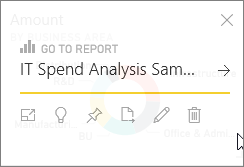
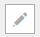
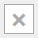

<properties
   pageTitle="編輯磚-調整大小、 移動、 重新命名、 釘選、 刪除、 加入超連結"
   description="文件說明如何編輯儀表板磚-調整大小、 移動、 重新命名、 釘選、 刪除、 加入超連結。"
   services="powerbi"
   documentationCenter=""
   authors="mihart"
   manager="mblythe"
   backup=""
   editor=""
   tags=""
   featuredVideoId="lJKgWnvl6bQ"
   qualityFocus="no"
   qualityDate=""/>

<tags
   ms.service="powerbi"
   ms.devlang="NA"
   ms.topic="article"
   ms.tgt_pltfrm="NA"
   ms.workload="powerbi"
   ms.date="08/24/2016"
   ms.author="mihart"/>

# 編輯磚-調整大小、 移動、 重新命名、 釘選、 刪除、 加入超連結

您可以變更儀表板中並排顯示的外觀和預設行為。

<iframe width="560" height="315" src="https://www.youtube.com/embed/lJKgWnvl6bQ" frameborder="0" allowfullscreen></iframe>

本文章涵蓋下列項目。

-   [釘選到不同的儀表板] 磚](#different)

-   [重新命名磚](#rename)

-   [將磚](#move)

-   [調整大小，並排顯示](#resize)

-   [加入磚的超連結](#hyperlink)

-   [刪除磚](#delete)

    >[AZURE.NOTE] 若要變更根據本身的方塊中顯示的視覺效果，刪除該方塊，並加入新 [儀表板磚](powerbi-service-dashboard-tiles.md)。

##  如何開始   

1.  在 [儀表板](powerbi-service-dashboards.md), ，[取得資料 ](powerbi-service-get-data.md), ，並將磚加入。 

    

2.  將滑鼠停留在儀表板] 方塊中，選取 [顯示選項的省略符號。

    

## 釘選到不同的儀表板] 磚

1.    選取 [釘選圖示  。

2.  決定是否要釘選到現有的儀表板或新的儀表板。 

    

3.  選取 **Pin**。

****

## 重新命名磚

-   選取的鉛筆圖示     編輯磚的標題。

****

## 將磚移動

-   選取 [按住不放磚便可將它拖曳至新位置中，儀表板畫布上。

****

## 調整大小方塊

您可以讓磚許多不同的大小-從 1x1 tile 單位總至 5 x 5。

-    選取並拖曳控點 （在右下角），來調整並排顯示大小。
    

****

## 將超連結加入至儀表板] 磚

根據預設，按一下磚帶您磚建立所在的報表或問答集 （如果問答集建立磚）。 若要連結至某網頁，另一個儀表板、 SSRS 報表或其他線上內容-新增自訂的連結︰

1.    選取的鉛筆圖示   編輯方塊。

2.    將核取記號 **組自訂連結** 並輸入的 URL。

****

## 刪除區塊

-   選取 X 圖示  刪除磚。 刪除磚不會刪除基礎的報表。

****

## 請參閱

[在 Power BI 儀表板] 磚](powerbi-service-dashboard-tiles.md)

[在 Power BI 儀表板](powerbi-service-dashboards.md)

[Power BI-基本概念](powerbi-service-basic-concepts.md)

更多的問題嗎？ [試用 Power BI 社群](http://community.powerbi.com/)
