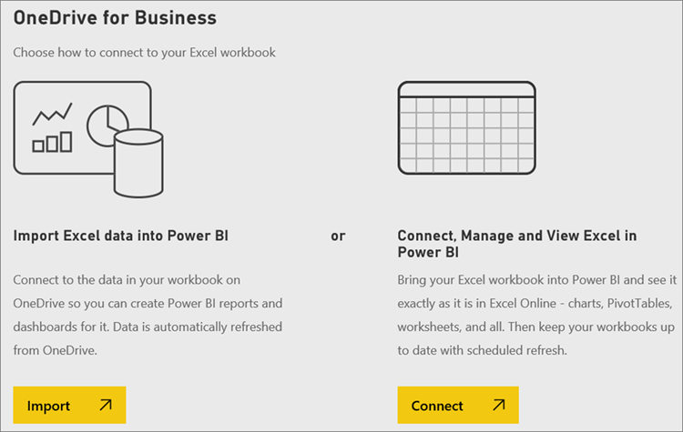

<properties
    pageTitle="從 Excel 活頁簿檔案取得資料"
    description="了解如何從 Excel 活頁簿檔案將資料送入 Power BI"
    services="powerbi"
    documentationCenter=""
    authors="davidiseminger"
    manager="mblythe"
    backup=""
   editor=""
    tags=""
   qualityFocus="monitoring"
   qualityDate="05/25/2016"/>

<tags
    ms.service="powerbi"
    ms.devlang="NA"
    ms.topic="article"
    ms.tgt_pltfrm="NA"
    ms.workload="powerbi"
    ms.date="09/29/2016"
    ms.author="davidi"/>

# 從 Excel 活頁簿檔案取得資料

Microsoft Excel 是其中一個最普遍使用的商務應用程式。 它也是其中一種最常見的方式來將資料送入 Power BI。

## Power BI 支援何種類型的活頁簿？

Power BI 支援匯入或連接到在 Excel 2007 和更新版本所建立的活頁簿。 活頁簿必須儲存為.xlsx 或.xlsm 檔案類型，而且會在 1 GB。 只使用在新版 Excel 中的這篇文章中所述的某些功能。

#### 使用範圍或資料表的資料的活頁簿

如果您的活頁簿有大範圍的資料的簡單工作表，若要在 Power BI 中充分運用您的資料是確定格式化為資料表的範圍。 如此一來，在 Power BI 中建立報表時您會看到已命名的資料表和資料行中的欄位] 窗格中，讓它更容易將資料視覺化。

#### 資料模型的活頁簿

活頁簿可以包含資料模型與一個或多個資料表的資料載入到它，藉由使用連結的資料表，Power Query 取得 & Excel 2016 中轉換、 或 Power Pivot。 Power BI 支援所有的資料模型內容，例如關聯性、 量值、 階層和 Kpi。

>   注意︰ Power BI 租用戶之間無法共用活頁簿的資料模型。 例如，使用者登入 Power BI 使用 *contoso.com* 帳戶無法登入 Power BI 從登入帳戶的使用者與共用 Excel 活頁簿 *woodgrovebank.com*。

#### 連線到外部資料來源的活頁簿

如果您使用 Excel 來連接至外部資料來源，Power BI 活頁簿之後，您可以建立報表和儀表板，根據該連接的資料來源的資料。 您也可以設定排程以自動連接到資料來源的權限，並取得更新的重新整理。 您將不再需要手動重新整理資料功能區上，在 Excel 中。 在報表中的任何視覺效果和在該資料來源的資料為基礎的儀表板] 磚會自動更新。 若要深入了解，請參閱 [Power BI 中的資料重新整理](articles/powerbi-refresh-data.md)。

#### 具有 Power View 工作表、 樞紐分析表和圖表的活頁簿

您如何 PowerView 工作表和樞紐分析表和圖表會出現，或未出現在 Power BI，取決於活頁簿檔案的儲存位置，並選擇將送入 Power BI 的方式。 我們將討論下列這個詳細資訊。

#### 資料類型

Power BI 可支援下列資料類型︰ 整數、 十進位數字、 貨幣、 日期、 True/False、 文字。 在 Excel 中的類型會標示為特定資料的資料來改善 Power BI 體驗。

### 準備您的活頁簿 Power bi

此影片有幫助能深入了解如何確定您的 Excel 活頁簿已做好 Power BI。

<iframe width="500" height="281" src="https://www.youtube.com/embed/l2wy4XgQIu0" frameborder="0" allowfullscreen></iframe>

## 儲存活頁簿檔案差異

            **本機** -如果您儲存活頁簿檔案在本機磁碟機上您的電腦或另一個位置在您的組織從 Power BI，您可以載入檔案到 Power BI。 讓整個檔案不真的匯入 Power BI，您的檔案實際上會保留在本機磁碟機。 真正發生的情況是在 Power BI 中建立新的資料集和資料和活頁簿的資料模型 （如果有的話） 會載入到資料集。 如果您的活頁簿有任何 Power View 工作表，這些會出現在 [報表] 下的 Power BI 網站。 也有 Excel 2016 **發行** 功能 (在 **檔案** 功能表)。 使用 **發行** 實際上是使用相同 **取得資料 > 檔案 > 本機檔案** 從 Power BI，但通常是容易更新您在 Power BI 中的資料集，如果您定期活頁簿進行變更。

            **OneDrive-商務** – 如果您有商務用 OneDrive，而您登入使用相同的帳戶登入與 Power BI，這是由遠方最有效的方法讓工作在 Excel 您資料集、 報表和儀表板 Power BI 中的保持同步。 因為 Power BI 和 OneDrive 位於定域機組，Power BI *連接* 至您的活頁簿檔案放在 OneDrive 上大約每個小時。 如果找不到任何變更，您的資料集、 報表和儀表板會自動更新，Power BI。 如果您在本機磁碟機儲存您的活頁簿，如同您也可以使用發佈更新資料集和 Power BI 中的報表立即;否則 Power BI 會自動同步處理，通常會在一小時內。

            **OneDrive-個人** – 如果您將活頁簿檔案儲存至您自己的 OneDrive 帳戶時，您會得到許多相同的優點就與商務用 OneDrive。 最大的差異是當您第一次連接到您的檔案 (使用取得資料 > 檔案 > OneDrive-個人) 需要您的 OneDrive 與您通常不同於您用於登入 Power BI 的 Microsoft 帳戶登入。 當登入您的 OneDrive 與您的 Microsoft 帳戶，請務必在選項中選取 [讓我保持登。 如此一來，Power BI 無法連接到您的活頁簿檔案大約每個小時，並確定您的資料集，並在 Power BI 中的報表是在同步處理。

            **SharePoint 小組網站** – 將 Power BI Desktop 檔案儲存到 SharePoint – 小組網站時，就如同儲存至商務用 OneDrive。 最大的差別是如何連接至檔從 Power BI。 您可以指定 URL，或連線至根資料夾。

## 一個 Excel 活頁簿 – 兩個的使用方式
如果您儲存活頁簿檔案 **OneDrive**, ，您必須透過數種方式，您可以瀏覽 Power BI 中的資料

### Excel 資料匯入至 Power BI
當您選擇 **匯入**, ，資料表和/或資料模型中的任何支援的資料匯入至 Power BI 中的新資料集。 如果您有任何 Power View 工作表時，這些將重新建立 Power BI 中與報表。

您可以繼續編輯您的活頁簿。 儲存您的變更，它們會內進行同步處理與 Power BI 中的資料集通常大約一小時。 如果您需要更多的立即 gratification，同樣地，您可以按一下發行，並會當場匯出您的變更。 您在報表中有任何視覺效果和儀表板將會更新，太。

如果您使用 Get 和轉換資料或 Power Pivot 資料載入資料模型，或如果您的活頁簿具有 Power View 工作表與視覺效果要在 Power BI 中查看，請選擇這個選項。

在 Excel 2016 中，您也可以使用發行 > 匯出。 它是幾乎相同的動作。 若要深入了解，請參閱 [從 Excel 2016 發行至 Power BI](powerbi-service-publish-from-excel.md)。

### 連接、 管理及 Power BI 中檢視 Excel
當您選擇 **連接**, ，就像在 Excel Online 中一樣，將會出現在 Power BI 的活頁簿。 但不同於 Excel Online 中，您將有一些很棒的功能，可協助您從您的工作表固定項目由右至儀表板。

您無法編輯 Power BI 的活頁簿。 但如果您需要進行一些變更，您可以按一下 [編輯]，然後選擇 [編輯您在 Excel Online 中的活頁簿，或在 Excel 中開啟您的電腦上。 您所做的任何變更會放在 OneDrive 上儲存活頁簿。

選擇這種方式，是在 Power BI 中建立不到資料集。 您的活頁簿會出現在 [報表] 下您 Power BI] 工作區瀏覽窗格中。 已連接的活頁簿是以特殊的 Excel 圖示。

如果您只在資料工作表，或者您有範圍、 樞紐分析表和圖表，您要釘選到儀表板，請選擇這個選項。

在 Excel 2016 中，您也可以使用發行 > 上傳。 它是幾乎相同的動作。 若要深入了解，請參閱 [從 Excel 2016 發行至 Power BI](articles/powerbi-service-publish-from-excel)。

## 匯入，或從 Power BI 連接到 Excel 活頁簿

1.  在 Power BI 中瀏覽窗格中，按一下 **取得資料**。

    

2.  在檔案中，按一下 [ **取得**。

    

3.  尋找檔案。

    

4.  如果您的活頁簿檔案是在 OneDrive 或 SharePoint-小組網站選擇 **匯入** 或 **連接**。

## 本機的 Excel 活頁簿
您也可以使用本機的 Excel 檔案，並將它上傳到 Power BI。 只需選取 **本機檔案** 從上一個功能表，然後瀏覽至您有儲存 Excel 活頁簿。

一旦選取此選項，選擇將您的檔案上傳到 Power BI。

一旦上傳您的活頁簿時，您會收到通知，活頁簿已準備好。

活頁簿準備就緒後，您可以找到它在 **報表** Power BI 的區段。

## 從 Excel 2016 發行到 Power BI 網站
使用 **發行到 Power BI** Excel 2016 功能實際上是使用相同 **取得資料** Power BI 來匯入或連接至您的檔案中。 我們不會詳述細節，但是您可以看到 [從 Excel 2016 發行至 Power BI](articles/powerbi-service-publish-from-excel.md) 若要深入了。

## 新功能

            **瀏覽資料** -一旦您將資料和報告檔中送入 Power BI，現在是時候來瀏覽。 只要以滑鼠右鍵按一下新的資料集，然後按一下 [瀏覽。 如果您選擇連接到活頁簿檔案放在 OneDrive 上在步驟 4 中，您的活頁簿將會顯示在報表中。 當您按一下它時，它會開啟中 Power BI，就像是在 Excel Online 中一樣。

            **排程重新整理** -如果您的 Excel 活頁簿檔案連接到外部資料來源，或從本機磁碟機中匯入、 您可以設定排定的重新整理，以確定您的資料集或報表永遠是最新。 在大部分情況下，設定排定的重新整理是相當容易，但是進入細節已超出本文的範圍。 請參閱 [Power BI 中的資料重新整理](articles/powerbi-refresh-data.md) 若要深入了。

## 疑難排解

活頁簿檔案太大？ 簽出 [減少在 Power BI 中檢視 Excel 活頁簿大小](articles/powerbi-reduce-the-size-of-an-excel-workbook.md)。

目前，當您選擇匯入，Power BI 只會匯入資料的已命名的資料表或資料模型的一部分。 如此一來，如果活頁簿包含任何具名的資料表、 Power View 工作表或 Excel 資料模型，您可能會看到此錯誤︰ **「 我們找不到任何資料到 Excel 活頁簿 」**。 
            [這篇文章](articles/powerbi-admin-troubleshoot-excel-workbook-data.md) 說明如何修正您的活頁簿並重新匯入。

## 請參閱
[從 Excel 2016 發行至 Power BI](articles/powerbi-service-publish-from-excel.md)

[適用於 Excel 的 power BI 發行者](articles/powerbi-publisher-for-excel.md)

[在 Power BI 中的資料重新整理](articles/powerbi-refresh-data.md)
