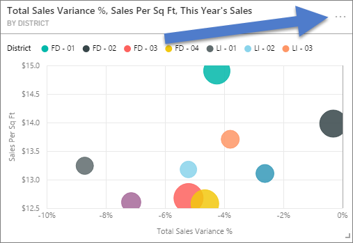
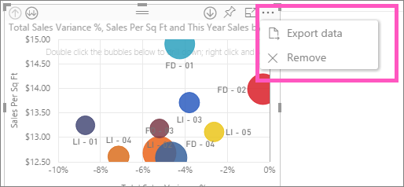

<properties
   pageTitle="從視覺效果匯出資料"
   description="從報表視覺效果和儀表板的視覺效果匯出資料"
   services="powerbi"
   documentationCenter=""
   authors="mihart"
   manager="mblythe"
   backup=""
   editor=""
   tags=""
   featuredVideoId="jtlLGRKBvXY"
   qualityFocus="no"
   qualityDate=""/>

<tags
   ms.service="powerbi"
   ms.devlang="NA"
   ms.topic="article"
   ms.tgt_pltfrm="NA"
   ms.workload="powerbi"
   ms.date="08/25/2016"
   ms.author="mihart"/>

# 從 Power BI 視覺效果匯出資料
可以從儀表板和報告中的視覺效果匯出資料。  

>[AZURE.NOTE] 您可以下載的資料列的數目上限為 10000。

觀看 Amanda 匯出使用她的儀表板中的資料，並將它儲存成.csv 檔案。 然後遵循以下視訊，試試看您自己的逐步指示。

<iframe width="560" height="315" src="https://www.youtube.com/embed/jtlLGRKBvXY?start=61" frameborder="0" allowfullscreen></iframe>

## 儀表板視覺效果的資料匯出

1. 選取右上角的視覺效果中的省略符號。

    

2. 選擇  **匯出資料** 圖示。

    

    將資料匯出至 CSV 檔案。 如果篩選視覺效果時，下載的資料將也篩選。

3. 在 Excel 中開啟 CSV 檔案。

    

    >[AZURE.NOTE] 如果沒有在.csv 檔案中的 unicode，在 Excel 中的文字可能無法正常顯示。 不過，您也可以開啟 [記事本] 中將會正常運作。 Unicode 的範例是貨幣符號和外部索引的字。 因應措施是 csv 匯入 Excel，，而不是直接開啟 csv。 若要這樣做︰ 1。 開啟 Excel 2。 從 **資料** 索引標籤上，選取 **取得外部資料** > **從文字**。

## 匯出報表視覺效果的資料

1. 選取右上角的視覺效果中的省略符號。 選擇  **匯出資料**。

    

    >[AZURE.NOTE] 若要移除的視覺效果選項僅供以 [報表編輯檢視](powerbi-service-go-from-reading-view-to-editing-view.md)。

2. 請參閱上述步驟 3。

## 請參閱

[在 Power BI 儀表板](powerbi-service-dashboards.md)

[在 Power BI 中的報表](powerbi-service-reports.md)

[Power BI-基本概念](powerbi-service-basic-concepts.md)

更多的問題嗎？ [試用 Power BI 社群](http://community.powerbi.com/)
