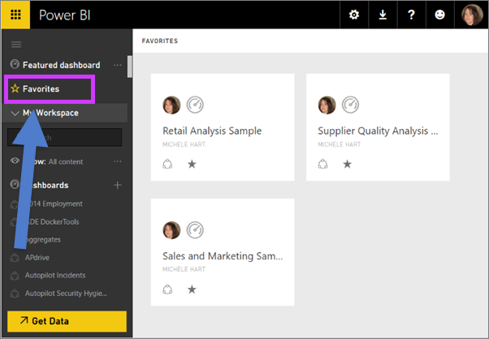

<properties
   pageTitle="在 Power BI 最愛的儀表板"
   description="文件中有關儀表板為 Power BI 中的 [我的最愛]"
   services="powerbi"
   documentationCenter=""
   authors="mihart"
   manager="mblythe"
   backup=""
   editor=""
   tags=""
   qualityFocus="no"
   qualityDate=""/>

<tags
   ms.service="powerbi"
   ms.devlang="NA"
   ms.topic="article"
   ms.tgt_pltfrm="NA"
   ms.workload="powerbi"
   ms.date="10/07/2016"
   ms.author="mihart"/>

# 在 Power BI 最愛的儀表板

當您對儀表板 *最愛*,  ，您可以存取所有的工作區。  最愛的儀表板通常是指您最常瀏覽。

>[AZURE.NOTE] 您也可以選取做為單一儀表板 [精選的儀表板](powerbi-service-featured-dashboards.md) Power BI 中。

## 為 「 我的最愛 」 加入儀表板

1.  在左的導覽窗格中，選取 [儀表板。

2.  從右上角中，選取 **最愛**。

    

3. 若要查看所有儀表板，您將新增為左 navpane，在 [我的最愛] 選取 **我的最愛**。

    

  從這裡您可以選取的儀表板，以開啟它，或與同事共用儀表板。

## 中移除最愛的儀表板

就像您使用，不能再使用儀表板嗎？  您可以中移除最愛它。

1.  在左的導覽窗格中，選取 [儀表板。

2.  從右上角中，選取 **Unfavorite**。  儀表板會從您最愛，而不是從您的 Power BI 中移除。

## 請參閱

[開始使用 Power BI](powerbi-service-get-started.md)

[Power BI-基本概念](powerbi-service-basic-concepts.md)

更多的問題嗎？ [試用 Power BI 社群](http://community.powerbi.com/)
