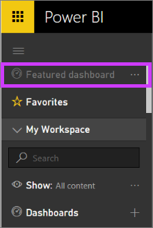
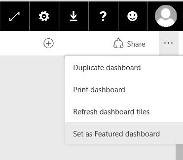

<properties
   pageTitle="在 Power BI 中的精選儀表板"
   description="如何在 Power BI 中建立的精選的儀表板上的文件"
   services="powerbi"
   documentationCenter=""
   authors="mihart"
   manager="mblythe"
   backup=""
   editor=""
   tags=""
   featuredVideoId="6aTiAK-oiJ8"
   qualityFocus="no"
   qualityDate=""/>

<tags
   ms.service="powerbi"
   ms.devlang="NA"
   ms.topic="article"
   ms.tgt_pltfrm="NA"
   ms.workload="powerbi"
   ms.date="08/25/2016"
   ms.author="mihart"/>

# 在 Power BI 中的精選儀表板

## 建立優惠的儀表板

許多您有一個您瀏覽超過任何其他的儀表板。  它可能是您用來執行您的企業儀表板，或可能包含許多不同的儀表板和報表的並排顯示彙總。

若要讓您更輕鬆地連線到您關心的儀表板最，我們新增了功能在您的工作區中的儀表板的功能。 這表示 Power BI 會永遠開啟此儀表板 （而不是您瀏覽的最後一個儀表板）。  您也可以選取在任何時間到達精選的儀表板和  **精選的儀表板** 左的導覽窗格中。

>
            **請注意**︰ 您也可以選取幾個儀表板，並設定為 *我的最愛*。 請參閱 [儀表板的最愛](powerbi-service-favorite-dashboards.md)。

 **精選的儀表板** 您左 navpane 一節將會呈現灰色，直到您設定儀表板功能。

### 若要設定的儀表板為 **精選**

觀看 Amanda 建立精選的儀表板，然後依照 [視訊下列指示來試試看自己。

<iframe width="560" height="315" src="https://www.youtube.com/embed/7-gQWhUZSsk" frameborder="0" allowfullscreen></iframe>

1. 從儀表板右上角，選取 [...] 選擇 [ **設成精選的儀表板**。

    

2. 確認您的選擇。

    

3. 您會看到成功訊息之後 **精選的儀表板** 中左 navpane 啟動選項。

    

## 變更精選的儀表板

當然，如果您改變心意稍後您可以設定新的儀表板的精選的儀表板，或您可以完全移除精選的儀表板。

1. 選取 [...] 選擇 [ **停用功能的儀表板**。

    

2. 確認您不再想要這個特定的儀表板的功能。 未包含儀表板不會移除從工作區。  

    

## 請參閱

[開始使用 Power BI](powerbi-service-get-started.md)

[Power BI-基本概念](powerbi-service-basic-concepts.md)

更多的問題嗎？ [試用 Power BI 社群](http://community.powerbi.com/)
