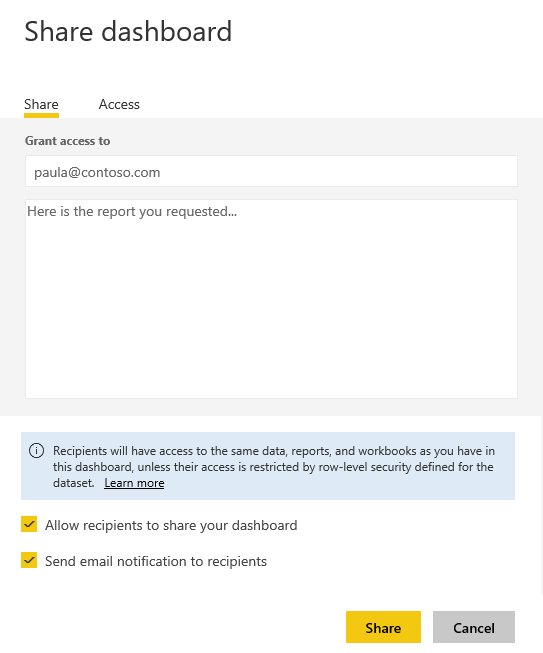

<properties
   pageTitle="教學課程︰ 從 Excel 活頁簿中沒有時間驚人的報表"
   description="教學課程︰ 從 Excel 活頁簿中沒有時間驚人的報表"
   services="powerbi"
   documentationCenter=""
   authors="mihart"
   manager="mblythe"
   backup=""
   editor=""
   tags=""
   qualityFocus="no"
   qualityDate=""/>

<tags
   ms.service="powerbi"
   ms.devlang="NA"
   ms.topic="article"
   ms.tgt_pltfrm="NA"
   ms.workload="powerbi"
   ms.date="10/01/2016"
   ms.author="mihart"/>

# 從 Excel 活頁簿中沒有時間驚人的報表

您的專案經理想要查看報表上您最新的銷售數字與過去的活動感想結合一天的結束。 但最新的資料位於膝上型電腦中的檔案和各種協力廠商系統上。 在過去花時間來建立視覺效果和格式化報表。 您開始覺得想。

別客氣 透過 Power BI，您可以建立令人讚嘆的報表中沒有時間。

在此範例中，我們將上傳 Excel 檔案從本機系統、 建立新的報表，並與同事分享 — 全都從 Power BI 中。

## 準備您的資料

我們來看一個簡單的 Excel 檔案做為範例。 載入 Power BI 的 Excel 檔案之前，您必須將組織二維資料表中的資料。 這表示每個資料行包含相同的資料類型-例如，文字、 日期、 數字或貨幣。 您應該會有標題列中，但不是應該有任何資料行或資料列，顯示總計。

接下來，格式化為資料表的資料。 在 Excel 中，在 [首頁] 索引標籤的 [樣式] 群組中選取 **格式為表格**。 選取要套用至您的工作表的資料表樣式。 現在準備好要載入 Power BI Excel 工作表。

## 將您的 Excel 檔案上傳到 Power BI

Power BI 連接至各種資料來源，包括您的電腦上的 Excel 檔案。 若要開始，登入 Power BI。 如果您還沒有註冊， [可以免費進行](https://powerbi.com)。

您想要建立新的儀表板。 在左瀏覽窗格中，旁邊 **儀表板**, ，選取加號。 輸入新儀表板的名稱。

在左窗格底部，選取 **取得資料**。 在 [取得資料] 頁面的 [匯入或連接到資料，請在 [檔案] 方塊中，選取 [ **取得**。

在 [檔案] 頁面中，選取 [ **本機檔案**。 瀏覽至您的電腦上的 Excel 活頁簿檔案，並選取它，以便載入 Power BI。

>
            **請注意**︰ 若要依照本教學課程的其餘部分，使用 [財務範例活頁簿](powerbi-sample-download-the-financial-sample-workbook.md)。

## 建立報表

Power BI 載入您的 Excel 活頁簿之後，開始建立報表。 在左瀏覽窗格中，在 **資料集** 區段中，選取您剛匯入的資料集。 Power BI 顯示報表畫布。 在右邊的 [視覺效果和欄位] 窗格。

請注意您 Excel 活頁簿的資料表資料會出現在 [欄位] 窗格。 資料表的名稱、 Power BI 會列出資料行標題，做為個別欄位。

現在您可以開始建立視覺效果。 您的專案經理想要查看一段時間的收益。 在 [欄位] 窗格中，拖曳 **收益** 報表畫布。 Power BI 預設會顯示橫條圖。 接著，您可以拖曳 **日期** 報表畫布。 Power BI 更新橫條圖來顯示日期的利潤。

>
            **秘訣**︰ 如果您的圖表看起來如預期般，檢查彙總。 例如，在 **值** ，以滑鼠右鍵按一下您剛才加入的欄位，並確定資料彙總您想要的方式。  在此範例中，我們將使用 **總和**。

您的經理想要知道最有利潤的國家 （地區）。 讓她使用地圖視覺效果。 選取您在畫布上，並從 [欄位] 窗格的空白區域，只要拖曳 **國家/地區** 然後 **收益** 欄位。 Power BI 建立地圖視覺與 （泡泡） 代表每個位置相對的收益。

呢產品和市場區段所顯示的視覺顯示銷售嗎？ 簡單。 在 [欄位] 窗格中，選取 [銷售] 旁邊的核取方塊產品] 和 [區段] 欄位。 Power BI 會立即建立橫條圖。 視覺效果] 功能表中選擇其中一個圖示來變更圖表類型。 例如，變更至堆疊橫條圖。  若要排序的圖表，請選取 [省略符號 （...） > **排序**。

釘選所有視覺效果儀表板。 您要與同事共用。

## 共用您的儀表板

您想要分享您的管理員，Paula 儀表板。 您可以使用任何具有 Power BI 帳戶的同事共用您的儀表板與基礎報表。 它們可以與報表互動，但無法儲存變更。

若要共用您的報表頂端的 [儀表板中，選取 **共用**。

Power BI 顯示共用儀表板頁面。 在上層區域中，輸入收件者電子郵件地址。 加入下列欄位中的訊息。 若要允許收件者與其他人分享您的儀表板，請選取 **允許收件者共用您的儀表板**。 選取 **共用**。

請參閱

- [開始使用 Power BI 服務](powerbi-service-get-started.md)

- [開始使用 Power BI Desktop](powerbi-desktop-getting-started.md)

- [Power BI-基本概念](powerbi-service-basic-concepts.md)

-  更多的問題嗎？ [試用 Power BI 社群](http://community.powerbi.com/) 
