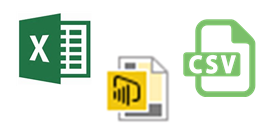
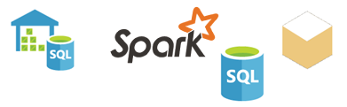

<properties
   pageTitle="Power bi 資料來源"
   description="Power bi 資料來源"
   services="powerbi"
   documentationCenter=""
   authors="davidiseminger"
   manager="mblythe"
   backup=""
   editor=""
   tags=""
   qualityFocus="identified"
   qualityDate=""/>

<tags
   ms.service="powerbi"
   ms.devlang="NA"
   ms.topic="get-started-article"
   ms.tgt_pltfrm="NA"
   ms.workload="powerbi"
   ms.date="09/29/2016"
   ms.author="davidi"/>

# Power BI 服務的資料來源

資料是 Power BI 的核心。 每當您要瀏覽資料，建立圖表和儀表板，詢問問題的問答集，所有這些視覺效果和解答，您會看到真的從資料集取得其基礎資料。 但是，該資料集來自何處？ 嗯，從資料來源。

在本文中，我們會透過不同類型的資料來源，您可以從 Power BI 服務連接到。 請記住，有許多其他類型的資料來源，您也可以取得資料的來源。 但是，可能需要先使用 Power BI Desktop 或 Excel 的進階的資料查詢與模型功能。 我們將討論更詳盡的資訊更新版本。 現在，讓我們看看不同類型的資料來源，您可以從您的 Power BI 服務網站連接到右邊。

您可以從任何 Power BI 中的這些資料來源取得資料，依序按一下 **我的工作區** > **取得資料**。

## 檔案

            **Excel** （.xlsx、 xlxm） – Excel 是唯一的因為活頁簿可以有兩個您所輸入自己的工作表的資料，或您可以查詢與使用 Power Query 將資料載入從外部資料來源取得 & Excel 2016 中轉換或 Power Pivot。 資料可以是簡單的工作表中，或載入資料模型。 若要深入了解，請參閱 [取得資料從 Excel](powerbi-service-get-data-from-files.md)。

            **Power BI Desktop** (.pbi)-您可以使用 Power BI Desktop 來查詢和外部資料來源載入資料、 擴充您的資料模型的量值和關聯性，以及建立報表。 您可以將您 Power BI Desktop 檔案匯入 Power BI 網站。 Power BI Desktop 是最佳的進階使用者充分了解資料來源、 資料查詢及轉換和資料模型化的概念。 若要深入了解，請參閱 [連接至 Power BI Desktop 中的資料](powerbi-desktop-connect-to-data.md)。

            **以逗號分隔值** (.csv) 的檔案是簡單的文字檔案的資料列。 每個資料列可以包含一或多個值，並以逗號區隔。 範例、.csv 包含名稱和地址資料可擁有許多資料列，其中每個資料列會具有值的名字、 姓氏、 街道地址、 縣 （市），狀態時，等等。 您無法匯入資料至.csv 檔案，但是許多應用程式，類似 Excel，可以將簡單的資料表資料儲存成.csv 檔案。

您可以使用 XML 資料表 (.xml) 或文字檔 (.txt) 等其他檔案類型，取得與查詢、 轉換和該資料載入 Excel 或 Power BI Desktop 檔案第一次轉換。 您可以再將 Excel 或 Power BI Desktop 檔案匯入 Power BI。

您用來儲存檔案時，也讓主要的差別。 商務用 OneDrive 可提供最大的彈性和與 Power BI 的整合。 如果您保留本機磁碟機上的檔案，好吧，但如果您需要重新整理資料，涉及一些額外的步驟。 連結文件中提供更多詳細資料。

## 內容組件

內容組件包含的所有資料和您已經準備好您需要的報表。 在 Power BI 中有兩種類型的內容組件。與服務，例如 Google 分析、 Marketo、 或 Salesforce，並建立及組織中的其他使用者共用。

            **服務** – 實際上，有許多 Power bi 內容組件與服務和更多新增所有的時間。 大部分的服務必須要有帳戶。 若要深入了解，請參閱 [連線到服務](powerbi-content-packs-services.md)。

            **組織** – 如果您和您組織中的其他使用者沒有 Power BI Pro 帳戶，您可以建立、 共用，並使用內容的組件。 若要深入了解，請參閱 [組織內容套件](powerbi-service-organizational-content-packs-introduction.md)。

## 資料庫

            **資料庫的定域機組中** – 從 Power BI 服務，您可以即時連接到 Azure SQL Database、 Azure SQL 資料倉儲 Azure HD insight，Spark 和 SQL Server Analysis Services 使用 DirectQuery。 即時 Power BI 與這些資料庫的連接，也就是當您已連接到 Azure SQL Database，說出，並開始探索它的資料建立報表，在 Power BI 中，任何時候您配量您的資料或將另一個欄位加入至視覺效果，查詢會對正確資料庫。 若要深入了解，請參閱 [Azure 與 Power BI](powerbi-azure-and-power-bi.md)。

            **資料庫內部** – 從 Power BI 服務，您可以直接連接到 SQL Server Analysis Services 表格式模型資料庫。 需要 Power BI 企業閘道。 如果您不確定如何連接到您的組織表格式模型資料庫，請洽詢您的系統管理員或 IT 部門。 若要深入了解，請參閱 [Power BI 中的 SQL Server Analysis 表格式資料](powerbi-sql-server-analysis-services-tabular-data.md)。

對於其他類型的組織中的資料庫中，您必須先連接到、 查詢和資料載入資料模型中使用 Power BI Desktop 或 Excel。 您接著可以將您的檔案匯入 Power BI 建立資料集的位置。 如果您設定排定的重新整理，Power BI 會使用連接資訊以及重新整理設定，您可以設定為直接連接至資料來源和更新的查詢檔案。 這些更新，然後載入至 Power BI 中的資料集。 若要深入了解，請參閱 [連接至 Power BI Desktop 中的資料](powerbi-desktop-connect-to-data.md)。

## 如果我的資料來自於不同的來源？
實際上，有數百個不同的資料來源，您可以使用 Power BI。 但不論其中您取得資料，資料必須為 Power BI 服務可用來建立報表和儀表板的格式，請回答問題的問答集，並以此類推。

某些資料來源已經有資料供 Power BI 服務，例如 Google 分析、 和 Twilio 等服務提供者中的內容組件的格式。 SQL Server Analysis Services 表格式模型資料庫也會尚未就緒。 您可以即時連接到 SQL Azure 和 HDInsight 上的 Spark 等定域機組中的資料庫。

在其他情況下，它可能需要以查詢與您想要將的資料載入至檔案。 比方說，假設您在伺服器上的資料倉儲資料庫中有物流資料組織中。 在 Power BI 服務中，您無法直接連接至該資料庫，並開始探索它的資料 （除非它是表格式模型資料庫）。 不過，您可以使用 Power BI Desktop 或 Excel 來查詢並物流資料載入資料模型，然後儲存為檔案。 您接著可以將該檔案匯入 Power BI 建立資料集的位置。

您可能想要 」，但是，在該資料庫的邏輯資料每天變更。 如何確定我的資料集，在 Power BI 中重新整理？ 」 從 Power BI Desktop 或 Excel 檔案的連接資訊會匯入資料集和資料。 如果您設定排定的重新整理或手動重新整理資料集，Power BI 將使用的連接資訊從資料集，以及其他一些設定，來直接連接至資料庫時，更新的查詢，並載入資料集的更新。 Power BI 閘道可能會需要保護您的內部部署伺服器與 Power BI 之間的所有資料傳輸。 自動重新整理報表和儀表板中的任何視覺效果。

您看到，只是因為您無法從 Power BI 服務連接到您的資料來源權限並不表示您無法將資料送入 Power BI。 就可能需要幾個步驟，可能會導致一些幫助 IT 人員。 請參閱 [Power BI Desktop 中的資料來源](powerbi-desktop-data-sources.md) 若要深入了。

## 某些更多詳細資料
您會看到條款資料集和使用 Power BI 中的許多資料來源。 通常是 synonymously，使用，但它們其實是兩個不同的項目，雖然相關。

A ***資料集*** 時自動建立 Power BI 中連接到的情況下，您在使用取得資料，並連接到即時資料來源的內容組件、 檔案，或是您從匯入資料。 資料集包含相關資訊的資料來源，資料來源認證，並在許多情況下，資料的子集複製資料來源。 在大部分情況下，當您建立報表和儀表板中的視覺效果時您正在查看資料集。

A ***資料來源*** 是資料集中的真正來自何處。 例如，線上服務，例如 Google 分析或 QuickBooks，例如 Azure SQL Database，或資料庫或檔案在本機電腦或您自己的組織中的伺服器定域機組中的資料庫。

### 資料重新整理
如果組織中某處儲存您的本機磁碟或磁碟機上的檔案，Power BI 閘道可能需要依照順序來重新整理 Power BI 中的資料集。 並儲存檔案的電腦必須在重新整理發生時。 您也可以重新匯入您的檔案，或使用 [從 Excel 或 Power BI Desktop 發佈，但那些不自動化程序。

如果您將檔案儲存在 OneDrive 商業或 SharePoint – 小組網站，然後連接到或匯入 Power BI，您的資料集、 報表、 儀表板會永遠是最新狀態。 因為 OneDrive 和 Power BI 位於定域機組，Power BI 可以直接連接到儲存檔案，有關每個小時一次，並檢查更新。 如果找到任何，資料集和任何視覺效果會自動重新整理。

從服務內容的組件會自動更新。 在大部分情況下，一天一次。 您可以手動重新整理，但不會看到更新的資料將取決於服務提供者。 內容的組件與其他組織中將取決於所使用的資料來源，並建立內容套件安裝程式的人的重新整理。

Azure SQL Database、 Azure SQL 資料倉儲和 Azure HDInsight 上的 Spark 是唯一的因為它們是在雲端中的資料來源。 因為 Power BI 服務也是在雲端中，Power BI 可以連接至這些即時，使用 DirectQuery。 您看到 Power BI 中永遠是在同步處理，並不需要安裝程式重新整理。

當您從 Power BI 連接到它，它是一個即時的連線，就像在雲端中的 Azure 資料庫，但資料庫本身是在您的組織的伺服器上，SQL Server Analysis Services 是唯一的。 此類型的連線需要 IT 部門通常會設定一個 Power BI 閘道。

資料重新整理是超級重要 Power BI 的一部分，也更太深，無法討論。 如果您想要取得徹底了解，請務必簽出 [Power BI 中的資料重新整理](powerbi-refresh-data.md)。
