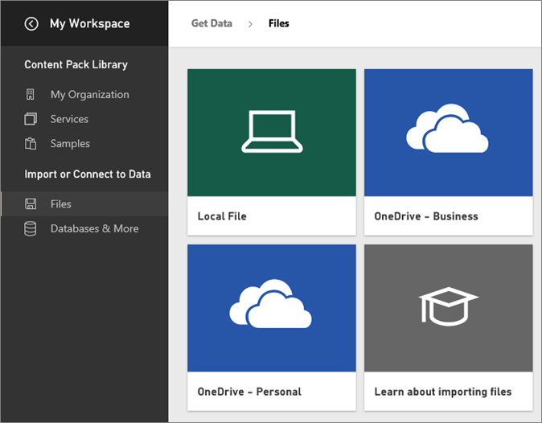
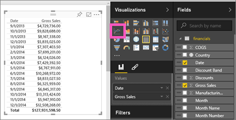
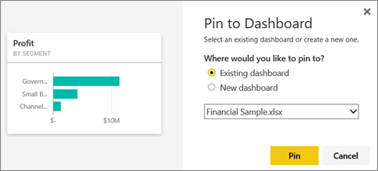

<properties
   pageTitle="開始使用 Power BI"
   description="開始使用 Power BI"
   services="powerbi"
   documentationCenter=""
   authors="mihart"
   manager="mblythe"
   backup=""
   editor=""
   tags=""
   qualityFocus="monitoring"
   qualityDate=""/>

<tags
   ms.service="powerbi"
   ms.devlang="NA"
   ms.topic="article"
   ms.tgt_pltfrm="NA"
   ms.workload="powerbi"
   ms.date="10/05/2016"
   ms.author="mihart"/>

# 開始使用 Power BI

##  快速入門

本教學課程可協助您開始使用 Power BI 服務。  如果您要尋找有關 Power BI Desktop，請參閱 [開始使用桌面](powerbi-desktop-getting-started.md)。

Microsoft Power BI 可協助您保持最新的關切的事項的資訊。  有了 Power BI ***儀表板*** 協助您保持手指在業務的脈動。  儀表板顯示 ***磚*** ，您可以按一下以開啟 ***報表*** 來進一步探索。  連接到多個 ***資料集*** 使所有相關資料一起在同一個地方。

需要了解 Power BI 所組成的建置組塊的協助嗎？  請參閱 [Power BI-基本概念](powerbi-service-basic-concepts.md)。

如果您在 Excel 或 CSV 檔案的重要資料，您可以建立 Power BI 儀表板掌握任何位置，並與其他人共用。  您有 SaaS 應用程式，例如 Salesforce 的訂閱嗎？  取得開始 [連接至 Salesforce](powerbi-content-pack-salesforce.md) 自動從該資料，建立儀表板或 [簽出所有其他 SaaS 應用程式](powerbi-service-get-data.md) 可以連接到。 如果您是組織的一份子，查看是否有任何 [組織內容套件](powerbi-service-organizational-content-packs-introduction.md) 已經發行了。

閱讀所有其他方法 [取得 Power BI 資料](powerbi-service-get-data.md)。

## 步驟 1︰ 取得資料

以下是從 CSV 檔案中取得資料的範例。 想要依照本教學課程嗎？ 
            [下載範例 CSV 檔案](http://go.microsoft.com/fwlink/?LinkID=619356)。

1.  
            [登入 Power BI](http://www.powerbi.com/)。 沒有帳戶嗎？ 您可以註冊 [Power BI for 釋放](http://www.powerbi.com/ "免費試用新的 Power BI 預覽")。

1.  Power BI 會開啟並顯示在儀表板。 選取 **取得資料** 左的導覽窗格的底部。

    

2.  選取 **檔案**。 

    

3.  選取 **本機檔案**, ，瀏覽至您的電腦上的檔案，然後選擇 [ **開啟**。

    

4.  Power BI 上傳 CSV 檔案，並將其當做新資料集 （黃色星號表示新項目）。  由於我們已經沒有儀表板，Power BI 也為我們建立新的儀表板。  在左的導覽窗格中，新的儀表板列底下 **儀表板** 標題和新的資料集下方 **資料集** 標題。 

    

## 步驟 2︰ 開始探索您的資料集

既然您已經連接到資料，探索尋找見解。  當您發現了您想要監視的一些東西時，您可以建立儀表板來追蹤最新變更。

1.  選取瀏覽資料只連線至，或在儀表板上的資料集映像 **資料集** 標題之下，選取資料集名稱，以開啟它。 這會開啟資料集為空白的報表。

    

    >注意︰ 若要瀏覽資料的另一種方式是 **即時掌握所有資訊**。  如需詳細資訊，請參閱 [快速 Insights 簡介](powerbi-service-auto-insights.md)

2.  在 **欄位** 頁面右側清單中，選取要建置視覺效果的欄位。  選取此核取方塊旁的 **銷售毛額** 和  **日期**。

    

3.  Power BI 分析資料，並建立視覺效果。  如果您選取 **日期** 首先，您會看到資料表。  如果您選取 **銷售毛額** 首先，您會看到一個圖表。 切換至不同的方式顯示您的資料。 請嘗試變更為折線圖，藉由選取列圖表選項。

    

4.  當您想要在儀表板的視覺效果，將滑鼠停留在該視覺效果，然後選取 **Pin** 圖示。  當您釘選此視覺效果時，會儲存您的儀表板上讓您能夠追蹤一眼的最新值。

    

5.  因為這是新的報表，您需要儲存它之前，您可以釘選視覺效果從它的儀表板。 指定報表的名稱 (例如 *銷售一段時間*)，然後選取 **儲存並且繼續**。 

    

    新的報表會出現在瀏覽窗格下 **報表** 標題。

6.  釘選磚至現有的儀表板或新的儀表板。 

    

    -   
            **現有的儀表板**︰ 從下拉式清單中選取的儀表板名稱。
    -   
            **新的儀表板**︰ 輸入新的儀表板的名稱。

7.  選取 **Pin**。

    成功的訊息 （靠近右上角） 可讓您知道已新增的視覺效果，做為您的儀表板] 的磚。

    

8.  開啟您剛建立的儀表板。 若要這樣做，請選取該名稱 **儀表板** 左的導覽窗格中的標題。 儀表板是新的因為它會有黃色星號。 折線圖被固定的做為儀表板的磚。 讓您的儀表板更臻完善 [重新命名、 調整大小、 連結及重新定位磚](powerbi-service-edit-a-tile-in-a-dashboard.md)。

    

    選取新的磚，來隨時返回至報表的儀表板上。

##  步驟 3︰ 繼續瀏覽透過問與答 （自然語言查詢）

1.  您的資料快速瀏覽，請嘗試提問問與答的方塊中。 問與答問題方塊位於頂端的 [儀表板。 例如，請輸入"**哪些區段有充分的營收**」。

    

1. 選取 [釘選圖示  過您的儀表板上顯示此視覺效果。

2. 釘選到財務範例儀表板的視覺效果。

    

3. 選取 [上一頁] 箭頭  以返回儀表板，您會看到新的磚。

準備好重試多？  以下是一些很棒的方法，若要深入探討的 Power BI。

-   
            [連接到另一個資料集](powerbi-service-get-data.md)。
-   
            [共用您的儀表板](powerbi-service-share-unshare-dashboard.md) 與您的同事。
-   讀取 [設計的儀表板的秘訣](powerbi-service-tips-for-designing-a-great-dashboard.md)。
-   檢視與儀表板 [行動裝置上的 Power BI 應用程式](powerbi-power-bi-apps-for-mobile-devices.md)

您可以直接的不完全準備了嗎？ 這些主題能協助您適應 Power BI 的開頭。

-   [了解報表、 資料集、 儀表板和並排顯示所有的搭配](powerbi-service-basic-concepts.md)
-   [Power BI 影片](powerbi-videos.md)
-   [請參閱我們有可供您使用何種範例](powerbi-sample-datasets.md)

### 掌握 Power BI

-   請依照下列 [@MSPowerBI 的 Twitter](https://twitter.com/mspowerbi)
-   訂閱我們 [YouTube 影片頻道](https://www.youtube.com/channel/UCy--PYvwBwAeuYaR8JLmrfg)
-   監看式我們 [Power BI 快速入門的網路研討會](powerbi-webinars.md) 隨選
-  更多的問題嗎？ [試用 Power BI 社群](http://community.powerbi.com/)
