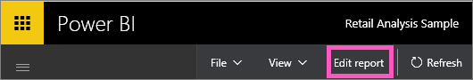
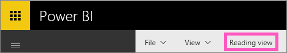

<properties
   pageTitle="從編輯 Power BI 中的檢視讀取檢視"
   description="從編輯 Power BI 中的檢視讀取檢視"
   services="powerbi"
   documentationCenter=""
   authors="mihart"
   manager="mblythe"
   backup=""
   editor=""
   tags=""
   qualityFocus="no"
   qualityDate=""/>

<tags
   ms.service="powerbi"
   ms.devlang="NA"
   ms.topic="article"
   ms.tgt_pltfrm="NA"
   ms.workload="powerbi"
   ms.date="08/25/2016"
   ms.author="mihart"/>

# 從編輯 Power BI 中的檢視讀取檢視

在 Power BI 中編輯] 檢視 (相較於 [讀取檢視](powerbi-service-interact-with-a-report-in-reading-view.md)) 您可以更深入了解您的資料的加入和移除欄位、 變更視覺效果類型，建立新的視覺效果，以及加入和刪除視覺效果和頁面從報表。  若要編輯報表，您必須是報表的擁有者。

1.  在 [讀取] 檢視中，選取 **編輯報表**。 

    

    報告目前處於編輯的檢視，而且會使用相同 [顯示設定](powerbi-service-change-report-display-settings.md) 上次使用讀取檢視。

2. 若要返回 **讀取檢視**, ，請選取上方導覽列中讀取檢視。

    

有許多方式 [編輯報表](powerbi-service-interact-with-a-report-in-editing-view.md), 、 切割和細分發現見解，並取得問題解答資料。  下一個主題 [編輯檢視中的報表互動](powerbi-service-interact-with-a-report-in-editing-view.md), 、 列出及描述這些詳細資料。

## 請參閱

深入了解 [Power BI 中的報表](powerbi-service-reports.md)

[開始使用 Power BI](powerbi-service-get-started.md)

[Power BI-基本概念](powerbi-service-basic-concepts.md) 

更多的問題嗎？ [試用 Power BI 社群](http://community.powerbi.com/) 
