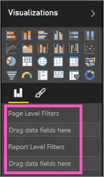

<properties
   pageTitle="[篩選] 窗格概觀"
   description="如何使用報表篩選"
   services="powerbi"
   documentationCenter=""
   authors="mihart"
   manager="mblythe"
   backup=""
   editor=""
   tags=""
   qualityFocus="monitoring"
   qualityDate=""/>

<tags
   ms.service="powerbi"
   ms.devlang="NA"
   ms.topic="article"
   ms.tgt_pltfrm="NA"
   ms.workload="powerbi"
   ms.date="10/24/2016"
   ms.author="mihart"/>

# 導覽報表篩選] 窗格
這篇文章將探討深層報表篩選] 窗格。 您會看到 Power BI 報表] 窗格和 [讀取檢視中編輯的檢視。

有許多不同的方式，在 Power BI 中篩選資料，因此建議第一次讀取 [需篩選和反白顯示](powerbi-service-about-filters-and-highlighting-in-reports)。

## 使用篩選條件  
可以在中開啟報表 [編輯檢視](powerbi-service-interact-with-a-report-in-editing-view.md) 或 [讀取檢視](powerbi-service-interact-with-a-report-in-reading-view.md)。 報表擁有者可以在 [編輯] 檢視 [將篩選加入至報表](powerbi-service-add-a-filter-to-a-report) 和這些篩選器會與報表一起儲存。 讓使用者的檢視讀取檢視中的報表可以使用篩選器，互動，但無法將篩選器變更儲存至報表。

## 在讀取檢視裡的篩選器

在讀取檢視中開啟報表時，[篩選] 窗格會顯示報表畫布右邊。  

>[AZURE.NOTE] 如果您沒有看到 [] 窗格中，選取箭頭以展開右上角。

在此範例中，我們已選擇視覺 6 的篩選器。 [報表] 頁面上也有篩選器，底下所列 **頁面層級篩選** 標題。 並在整個報表中有一個篩選太︰  **FiscalYear** 2013年或 2014年。  

有些篩選條件有 word **所有** 旁邊它們，這表示整個欄位作為篩選器。  例如， **Chain(All)** 以下螢幕擷取畫面中告訴我們此報表] 頁面包含所有存放區鏈結的相關資料。  相反地，報表層級篩選的 **FiscalYear 是 2013年或 2014年** 告訴我們報表，只包含 2013年和 2014年會計年度的資料。

檢視此報表的任何人都可以使用這些篩選器互動。

-    暫留，然後選取篩選條件旁邊的箭號，檢視篩選器的詳細資料。

      

-  變更篩選條件，例如，變更 **Lindseys** 到 **的方式直接**。

      

-  刪除選取的篩選條件 **x** 篩選器名稱旁邊。

   >[AZURE.NOTE]  刪除篩選器從清單中移除，但不會從報表刪除資料。  例如，如果您刪除 **FiscalYear 是 2013年或 2014年** 篩選條件，會計年度資料仍會留在報表中，但它將不會再篩選來顯示只有 2013年和 2014年; 它會顯示所有的會計年度的資料包含。  不過，一旦刪除篩選器時，您將無法再修改它，因為它從清單中移除。 較好的選擇是要清除篩選器，選取 [橡皮擦] 圖示 。

   

## 在 [編輯] 檢視的篩選器

在 [編輯] 檢視中開啟報表時，沿著報表的篩選器窗格會顯示畫布右下的下半部 **視覺效果窗格**。

            。  

>[AZURE.NOTE] 如果您沒有看到 [] 窗格中，選取箭頭以展開右上角。

如果沒有 visual 選取畫布上，[篩選] 窗格會顯示只套用至整個報表頁面和整個報表 （如果有任何已設定） 的篩選器。 在下列範例中，不選取任何視覺並沒有頁面層級的篩選器但還有報表層級篩選。  
  

如果畫布上選取視覺效果，則也會看到套用至剛視覺的篩選器︰  

若要顯示的特定篩選條件選項，選取篩選器名稱旁邊的向下箭號。  下列範例中，在報表層級篩選設 2013年和 2014年。 這是範例 **基本篩選**。  若要顯示進階的選項，請選取 **進階的篩選**。

## 清除篩選  
 在基本或進階篩選模式中，選取 [橡皮擦] 圖示   重設篩選器。 

##   新增篩選器
-  若要新增篩選器的頁面或報表，請在選取欄位] 窗格中的欄位，並將它拖曳下方 **報告層級的篩選器**  或 **頁面層級篩選** 標題，讓您看到幾個字 **將資料欄位拖曳到這裡**。 當欄位加入做為篩選條件時，微調使用基本篩選和進階篩選控制項 （如下所述）。

-  將篩選加入至視覺效果的一種方法是使用要用來建立的視覺化的欄位。 首先，選取視覺效果，讓它成為作用。 視覺效果中使用的欄位列底下的 [篩選] 窗格和 [視覺效果] 窗格中 **Visual 層級篩選** 標題。

      

    微調任何這些欄位使用基本篩選和進階篩選控制項 （如下所述）。

-  拖放欄位到另一種方法將篩選加入至視覺效果是 **Visual 層級篩選** 值區。 這裡拖曳新的欄位不會對該欄位視覺效果，但卻能讓您篩選到視覺與這個新的欄位。 在下列範例中， **鏈結** 做為新的篩選條件加入至視覺效果。 請注意，只要加入 **鏈結** 篩選不會更改視覺效果，除非您使用基本或進階篩選控制項。

    

## 篩選條件類型︰ 文字欄位篩選  
### 清單模式  
計時核取方塊，請選取或取消選取值。  **所有** 核取方塊可用來開啟或關閉切換所有核取方塊的狀態。 核取方塊，表示該欄位的所有可用的值。  當您調整篩選器，結算更新以反映您的選擇。 

請注意，現在的結算方式說 「 是 Amarilla 或 Carretera 」

### 進階的模式  
選取 **進階的篩選** 切換到進階模式。 使用下拉式清單控制項和文字方塊來識別要包含的欄位。 選擇 **和** 和 **或者**, ，您可以建立複雜的篩選條件運算式。 按一下 [ **套用篩選** 按鈕時，您已經設定您想要的值。  

## 篩選條件類型︰ 數值欄位篩選  
### 清單模式  
如果是有限的值，選取欄位名稱會顯示清單。  請參閱 **文字欄位篩選** &gt; **清單模式** 上面說明使用核取方塊。   

### 進階的模式  
如果值都是無限，或是代表的是範圍，選取欄位名稱會開啟進階的篩選模式。 使用下拉式清單和文字的方塊以指定您想要查看的值範圍。 

選擇 **和** 和 **或者**, ，您可以建立複雜的篩選條件運算式。 選取 **套用篩選** 按鈕時，您已經設定您想要的值。

## 篩選條件類型︰ 日期和時間  
### 清單模式  
如果是有限的值，選取欄位名稱會顯示清單。  請參閱 **文字欄位篩選** &gt; **清單模式** 上面說明使用核取方塊。   

### 進階的模式  
如果欄位值代表日期或時間，您可以指定當使用日期/時間篩選開始/結束時間。  

## 請參閱  

            [篩選和反白顯示在報表中](powerbi-service-about-filters-and-highlighting-in-reports.md)  

            [篩選器和讀取檢視報表中反白顯示互動](powerbi-service-interact-with-a-report-in-reading-view.md)  

            [編輯檢視的報表中建立篩選器](powerbi-service-add-a-filter-to-a-report.md)  

            [變更報表的視覺效果交叉篩選及方式跨醒目提示的其他](powerbi-service-visual-interactions.md)

深入了解 [Power BI 中的報表](powerbi-service-reports.md)  

            [Power BI-基本概念](powerbi-service-basic-concepts.md)

更多的問題嗎？ 
            [試用 Power BI 社群](http://community.powerbi.com/)
