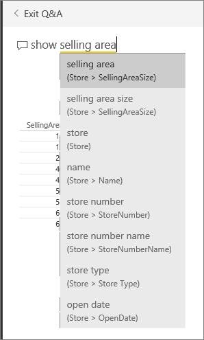

<properties
   pageTitle="如何使用 Power BI 問與答"
   description="如何使用 Power BI 問與答"
   services="powerbi"
   documentationCenter=""
   authors="mihart"
   manager="mblythe"
   backup=""
   editor=""
   tags=""
   featuredVideoId="qMf7OLJfCz8"
   qualityFocus="no"
   qualityDate=""/>

<tags
   ms.service="powerbi"
   ms.devlang="NA"
   ms.topic="article"
   ms.tgt_pltfrm="NA"
   ms.workload="powerbi"
   ms.date="08/23/2016"
   ms.author="mihart"/>

# 如何使用 Power BI 問與答  

## 提出使用自然語言資料的問題  
問與答問題方塊是您用來輸入您使用自然語言的問題。 問與答辨識您輸入的文字和數字位置 （資料集） 來尋找解答。 問答集也可協助您形成問題與自動完成、 結算，和其他文字和視覺輔助工具。

您問題的答案會顯示為互動式的視覺化和更新中，當您修改這個問題。

問與答互動和樂趣，而且不用，一個問題會導致許多其他視覺效果顯示追求有趣的路徑為。 觀看 Amanda 示範如何使用問與答來建立視覺效果、 深入探討這些視覺效果，以及它們固定到 [儀表板。

<iframe width="560" height="315" src="https://www.youtube.com/embed/qMf7OLJfCz8?list=PL1N57mwBHtN0JFoKSR0n-tBkUJHeMP2cP" frameborder="0" allowfullscreen></iframe>

## 使用自然語言來詢問您的資料有關的問題

1.  將游標放在 [問題] 方塊中。 即使您開始輸入之前，問與答顯示一個新畫面，並協助您設定您的問題的建議。

      

    此清單包含︰  
    - 用來建立問題 [磚 ](powerbi-service-dashboard-tiles.md)，已釘選到儀表板，並  

    - 中的資料表名稱 [基礎資料集](powerbi-service-get-data.md)。  

    您永遠可以選擇這些問題的其中一個做為起點，並繼續精簡，尋找您要尋找特定的解答的問題。  或者，使用資料表名稱，可協助您在 word 中新的問題。

2.  從下拉式清單中選取或輸入自己的問題。  
    

3.  當您輸入的問題，Power BI 問 & A 挑選最佳 [視覺化 ](powerbi-service-visualization-types-for-reports-and-q-and-a.md)顯示您的答案; 和視覺效果變更動態修改問題。 問與答也有助於您規劃您的問題與自動完成 restating 您的問題，以及其他文字和視覺輔助工具。  
    

4.  當您輸入查詢時，會尋找 Power BI 中有該儀表板並排顯示的任何資料集的解答。  如果所有的牌子都從 *datasetA*, ，則您的答案將來自 *datasetA*。  如果有從磚 *datasetA *和 *datasetB*, ，然後問答集將會搜尋這些 2 個資料集的最佳回應。

    用來建立視覺效果的資料集看得見以下視覺效果。  

    >
    >            **提示︰** 因此請務必小心，如果您只有一個來自方塊 *datasetA *和移除您的儀表板，問與答將不再有存取權 *datasetA*。

5.  當您滿意結果 [釘選到儀表板的視覺效果](powerbi-service-pin-a-tile-to-a-dashboard-from-the-question-box.md) 的右上角中選取 [釘選圖示。

    

## 告訴問答集若要使用哪一個視覺效果。  
透過問與答，不僅可以您要求您自己會說話的資料，您可以告訴它要顯示它。 只要加入"做為 &lt;視覺效果類型&gt;」 為您的問題。  比方說，「 植物當作對應表所顯示清查的磁碟區 」 和 「 顯示卡片的存貨總數 」。  請自行試用看。

## 請問要問與答不知怎麼回答的問題嗎？  
### 問與答使用哪一個資料集的運作方式

如何沒有問與答不知如何回答特定資料的問題嗎？ 它依賴資料表、 資料行和基礎資料集中的導出的欄位的名稱。 因此您 （或資料集擁有者） 所謂事項很重要 ！ 

例如，假設您擁有名為"Sales"，標題為 「 產品 」、 「 月 」、 「 銷售單位 」、 「 銷售毛額 」 和"Profit"的資料行的 Excel 資料表。 您可以詢問有關這些實體的任何問題。  您可以要求 」 顯示 *銷售 」*, ，"總 *收益 *所 *月 」*, ，"排序 *產品 *所 *銷售 」*, ，等等。

問與答可以回答問題，根據您的資料集的組織方式。 這有什麼作用在 Salesforce 中的資料？ 當您連接到您的 salesforce.com 帳戶時，Power BI 會自動產生儀表板。  詢問問題的問答集開始之前，請看在儀表板的視覺效果中顯示的資料和也問與答下拉式清單中顯示的資料。

-   如果視覺效果的軸標籤和值包含 「 銷售 」、 「 帳戶 」、 「 月 」 和 「 機會 」，則您可以安心地提問像是: 「 這 *帳戶 *具有最高 *機會*」，或 「 顯示 *銷售 *依月份與橫條圖 」。
 
-   如果下拉式清單中包含 「 銷售 」，「 狀態 」，以及 「 年 」，則您可以安心地提問像是: 「 這 *銷售人員 *有最低 *銷售 *中 *佛羅里達州* 中 *2013年*。 」

如果您在 Google 分析網站的效能資料，您可以要求問答時間花在網頁、 專屬的網頁拜訪和使用者參與率的數目。 或者，如果您查詢統計資料，您可能會詢問問題年齡和家庭收入的位置。

### 問與答使用哪一個視覺效果的運作方式  
問與答挑選最佳的視覺效果，根據所顯示的資料。 有時在基礎資料集定義為特定類型或類別，這有助於問與答不知如何顯示它。 比方說，如果資料定義為日期類型，則可能會顯示為折線圖。 比較可能會顯示為對應分類為城市的資料。

您也可以分辨問答集加入至您的問題使用哪一個視覺效果。 但是請記住，它可能不一定會問與答來顯示您所要求的視覺效果類型的資料。

問與答可辨識的關鍵字的詳細資訊，請參閱 [詢問問題的秘訣](powerbi-service-q-and-a-tips.md)。

## 請參閱  
回到 [問與答 Power BI 中](powerbi-service-q-and-a.md)  
[教學課程︰ 使用問與答零售範例](powerbi-service-tutorial-introduction-to-q-and-a.md)  
[問與答中提出的秘訣](powerbi-service-q-and-a-tips.md)  
[準備活頁簿的問與答](powerbi-service-make-your-data-work-well-with-q-and-a.md)  
[Pin 碼方塊，使其儀表板從問與答](powerbi-service-pin-a-tile-to-a-dashboard-from-the-question-box.md)  

更多的問題嗎？ [試用 Power BI 社群](http://community.powerbi.com/)
