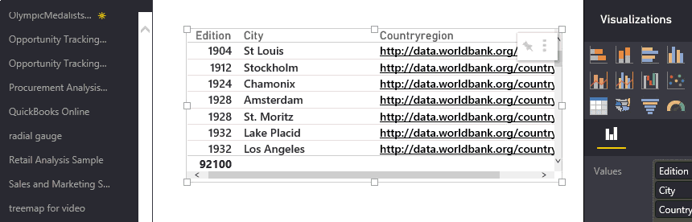

<properties
   pageTitle="資料表中的超連結"
   description="資料表中的超連結"
   services="powerbi"
   documentationCenter=""
   authors="mihart"
   manager="mblythe"
   backup=""
   editor=""
   tags=""
   qualityFocus="identified"
   qualityDate=""/>

<tags
   ms.service="powerbi"
   ms.devlang="NA"
   ms.topic="article"
   ms.tgt_pltfrm="NA"
   ms.workload="powerbi"
   ms.date="10/05/2016"
   ms.author="mihart"/>
# 資料表中的超連結

本主題將教導您如何建立及使用資料表和矩陣中的超連結。  Power BI 資料表 （和矩陣） 中的 Url 可以做為超連結。 資料表或矩陣，以變更色彩，當您將滑鼠移過它，在加底線的文字是超連結。  按一下將您連結的 url。 

>
>            **請注意**︰ 超連結也可以加入到 [儀表板上的磚](powerbi-service-edit-a-tile-in-a-dashboard.md), ，[文字方塊在報表中](powerbi-service-add-a-hyperlink-to-a-text-box.md), ，和 [儀表板上的文字方塊](powerbi-service-add-a-widget-to-a-dashboard.md)。

## 若要建立 Power BI 資料表或矩陣中的超連結

在 Power BI Desktop，而不是從 Power BI 服務，您可以建立資料表和矩陣中的超連結。 也可以將超連結建立 Excel 的 Power Pivot 中之前活頁簿匯入至 Power BI。 這兩種方法說明如下。

## 在 Power BI Desktop 中建立資料表或矩陣的超連結
加入超連結的程序取決於您是否已匯入資料或連接到使用 DirectQuery。 以下將描述這兩個案例。

### 資料匯入 Power BI  

1. 如果超連結不存在的欄位中資料集，使用桌面來新增它做為 [自訂欄](powerbi-desktop-common-query-tasks.md)。

2. 選取的資料行和 **模型** ] 索引標籤選擇下拉式清單中的 **資料類別**。

    

3. 選取 **Web URL**。

4. 切換至 [報表檢視，並建立資料表或矩陣使用分類為網頁 URL 的欄位。 超連結會藍色和底線。

    

4. 
            [發行報表從桌面到 Power BI 服務](powerbi-learning-4-1-publish-reports.md) 在 Power BI 服務中開啟報表。 超連結也可以使用那里。

### 資料連接和 DirectQuery

您無法在 DirectQuery 模式中建立新的資料行。  但是，如果您的資料已經包含 Url，您可以開啟成超連結。

2. 在報表檢視中，建立包含 Url 的欄位的資料表。

3. 選取的資料行，然後在 **模型** 索引標籤上，選擇下拉式清單中的 **資料類別**。

3. 選取 **Web URL**。 超連結會藍色和底線。

4. 
            [發行報表從桌面到 Power BI 服務](powerbi-learning-4-1-publish-reports.md) 在 Power BI 服務中開啟報表。 超連結也可以使用那里。

## 在 Excel 的 Power Pivot 中建立資料表或矩陣的超連結

1.  在 Excel 中開啟活頁簿。

2.  選取 **PowerPivot** 索引標籤，然後選擇 [ **管理**。

    

3.  Power Pivot 開啟時，選取 **進階 **] 索引標籤。

    

4.  將游標放在包含您想要變成 Power BI 資料表中的超連結 Url 的資料行。

    >
            **請注意**︰ 的 URL 開頭必須是 **http://、 https://** 或 **www**。

5.  在 **報告內容** 群組中，選取 **資料類別** 下拉式清單中選擇 [ **Web URL**。 

    

6.  從 Power BI 服務，連接至這個活頁簿。

7.  建立包含 [URL] 欄位的資料表視覺效果。

    

## 請參閱

[Power BI 報表中的視覺效果](powerbi-service-visualizations-for-reports.md)

[Power BI-基本概念](powerbi-service-basic-concepts.md)

更多的問題嗎？ [試用 Power BI 社群](http://community.powerbi.com/)
