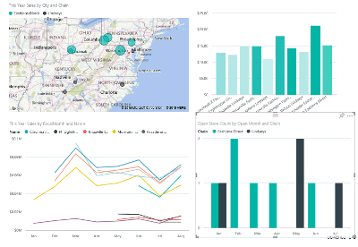
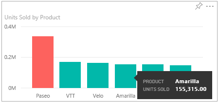

<properties
   pageTitle="在 Power BI 中的 [讀取] 檢視中的報表進行互動"
   description="在 Power BI 中的 [讀取] 檢視中的報表進行互動"
   services="powerbi"
   documentationCenter=""
   authors="mihart"
   manager="mblythe"
   backup=""
   editor=""
   tags=""
   qualityFocus="monitoring"
   qualityDate=""/>

<tags
   ms.service="powerbi"
   ms.devlang="NA"
   ms.topic="article"
   ms.tgt_pltfrm="NA"
   ms.workload="powerbi"
   ms.date="08/20/2016"
   ms.author="mihart"/>

# 在 Power BI 中的 [讀取] 檢視中的報表進行互動

##  讀取檢視

讀取檢視不是以 [編輯] 檢視中，為互動式，但它仍能提供許多選項來瀏覽資料。 其中有實用檢視報告時 [與您共用](powerbi-service-share-unshare-dashboard.md), ，因為這些只在讀取檢視中開啟。

讀取檢視可以跨反白顯示和交叉篩選頁面上的視覺效果。  只要反白或選取一個視覺化中的值並立即看到其影響其他視覺效果上。 使用 [篩選] 窗格來加入和修改報表] 頁面上的篩選器和變更的值會排序在視覺效果的方式。 讀取檢視是有趣且安全的方式使用，並了解您的資料。

##  跨反白顯示在頁面上相關的視覺效果

單一報表頁面上的視覺效果 「 連線 」 彼此。  這表示如果您一種視覺效果中選取一個或多個值，將會變更其他視覺效果會根據該選取項目。

>[AZURE.NOTE] 若要選取多個項目在視覺效果，請按住 CTRL 鍵。

##  將滑鼠停留在視覺項目，以查看詳細資料

##  排序視覺效果中的資料

選取省略符號 （...） 開啟 **排序**。 選取下拉式箭號，以選擇哪一個欄位排序，或選取 [AZ] 圖示以切換遞增和遞減。    

 

##  使用篩選器互動

如果報表作者加入篩選報表中的頁面，您可以與它們互動讀取檢視。 您所做的變更將不會與報表一起儲存。

1.  選取右上角的篩選圖示。

      

2.  您會看到所有已套用的篩選視覺效果來選取 （視覺層級篩選），橫跨整個報表頁面 （頁面層級篩選），並在整個報表 （報表層級篩選）。

    

3.  將滑鼠停留在篩選條件，並選取向下箭號來展開它。

    

4.  進行變更的篩選器，請參閱 [視覺效果如何受到影響。 以下是嘗試幾個︰

    -   篩選 **的方式直接** 而不是 **Lindseys** 藉由移除其中一個核取記號，加入其他。

        

    -   或完全移除篩選 **鏈結** 選取橡皮擦圖示  或藉由新增一個核取記號來 **的方式直接** 方塊。

    -   選取 **學區** 頁面層級篩選，並切換至 **進階篩選**。 若要顯示的篩選器只 districts 開頭的 **FD** 而且不包含數字 4。

        

##      放大個別視覺效果

將滑鼠停留在視覺效果，然後選取 **聚焦模式** 圖示 。 當您檢視視覺效果聚焦模式中時，它會展開以填滿整份報表畫布。

如需詳細資訊，請參閱 [將篩選加入至報表](powerbi-service-add-a-filter-to-a-report.md) 和 [需篩選和報告中反白顯示](powerbi-service-about-filters-and-highlighting-in-reports.md)。

##  調整顯示的大小
在許多不同的裝置使用不同的螢幕大小和外觀比例上檢視報告。  預設呈現可能不想要查看您的裝置上。  若要調整，請選取 **檢視** 選擇︰

 - 大小︰ 將內容調整成符合頁面
 - 適合寬度︰ 將內容調整為頁面的寬度
 - 實際大小︰ 以完整大小顯示內容  

  在讀取檢視中，您選取的顯示選項是暫時-不會儲存在您關閉報表。

  如需詳細資訊︰ [教學課程︰ 在報表中的變更顯示設定](powerbi-service-tutorial-change-report-display-settings.md)。

## 請參閱

[在 Power BI 中的報表](powerbi-service-reports.md)

[關於篩選和反白顯示在 Power BI 報表](powerbi-service-about-filters-and-highlighting-in-reports.md)

更多的問題嗎？ [試用 Power BI 社群](http://community.powerbi.com/)
