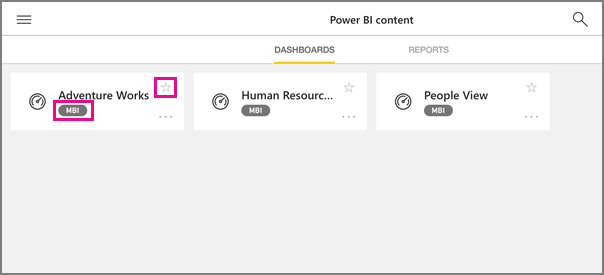

<properties 
   pageTitle="IPad 應用程式中的群組"
   description="Power BI 群組都建置在 Office 365 群組。 閱讀有關檢視與互動群組儀表板中的 Power BI iOS 行動應用程式 iPad。"
   services="powerbi" 
   documentationCenter="" 
   authors="maggiesMSFT" 
   manager="mblythe" 
   backup=""
   editor=""
   tags=""
   qualityFocus="no"
   qualityDate=""/>
 
<tags
   ms.service="powerbi"
   ms.devlang="NA"
   ms.topic="article"
   ms.tgt_pltfrm="NA"
   ms.workload="powerbi"
   ms.date="09/12/2016"
   ms.author="maggies"/>
# IPad 應用程式 (適用於 iOS 的 Power BI) 中的群組

Power BI 群組提供 Office 365 群組上建置的強大共同作業體驗。 深入了解 [Office 365 中的群組](https://support.office.com/article/Create-a-group-in-Office-365-7124dc4c-1de9-40d4-b096-e8add19209e9)。 群組是適用於 Power BI Pro 的經驗。

您 [Power BI 服務中建立群組](powerbi-service-create-a-group-in-power-bi.md)。

然後，請參閱並群組儀表板和報表互動的 microsoft [Power BI 的 iPad 的 iOS 應用程式](powerbi-mobile-iphone-app-get-started.md)。 

## 與 Power BI 群組的互動

1.  開啟 Power BI for iPad 的 iOS 應用程式。 

    需要 [下載並安裝 iOS 應用程式](http://go.microsoft.com/fwlink/?LinkId=522062) 第一次？

2.  點選全域瀏覽按鈕  左上角。

3.  選取群組。

    

4.  群組頁面會顯示儀表板和已經發佈到 [群組] 工作區的報表。

    

     -     黃色星星  顯示的儀表板是您的最愛。 

     -     每個儀表板名稱之下的標記法  顯示分類中每個儀表板資料的方式。 深入了解 [Power BI 中的資料分類](powerbi-service-data-classification.md)。

5.  
            [選取儀表板](powerbi-mobile-dashboards-on-the-ipad-app.md) 或 [選取報表](powerbi-mobile-reports-on-the-ipad-app.md) ，開啟並檢視。

### 請參閱
- [Power BI 行動應用程式適用於 ipad 的 iOS](powerbi-mobile-iphone-app-get-started.md)
- [在 Power BI 中建立群組](powerbi-service-create-a-group-in-power-bi.md)
