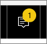

<properties
   pageTitle="Power BI 整合通知中心"
   description="整合通知中心是循序的 Power BI 體驗的相關資訊摘要。"
   services="powerbi"
   documentationCenter=""
   authors="mihart"  
   manager="mblythe"
   backup=""
   editor=""
   tags=""
   featuredVideoId="bZMSv5KAlcE"
   qualityFocus="no"
   qualityDate=""/>

<tags
   ms.service="powerbi"
   ms.devlang="NA"
   ms.topic="article"
   ms.tgt_pltfrm="NA"
   ms.workload="powerbi"
   ms.date="08/23/2016"
   ms.author="mihart"/>

# Power BI 整合通知中心

整合通知中心是循序的 Power BI 體驗的相關資訊摘要。 開啟以查看新儀表板已與您對您的群組空間、 Power BI 事件和會議，資訊是共用的相關訊息，系統會通知您已經設定，等等。 您可以 [Power BI 服務中設定警示](powerbi-service-set-data-alerts.md) 也在 Power BI 行動應用程式。

觀看 Amanda 檢閱她收到時，通知管理員她的通知，並加以回應。 然後遵循以下影片的指示，來試試看自己。

<iframe width="560" height="315" src="https://www.youtube.com/embed/bZMSv5KAlcE" frameborder="0" allowfullscreen></iframe>

1.  當您登入 Power BI 時，在您離線時，傳送給您有新的通知會加入到您的摘要。 如果您有新的通知，Power BI 會顯示黃色的泡泡圖與新的項目數目。

    

2.  在 Power BI 功能表列中，選取 [通知] 圖示。

    

3.  通知會顯示最新反白顯示的最上層和未讀取訊息。 通知會保留 90 天，除非您更快地加以刪除，或是達到最大限制為 100。

    

4.  若要關閉通知，請選取 X 圖示。

### 請參閱
- [Power BI 服務中的資料警示](powerbi-service-set-data-alerts.md)
- [IPhone 應用程式 (適用於 iOS 的 Power BI) 中設定資料警示](powerbi-mobile-set-data-alerts-in-the-iphone-app.md)
- [在 Windows 10 的 Power BI 行動應用程式中設定資料警示](powerbi-mobile-set-data-alerts-in-the-windows-10-mobile-app.md)
-  更多的問題嗎？ [試用 Power BI 社群](http://community.powerbi.com/)
