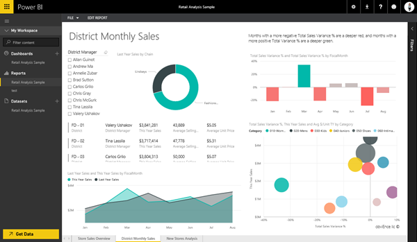

<properties
   pageTitle="在讀取檢視中開啟 Power BI 報表"
   description="在讀取檢視中開啟 Power BI 報表"
   services="powerbi"
   documentationCenter=""
   authors="mihart"
   manager="mblythe"
   backup=""
   editor=""
   tags=""
   qualityFocus="no"
   qualityDate=""/>

<tags
   ms.service="powerbi"
   ms.devlang="NA"
   ms.topic="article"
   ms.tgt_pltfrm="NA"
   ms.workload="powerbi"
   ms.date="08/25/2016"
   ms.author="mihart"/>

# 在讀取檢視中開啟 Power BI 報表  
##   讀取檢視
讀取檢視是探索 Power BI 報表中的資料，而不必擔心，您將會中斷東西的絕佳方式。  您可以瀏覽報表、 互動視覺效果，以及任何視覺效果釘選儀表板。 

>[AZURE.NOTE] 若要編輯的報表，然後儲存變更， [編輯檢視中開啟它](powerbi-service-go-from-reading-view-to-editing-view.md)。

1.  
            [建立報表](powerbi-service-create-a-new-report.md) 和閱讀檢視中開啟它。

    -   從左側的導覽窗格中，選取報告的名稱，或

    -   從儀表板中，選取一張牌，所建立的報表，請開啟報表。

2.  讀取檢視中開啟報表。  

3.  有很多，您可以在 [讀取] 檢視中。  藉由按一下畫面底部的箭號，瀏覽報表開始。  這個範例報表有多個頁面。 現在開始 [與報表互動](powerbi-service-interact-with-a-report-in-reading-view.md)

## 請參閱  
深入了解 [Power BI 中的報表](powerbi-service-reports.md)

[開始使用 Power BI](powerbi-service-get-started.md)

[Power BI-基本概念 ](powerbi-service-basic-concepts.md)

更多的問題嗎？ [試用 Power BI 社群](http://community.powerbi.com/)  
