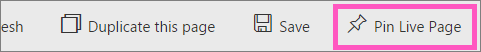

<properties
   pageTitle="釘選至 Power BI 儀表板整份報表頁面 "
   description="如何從報表固定的 Power BI 儀表板的整個即時報表頁面的文件。"
   services="powerbi"
   documentationCenter=""
   authors="mihart"
   manager="mblythe"
   backup=""
   editor=""
   tags=""
   featuredVideoId="EzhfBpPboPA"
   qualityFocus="no"
   qualityDate=""/>

<tags
   ms.service="powerbi"
   ms.devlang="NA"
   ms.topic="article"
   ms.tgt_pltfrm="NA"
   ms.workload="powerbi"
   ms.date="08/11/2016"
   ms.author="mihart"/>

# Pin 整份報表頁面上，為動態磚，Power BI 儀表板

另一種方式，加入新 [儀表板磚](powerbi-service-dashboard-tiles.md) 是固定的整份報表頁面。  這是可以輕鬆地釘選一次多個視覺效果。  此外，當您插入整個頁面時，方塊是 *live*; 可以與它們直接出現在儀表板互動。 而且您對報表編輯器，如加入篩選條件，或變更圖表中使用的欄位中的上一步的視覺任何的效果變更會反映在 [儀表板] 磚。  

>[AZURE.NOTE]  您無法釘選磚從與您共用的報表。

## Pin 報表頁面

觀看 Amanda 釘選儀表板即時報表頁面，然後依照自己試試看以下視訊的逐步指示。

<iframe width="560" height="315" src="https://www.youtube.com/embed/EzhfBpPboPA" frameborder="0" allowfullscreen></iframe>

1. 編輯檢視中開啟報表。

2.  從功能表列中，選取 **Pin 即時頁面**。

     

2.  釘選磚至現有的儀表板或新的儀表板。 請注意反白顯示的文字︰ *Pin 即時] 頁面可讓報告出現在 [儀表板] 磚，重新整理頁面時變更。*

  -   現有的儀表板︰ 從下拉式清單中選取的儀表板名稱。 已與您共用的儀表板不會出現在下拉式清單中。

  -   新的儀表板︰ 輸入新的儀表板的名稱。

     

3.  選取 **Pin live**。 成功的訊息 （靠近右上角） 可讓您知道已新增了頁面，做為您的儀表板] 的磚。

4.  從 [瀏覽] 窗格中，選取新的動態磚與儀表板。 那里，您可以執行下列作業 [重新命名、 調整大小、 連結和移動](powerbi-service-edit-a-tile-in-a-dashboard.md) 釘選的報表頁面。  

5. 動態磚進行互動。  在以下螢幕擷取畫面，選取資料行中的長條圖圖表有交叉篩選，然後跨反白顯示的磚上的其他視覺效果。

    

## 請參閱

[在 Power BI 中的報表](powerbi-service-reports.md)

[問與答 Power BI 中](powerbi-service-q-and-a.md)

[Power BI 預覽的基本概念](powerbi-service-basic-concepts.md)

[在 Power BI 儀表板](powerbi-service-dashboards.md)

更多的問題嗎？ [試用 Power BI 社群](http://community.powerbi.com/)
