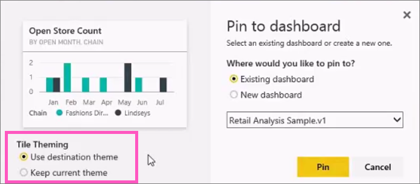

<properties
   pageTitle="從報表的 Power BI 儀表板磚的 pin 碼"
   description="從報表，磚釘選到 Power BI 儀表板。"
   services="powerbi"
   documentationCenter=""
   authors="mihart"
   manager="mblythe"
   backup=""
   editor=""
   tags=""
   featuredVideoId="lJKgWnvl6bQ"
   qualityFocus="no"
   qualityDate=""/>

<tags
   ms.service="powerbi"
   ms.devlang="NA"
   ms.topic="article"
   ms.tgt_pltfrm="NA"
   ms.workload="powerbi"
   ms.date="10/07/2016"
   ms.author="mihart"/>

# 從報表的 Power BI 儀表板磚的 pin 碼
## 從報表的磚釘選

其中一種方式新增 [儀表板磚](powerbi-service-dashboard-tiles.md) 是從 [Power BI 報表](powerbi-service-reports.md)。 事實上，您可以從報表加入許多新的磚。  按一下時，這些磚都回到報表的連結。

而且整個報表頁面可以固定至儀表板。  這也稱為固定 *live* 並排顯示。  
            *Live* 因為您可以在儀表板上的磚與互動，而且，不同於個別視覺效果磚，在報表中所做的變更會同步處理與儀表板。 深入了解以下。

            **請注意**︰ 您無法釘選磚從共用的報表，或從 Power BI Desktop。

## 從報表的磚釘選

觀看 Amanda 釘選視覺效果和從 Power BI 報表的映像來建立儀表板。
<iframe width="560" height="315" src="https://www.youtube.com/embed/lJKgWnvl6bQ" frameborder="0" allowfullscreen></iframe>

現在建立您自己的儀表板使用 Power BI 範例報表的其中一個。

1.  將滑鼠停留在您要釘選，視覺效果，然後選取 [pin  圖示。 Power BI 會開啟 **釘選到儀表板** 畫面。

      

2. 決定是否要釘選到現有儀表板或新的儀表板。

  -   現有的儀表板︰ 從下拉式清單中選取的儀表板名稱。 已與您共用的儀表板不會出現在下拉式清單中。

  -   新的儀表板︰ 輸入新的儀表板的名稱。

3. 在某些情況下，可能必須固定的項目 *佈景主題* 已經套用。  例如，從 Excel 活頁簿釘選視覺效果。 如果是的話，選取要套用到磚的主題。

4.  選取 **Pin**。

    成功的訊息 （靠近右上角） 可讓您知道已新增的視覺效果，做為您的儀表板] 的磚。

    

4.  從 [瀏覽] 窗格中，選取 [儀表板與新的方塊。 選取要跳回到報表的磚。 或者， [編輯的並排顯示和行為](powerbi-service-edit-a-tile-in-a-dashboard.md)。

## Pin 整份報表頁面

另一個選項是釘選到儀表板整份報表頁面。 這是可以輕鬆地釘選一次多個視覺效果。  此外，當您插入整個頁面時，方塊是 *live*; 可以與它們直接出現在儀表板互動。 而且您對報表編輯器，如加入篩選條件，或變更圖表中使用的欄位中的上一步的視覺任何的效果變更會反映在 [儀表板] 磚。  

如需詳細資訊，請參閱 [釘選整份報表頁面](powerbi-service-pin-a-live-tile-to-a-dashboard-from-a-report.md)

## 請參閱

[在 Power BI 儀表板](powerbi-service-dashboards.md)

[在 Power BI 儀表板] 磚](powerbi-service-dashboard-tiles.md)

[在 Power BI 中的報表](powerbi-service-reports.md)

[在 Power BI 中的資料重新整理](powerbi-refresh-data.md)

[Power BI 的基本概念](powerbi-service-basic-concepts.md)

更多的問題嗎？ [試用 Power BI 社群](http://community.powerbi.com/)
