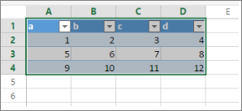

<properties
   pageTitle="從 Excel 的 Power BI 儀表板磚的 pin 碼"
   description="從商務用 onedrive 的 Excel 的 Power BI 儀表板磚的 pin。 Pin 碼範圍、 圖表、 資料表"
   services="powerbi"
   documentationCenter=""
   authors="mihart"
   manager="mblythe"
   backup=""
   editor=""
   tags=""
   featuredVideoId="l8JoB7w0zJA"
   qualityFocus="no"
   qualityDate=""/>

<tags
   ms.service="powerbi"
   ms.devlang="NA"
   ms.topic="article"
   ms.tgt_pltfrm="NA"
   ms.workload="powerbi"
   ms.date="08/25/2016"
   ms.author="mihart"/>

# 從 Excel 的 Power BI 儀表板磚的 pin 碼

監看式將示範數種方式匯入資料，並連接到 Excel 活頁簿。 然後遵循以下視訊，試試看您自己的逐步指示。

<iframe width="560" height="315" src="https://www.youtube.com/embed/l8JoB7w0zJA" frameborder="0" allowfullscreen></iframe>

>[AZURE.NOTE]  您可以檢視，但無法釘選磚，從已與您共用的活頁簿。

## 從商務用 OneDrive 的 Excel 活頁簿連接至 Power BI

1.  將您的活頁簿上傳至您的商務用 OneDrive。

2. 從 Power BI [連接到該活頁簿](powerbi-bring-in-whole-excel-files.md)。

3.  在 Power BI 活頁簿會列在左的導覽窗格中 **報表**。   圖示表示這是 Excel 活頁簿，黃色星號表示其為新增。

    

4.  選取報表名稱，在 Power BI 中開啟活頁簿。

>[AZURE.NOTE]  您在 Power BI 活頁簿所做的變更不會儲存，而且不會影響商務用 OneDrive 上的原始活頁簿。 如果您排序、 篩選，或變更在 Power BI 中的值，這些變更無法儲存或釘選。 若要更新的活頁簿，開啟在 Excel Online 中選取省略符號，選擇 **編輯**。 活頁簿的變更可能需要幾分鐘的時間在磚中更新。     

## 釘選到儀表板的範圍
其中一種方式新增 [儀表板磚](powerbi-service-dashboard-tiles.md) 是從 Excel 活頁簿中。 範圍可以固定從 Excel 活頁簿已在您的 OneDrive 儲存商業或其他群組共用文件庫。 範圍可以包含資料、 圖表、 資料表、 樞紐分析表、 樞紐分析圖，以及其他 Excel 組件。

1. 反白顯示您想要釘選到儀表板的資料格。

    

2.  選取 [釘選  圖示。 

3.  釘選磚至現有的儀表板或新的儀表板。 

    -   現有的儀表板︰ 從下拉式清單中選取的儀表板名稱。

    -   新的儀表板︰ 輸入新的儀表板的名稱。

    

3.  選取 **Pin**。

    成功的訊息 （靠近右上角） 可讓您知道已新增的範圍，做為您的儀表板] 的磚。

    

4.  從 [瀏覽] 窗格中，選取 [儀表板與新的方塊。 您可以在這裡， [重新命名、 調整大小、 連結和移動](powerbi-service-edit-a-tile-in-a-dashboard.md) 釘選視覺效果。

## 釘選儀表板的整個資料表或樞紐分析圖

1.  若要釘選的資料表或樞紐分析表，請選取資料表的整個範圍。

  - 對於資料表，請務必包含標頭。

  - 樞紐分析表中，確定包含樞紐分析表，包括篩選器，如果使用每個可見部分。

    

2. 請依照下列步驟 2-4 上面。

>[AZURE.NOTE] 從資料表或樞紐分析表建立一個方塊會顯示整個資料表。  如果您加入/移除/篩選資料列或原始活頁簿中的資料行，它們也會新增/移除/篩選並排顯示中。

## 檢視活頁簿連結至磚

按一下活頁簿磚會開啟連結的活頁簿。 因為活頁簿檔案位於擁有者的商務用 OneDrive 上，檢視活頁簿需要擁有活頁簿的 「 讀取 」 權限。 如果您沒有檢視此檔案的權限，您會收到錯誤訊息。 如需詳細資訊，請參閱 [Power BI 中並排顯示的儀表板](powerbi-service-dashboard-tiles.md)

>[AZURE.NOTE] 不支援的功能︰ Power BI 使用 Excel Services 擷取活頁簿磚。 因此，Excel 服務 REST API 中不支援某些功能從 Excel 桌面，因為它們不會看到 Power BI 中的方塊上。 例如︰ 走勢圖圖示設定條件式格式化，時間交叉分析篩選器。 如需完整清單，不支援的功能，請參閱 [Excel 服務 REST API 中不支援的功能](http://msdn.microsoft.com/library/office/ff394477.aspx)

## 請參閱

[共用的儀表板可連結至 Excel 活頁簿](powerbi-service-share-dashboard-that-links-to-excel.md)

[Power BI 中帶入 Excel 檔案](powerbi-bring-in-whole-excel-files.md)

[在 Power BI 中的報表](powerbi-service-reports.md)

[Power BI 預覽的基本概念](powerbi-service-basic-concepts.md)

[Power BI 預覽中的儀表板](powerbi-service-dashboards.md)

更多的問題嗎？ [試用 Power BI 社群](http://community.powerbi.com/)
