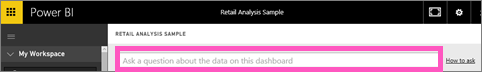
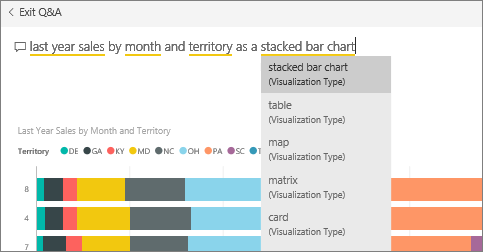

<properties
   pageTitle="從問與答問題方塊固定至 Power BI 儀表板的磚"
   description="如何從問與答問題方塊固定的 Power BI 儀表板的並排顯示的文件"
   services="powerbi"
   documentationCenter=""
   authors="mihart"
   manager="mblythe"
   backup=""
   editor=""
   tags=""
   qualityFocus="no"
   qualityDate=""/>

<tags
   ms.service="powerbi"
   ms.devlang="NA"
   ms.topic="article"
   ms.tgt_pltfrm="NA"
   ms.workload="powerbi"
   ms.date="10/08/2016"
   ms.author="mihart"/>

# 從問與答問題方塊固定至 Power BI 儀表板的磚  
## Pin 並排顯示如何從問與答
問與答是 Power BI 臨機操作報告工具。 要尋找特定的深入了解嗎？ 提出您的資料有關的問題，並接收回應的視覺效果形式。

1.  建立 [儀表板](powerbi-service-dashboards.md) 和 [取得資料](powerbi-service-get-data.md)。

2.  在 [儀表板頂端的 [問題] 方塊中，開始輸入想要了解您的資料。  
    

3.  例如，當您輸入 「 依月份和領域的最後一年銷售 」...  
    

    [問題] 方塊可讓您的建議 」

4.  若要將圖表加入至儀表板為方塊，選取 [pin  右上角的畫布上。

5.  釘選磚至現有的儀表板或新的儀表板。 

    -   現有的儀表板︰ 從下拉式清單中選取的儀表板名稱。

    -   新的儀表板︰ 輸入新的儀表板的名稱。

6.  選取 **Pin**。

    成功的訊息 （右上角附近） 可讓您知道已新增的視覺效果，做為您的儀表板] 的磚。  
    

7.  從 [瀏覽] 窗格中，選取 [儀表板與新的方塊。 您可以在這裡， [重新命名、 調整大小、 加入超連結，並重新定位磚，以及其他](powerbi-service-edit-a-tile-in-a-dashboard.md) 儀表板上。 

## 使用問與答的秘訣  
-   當您開始輸入問與答問題就會立即開始搜尋的最佳答案，從目前的儀表板與相關聯的所有資料集。  「 目前儀表板 」 是瀏覽窗格中反白顯示的儀表板。

-   
            **如何問與答知道哪一個資料集加入至使用**？  問與答有權存取所有已釘選到儀表板的視覺效果的資料集。

## 另請參閱  
[在 Power BI 儀表板](powerbi-service-dashboards.md)  
[問與答 Power BI 中](powerbi-service-q-and-a.md)  
[Power BI-基本概念](powerbi-service-basic-concepts.md)  
更多的問題嗎？ [試用 Power BI 社群](http://community.powerbi.com/)
