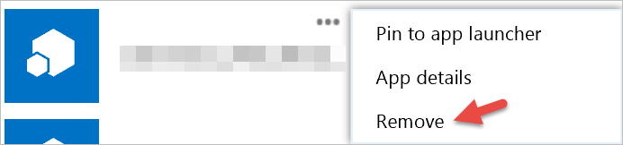

<properties
   pageTitle="Power BI 開始使用協力廠商應用程式"
   description="Power BI 開始使用協力廠商應用程式"
   services="powerbi"
   documentationCenter=""
   authors="guyinacube"
   manager="erikre"
   backup=""
   editor=""
   tags=""
   qualityFocus="no"
   qualityDate=""/>

<tags
   ms.service="powerbi"
   ms.devlang="NA"
   ms.topic="get-started-article"
   ms.tgt_pltfrm="NA"
   ms.workload="powerbi"
   ms.date="10/10/2016"
   ms.author="asaxton"/>

# 開始使用協力廠商應用程式

透過 Power BI，您可以使用建置由公司或個人 Microsoft 以外的應用程式。 例如，您可以使用協力廠商應用程式以便將 Power BI 磚整合到自訂內建的 web 應用程式。 當您使用協力廠商應用程式時，將會要求您授與該應用程式特定 Power BI 帳戶和資源的權限。 請務必只授予您已知且信任的應用程式的權限。 隨時都可以撤銷應用程式的權限。 請參閱 [撤銷協力廠商應用程式的權限](#revoke)。

以下是一種應用程式可以要求的存取權。

## Power BI 應用程式權限

-   **檢視所有儀表板 （預覽）**

  - 此權限可讓應用程式能夠檢視您具有存取權的所有儀表板。 這包括您所擁有、 內容的組件，了解並共用您和您所屬的群組中的儀表板。 應用程式無法進行任何修改的儀表板。 在其他方面，此權限可用應用程式，將您的儀表板內容內嵌至其的經驗。

-   **檢視所有報告 （預覽）**

  - 此權限為應用程式提供可檢視所有報告，您可以存取的能力。 這包括您擁有內容的組件，了解，則您所屬的群組中的報表。 檢視報表時，表示應用程式也可以查看資料的一部分。 應用程式無法進行任何修改自己的報告。 在其他方面，此權限可用應用程式，將報表內容內嵌至其的經驗。

-   **檢視所有資料集**

  - 此權限可讓應用程式，列出您可以存取的所有資料集。 這包括您擁有內容的組件，了解，則您所屬的群組中的資料集。 應用程式可以看到您的資料集，以及其結構，包括資料表和資料行名稱的名稱。 此權限讓權限可讀取的資料集中的資料。 權限並不授予新增或變更資料集的應用程式權限。

-   **讀取和寫入所有資料集**

  - 此權限可讓應用程式，列出您可以存取的所有資料集。 這包括您擁有內容的組件，了解，則您所屬的群組中的資料集。 應用程式可以看到您的資料集，以及其結構，包括資料表和資料行名稱的名稱。 此權限可讓您讀取和寫入資料集內的權限。 應用程式也可以建立新的資料集，或修改現有項目。 這常用的應用程式傳送資料至 Power BI 直接。

-   **檢視使用者的群組**

  -  此權限可讓應用程式，列出所有您所隸屬的群組。 它可以使用此權限，以及檢視或更新該特定群組的內容中列出的其他權限。 應用程式不能修改群組本身。

<a name="revoke"/>
## 撤銷協力廠商應用程式的權限

您可以撤銷的協力廠商應用程式的權限移至 Office 365 我的應用程式的站台。

在 **Office 365 我的應用程式** 站台，撤銷協力廠商的權限的方法如下︰

1. 移至 [Office 365 我的應用程式的站台](https://portal.office.com/myapps)。
2. 在 **我的應用程式** 頁面上，找出協力廠商應用程式。
3. 將滑鼠停留在應用程式磚中，按一下 **（...）** ] 按鈕，然後按一下 [ **移除**。

  
