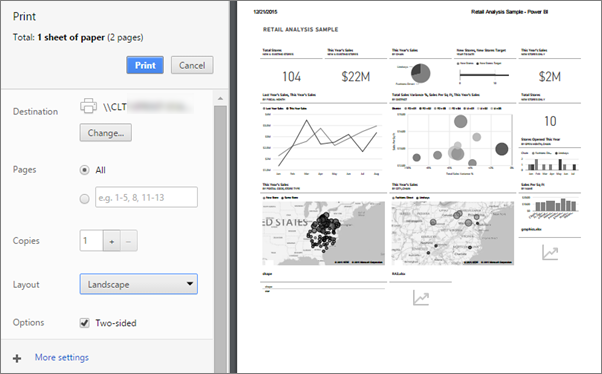
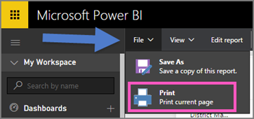
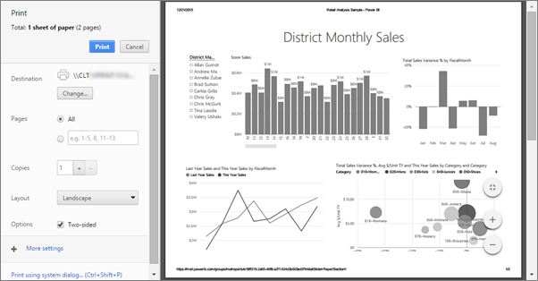

<properties
   pageTitle="列印儀表板、 列印儀表板的檔案、 列印報表頁面"
   description="列印 Power BI 儀表板、 磚或報表頁面。"
   services="powerbi"
   documentationCenter=""
   authors="mihart"
   manager="mblythe"
   backup=""
   editor=""
   tags=""
   featuredVideoId="jtlLGRKBvXY"
   qualityFocus="monitoring"
   qualityDate=""/>

<tags
   ms.service="powerbi"
   ms.devlang="NA"
   ms.topic="article"
   ms.tgt_pltfrm="NA"
   ms.workload="powerbi"
   ms.date="08/25/2016"
   ms.author="mihart"/>

# 從 Power BI 列印

從 Power BI 服務列印整個儀表板、 儀表板磚、 報表] 頁面上或報表視覺化。 列印一頁會一次-您無法列印整份報表一次只能報告。

>[AZURE.NOTE] 只使用 Power BI 服務和 Power BI Desktop 中列印。

觀看 Amanda 從她的儀表板和報表列印。 然後遵循以下視訊，試試看您自己的逐步指示。

<iframe width="560" height="315" src="https://www.youtube.com/embed/jtlLGRKBvXY" frameborder="0" allowfullscreen></iframe>

## 列印儀表板

1. 開啟您想要列印的儀表板。

2. 在右上方選取省略符號 （...），然後選擇 [ **列印儀表板**。

    

3. 您的瀏覽器的 [列印] 視窗隨即開啟。 選擇 [設定和列印的目的地，然後選取 **列印**。

    > [AZURE.NOTE] 您會看到 [列印] 對話方塊將取決於您所使用的瀏覽器。

    

## 列印儀表板] 磚

1. 
            [焦點模式開啟磚](powerbi-service-display-dash-in-focus-mode.md)。

2. 開啟以並排顯示 [全螢幕模式](powerbi-service-display-tile-in-full-screen-mode.md)。

2. 暫留在磚以顯示 [選項] 功能表。

    

3. 選取 [列印] 圖示  。 繼續執行上述步驟 3。

## 列印報表頁面

報表可以一次列印一頁。

1. 在讀取檢視或編輯檢視中開啟報表。

2. 選取 **檔案** > **列印** 列印目前報表頁面。

    

2. 您的瀏覽器的 [列印] 視窗隨即開啟。 選擇 [設定和列印的目的地，然後選取 **列印**。

    

  > [AZURE.NOTE] 您會看到 [列印] 對話方塊將取決於您所使用的瀏覽器。

## 列印報表視覺效果

1. 
            [焦點模式開啟視覺效果](powerbi-service-display-dash-in-focus-mode.md)。

2. 依照步驟 2-3 下 *列印報表頁面* 上方。

##  疑難排解

*   問︰ 我找不到 **列印** ] 按鈕。
*   答︰ 如果您使用 Power BI Desktop，目前不支援列印。  列印僅適用於 Power BI 服務。

*   問︰ 我無法一次列印所有報表頁面。
*   答︰ 沒錯。 報表頁面一次只能列印一個頁面。

*   問︰ 我無法列印至 PDF。
*   答︰ 您只會看到此選項，如果您已經在瀏覽器 PDF 驅動程式。    

*   問︰ 我看到當我選取 **列印** 不符合所要顯示我這裡。
*   答︰ 列印螢幕擷取畫面會因瀏覽器與軟體版本。

*   問︰ 我的列印輸出不正確地調整。  在頁面上，不符合我的儀表板。 其他調整和方向的問題。
*   答︰ 像是調整、 邊界、 方向、 大小不受 Power BI。 就像這樣的問題的說明，請參閱特定瀏覽器的文件。      

## 請參閱

[在 Power BI 儀表板](powerbi-service-dashboards.md)

[Power BI-基本概念](powerbi-service-basic-concepts.md)

更多的問題嗎？ [試用 Power BI 社群](http://community.powerbi.com/)
