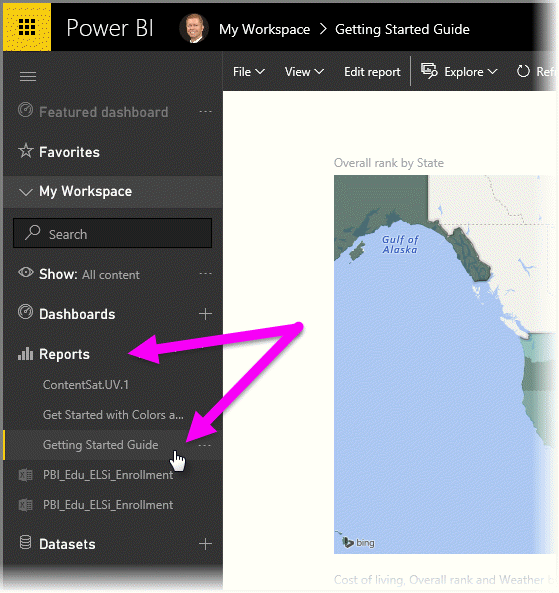
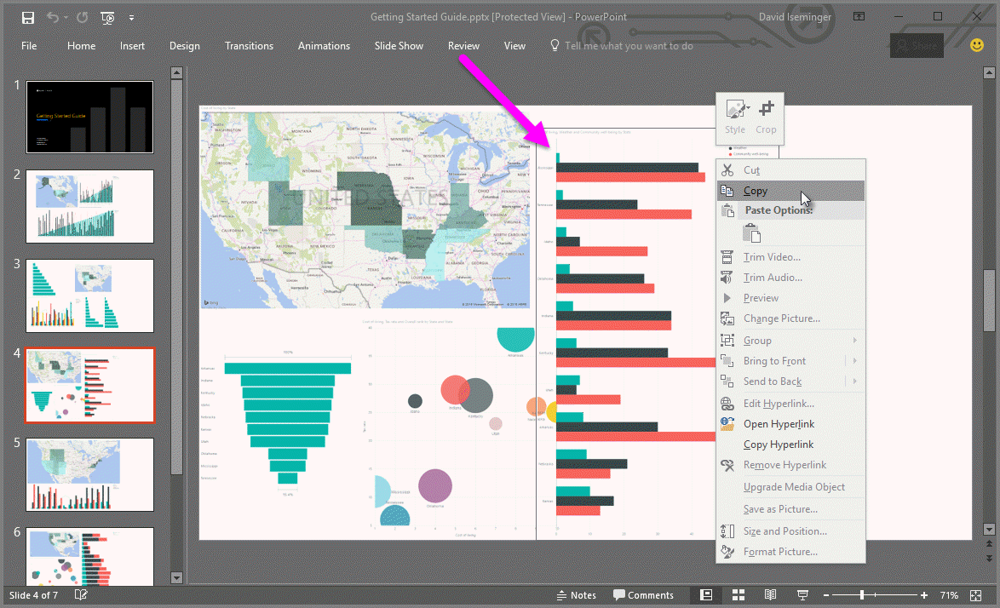

<properties
   pageTitle="將報表從 Power BI 匯出至 PowerPoint （預覽）"
   description="了解如何將 Power BI 報表匯出至 PowerPoint。"
   services="powerbi"
   documentationCenter=""
   authors="davidiseminger"
   manager="mblythe"
   backup=""
   editor=""
   tags=""
   qualityFocus="complete"
   qualityDate=""/>

<tags
   ms.service="powerbi"
   ms.devlang="NA"
   ms.topic="article"
   ms.tgt_pltfrm="NA"
   ms.workload="powerbi"
   ms.date="10/04/2016"
   ms.author="davidi"/>

# 將報表從 Power BI 匯出至 PowerPoint （預覽）

透過 Power BI，您現在可以發行報表至 **Microsoft PowerPoint**, ，並輕鬆地建立投影片組，根據您的 Power BI 報表。 當您 **匯出至 PowerPoint**, ，會發生下列狀況︰

-   Power BI 報表中的每個頁面會變成在 PowerPoint 中的個別投影片
-   Power BI 報表中的每個 visual 匯出成在 PowerPoint 中的高解析度影像
-   Power BI 報表中文字方塊變成可編輯的文字方塊，在 PowerPoint 中
-   連結至 Power BI 報表建立連結在 PowerPoint 中

取得您 **Power BI 報表** 匯出到 **PowerPoint** 很簡單。 只要遵循下一節所述的步驟。

## 如何將 Power BI 報表匯出到 PowerPoint

在 Power BI 服務中，選取 **報表** 左的導覽窗格中展開該區段中，然後選取您要顯示在畫布上的報表中的一節。 您也可以選取報告您 **我的工作區** ] 區段中，或是您 **我的最愛**, ，如果報表是在這些位置。

當您想要匯出至 PowerPoint 的報表會顯示在畫布上，選取 **檔案 > 匯出至 PowerPoint （預覽）** 從功能表列中，在 Power BI 服務中，如下圖所示。

您會看到通知橫幅正在將報表匯出至 PowerPoint 的 Power BI 服務瀏覽器視窗右上角。 這可能需要幾分鐘的時間，而且您可以繼續在 Power BI 報表匯出工作。

完成後，通知橫幅變更，讓您知道 Power BI 服務已完成匯出程序。

在您的瀏覽器會顯示下載的檔案，就可以使用您的檔案。 在下圖中，它會顯示為下載橫幅瀏覽器視窗的底部。

都不是這麼簡單。 您可以下載檔案、 開啟 PowerPoint，然後修改或增強其功能，就像任何其他的 PowerPoint 簡報。

## 簽出匯出的 PowerPoint 檔案

當您開啟 Power BI 匯出的 PowerPoint 檔案時，您會發現一些酷而有用的項目。 看看下圖中，然後查看下方有編號的項目說明部分這些酷炫的功能。

1.  Powerpoint 投影片的第一頁會包含您的報表和連結的名稱，如此您便可以 **Power BI 中的檢視** powerpoint 投影片所根據的報表。

2.  您取得報表中，一些實用資訊，包括 *上次資料重新整理* 所依據之匯出的報表，而 *下載網址* 時間和日期，也就是 Power BI 報表匯出到 PowerPoint 檔案時的日期和時間。

3.  每個報表頁面是個別的投影片，左的導覽窗格中所示。

當您移到個別的投影片時，您會注意到每個 visual 獨立的映像 （如前所述）。 這樣一來，您可以複製該映像，並將它貼到另一張投影片，或是您想要。

您在這裡，您 PowerPoint 簡報或任何高解析度的影像，您必須負責 ！

## 限制
有幾個考量和限制使用時，請記住 **匯出至 PowerPoint** 功能。

-   
            **自訂視覺效果**, ，和 **R 視覺效果**, ，目前不支援。 這類的視覺效果都做為空白的映像將匯出到 PowerPoint。
-   目前無法匯出報表有超過 15 個報表頁面。
-   將報表匯出至 PowerPoint 的程序可能需要幾分鐘才能完成，因此請耐心等候。 可能會影響所需的時間的因素包括報表，Power BI 服務目前所載入的結構。
-   如果 **匯出至 PowerPoint （預覽）** 功能表項目將無法使用 Power BI 服務，很可能是因為您的租用戶系統管理員已停用此功能。 請如需詳細資訊，連絡您的租用戶系統管理員。
-   背景影像將會從圖表的週框區域。 強烈建議您移除背景影像，然後再匯出至 PowerPoint。
-   
            **在工作階段互動性** 例如反白顯示和篩選，向下鑽研和等等，也尚未支援匯出至 PowerPoint 時。 匯出的 PowerPoint 之前儲存在報表中顯示原始的視覺效果。

## 請參閱

            [在 Excel 中分析](articles/powerbi-service-analyze-in-excel.md)

            [Power BI 中的 Excel 資料](articles/powerbi-service-excel-data.md)
