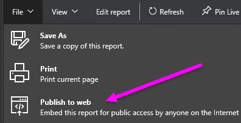
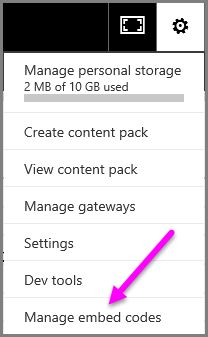
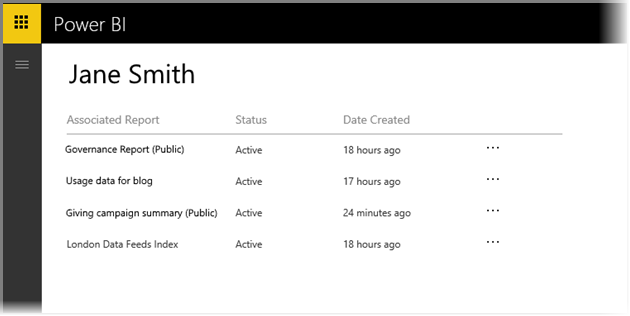

<properties
   pageTitle="從 Power BI 發佈到網站"
   description="使用 Power BI 發佈到網站，您可以輕鬆地內嵌互動式 Power BI 視覺效果線上，例如部落格文章，透過電子郵件或社交媒體，在任何裝置上的網站。"
   services="powerbi"
   documentationCenter=""
   authors="guyinacube"
   manager="ericre"
   backup=""
   editor=""
   tags=""
   qualityFocus="no"
   qualityDate=""/>

<tags
   ms.service="powerbi"
   ms.devlang="NA"
   ms.topic="article"
   ms.tgt_pltfrm="NA"
   ms.workload="powerbi"
   ms.date="10/10/2016"
   ms.author="asaxton"/>

# 從 Power BI 發佈到網站

有了 Power BI **發佈到網站**, ，您可以輕鬆地將內嵌互動式 Power BI 視覺效果線上，例如部落格文章，透過電子郵件或社交媒體網站，在任何裝置上。

您也可以輕易地編輯、 更新、 更新或取消共用您已發行的視覺效果。

> [AZURE.WARNING] 當您使用 **發佈到網站**, ，網際網路上的任何人，則可以檢視報表或在發行的 visual。 不沒有檢視這些報表時使用任何驗證。 只使用報表和所有網際網路 （未經授權的公用成員） 應該會看到資料的 web 發行。 之前發行這份報表，請確定您有權共用公開的資料和視覺效果。 不會發行機密或專屬的資訊。 如果有疑問，請檢查發行前您組織的原則。

## 如何使用發佈到網站

            **將發行至 web** 可用的報告，您可以編輯您個人或群組工作區中。  您無法使用已與您共用的報表或依賴資料列層級安全性來保護資料的報表與 web 發行。 請參閱 **限制** 下面章節針對不支援發佈到網站時的完整清單。 請檢閱 **警告** 稍早之前使用發佈至 web 的這篇文章。

您可以觀賞這項功能在下列的運作方式 *短片*。 然後，遵循下列步驟來自己試試看。

<iframe width="560" height="315" src="https://www.youtube.com/embed/UF9QtqE7s4Y" frameborder="0" allowfullscreen></iframe>

下列步驟說明如何使用 **發佈到網站**。

1.  在報表中，您可以編輯工作區中，選取 **檔案 > 發佈到網站**。

    

2.  檢閱的內容，在對話方塊中，然後選取 **建立內嵌程式碼** 下列對話方塊中所示。

    

3.  檢閱警告，顯示在下列對話方塊中，並確認資料是否可以將內嵌在公開網站。 如果需要，選取 **發行**。

    

4.  提供的連結，可傳送電子郵件，內嵌於程式碼 （例如 iFrame)，或您可以直接將您的網頁或部落格貼上] 對話方塊隨即會出現。

    

5.  如果您先前已建立報表的內嵌程式碼，內嵌程式碼快速會出現。 您可以只建立一個內嵌的程式碼的每個報表。

    

## 秘訣和訣竅的檢視模式

當您內嵌的部落格文章中的內容時，通常需要符合特定螢幕的大小。  您也可以調整高度和寬度的 iFrame 標記，如有需要但您可能也需要確保報表符合 iFrame，特定區域，因此您也必須設定適當的檢視模式，當編輯報表。

下表提供的檢視模式，和內嵌時的顯示方式的相關指引。

|檢視模式|內嵌時的外觀|
|---|---|
|| 
            **大小** 都會使用頁面高度與寬度的報表。 如果您將您的頁面設定為 「 Dynamic 」 的外觀比例 16:9 或 4:3 等您的內容會縮放以符合您所提供的 iFrame。 當內嵌在 iFrame，使用 **大小** 可能會導致 **letterboxing**, ，其中灰色背景顯示在 iFrame 的部分內容之後為調整以符合 iFrame。 若要降低 letterboxing，適當地設定您 iFrame 高度或寬度。|
|| 
            **實際大小** 可確保報表 [報表] 頁面上保留其大小。 這會導致出現在您 iFrame 中的捲軸。 設定的 iFrame 高度和寬度，以避免捲軸。 |
|| 
            **適合寬度** 可確保內容是否符合您 iFrame 的水平區域。 仍將顯示框線，但是內容會調整以使用所有的水平空間可用。  |

## 秘訣和訣竅 iFrame 高度和寬度

您收到之後您發行至 web 的內嵌程式碼會如下所示︰

您可以編輯以手動方式以確保它正是您要如何配合拖曳到頁面在其中內嵌它的高度與寬度。

若要達到更理想，您可以嘗試加入 iFrame 的高度 56 像素為單位。 這所帶來的底端列的目前大小。 如果您的報表頁面會使用動態的大小下, 表提供一些您可以使用以達到 letterboxing 不適當的大小。

|比率|大小|維度 （寬度 x 高度）|
|---|---|---|
|16:9|小型|640 x 416 像素|
|16:9|中型|800 x 506 px|
|16:9|大型|960 x 596 像素|
|4:3|小型|640 x 536 像素|
|4:3|中型|800 x 656 像素|
|4:3|大型|960 x 776 px|

## 管理內嵌程式碼

一旦您建立 **發佈到網站** 內嵌程式碼，您可以管理的程式碼，您從建立 **設定** ] 功能表上的 Power BI 服務。 管理內嵌程式碼的工作包括能夠移除目的地 visual 或報表中的程式碼中 （而內嵌程式碼無法使用），或再次取得內嵌程式碼。

1.  若要管理您 **發佈到網站** 內嵌代碼，請開啟 **設定** 齒輪，然後選取 **管理內嵌程式碼**。

    

2.  您已建立的內嵌代碼的清單隨即出現，如下圖所示。

    

3.  每個 **發佈到網站** 內嵌程式碼或在清單中，您可以擷取內嵌程式碼，或刪除內嵌程式碼，並因此對該報表中的任何連結 visual 無法再運作。

    

4.  如果您選取 **刪除**, ，詢問您是否確定要刪除內嵌程式碼。

    

## 更新報表和資料重新整理

在建立之後您 **發佈到網站** 內嵌程式碼和共用它，報表將依據您所做的任何變更。 不過，它是一定要知道，可能需要更新您的使用者可以看見一段時間。 更新報表或視覺花大約一小時才會反映在發佈到 web 內嵌程式碼。

當您最初使用 **發佈到網站** 內嵌程式碼，請將內嵌程式碼連結立即作用中然後開啟連結的人可以檢視。  之後初始發行至 web 動作、 報告或發佈為 web 連結點可讓使用者看見大約一小時的視覺效果的後續更新。

若要深入了解，請參閱 **它的運作方式** 本文稍後的章節。 如果您需要您立即可用的更新，您可以刪除內嵌程式碼，並建立一個新。

## 資料重新整理

資料重新整理會自動反映在內嵌的報表或視覺化。 可能需要大約 1 小時重新整理的資料會顯示內嵌程式碼。 您可以選取 [停用自動重新整理 **不重新整理** 上使用報表的資料集的排程。  

## 自訂視覺效果

自訂視覺效果中支援 **發佈到網站**。 當您使用發行到 web 時，與您共用已發行 visual studio 的使用者不需要啟用檢視報表的自訂視覺效果。

## 限制

            **發佈到網站** 支援的絕大多數的 Power BI 服務中的資料來源和報表，不過，下列目前不支援或使用網頁發行︰

1.  使用即時資料來源的報表。

2.  使用資料列層級安全性的報表。

3.  使用 Analysis Services Tablular 裝載在內部部署的報表。

4.  共用您直接或透過組織內容套件的報告。

5.  您有不編輯成員的群組中的報表。

6.  "R"視覺項目目前不支援在發佈網站報告。

## 了解內嵌程式碼狀態] 欄

檢視時 **管理內嵌代碼** 頁，以查看您 **發佈到網站** 內嵌程式碼，提供狀態的資料行。 內嵌程式碼作用中根據預設，但您可能會遇到的任何狀態下面所列。  

|狀態|說明|
|---|---|
|**[作用中]**|報表是網際網路使用者可以檢視並與其互動。|
|**已封鎖**|報表的內容違反 [Power BI 服務條款](https://powerbi.microsoft.com/terms-of-service)。 它已被 microsoft 封鎖。 如果您認為錯誤封鎖內容，請連絡支援。|
|**不支援**|報表的資料集使用資料列層級安全性或另一個不支援的組態。 請參閱 **限制** 區段，如需完整清單。|

## 如何報告關於發行到 web 內容

報表與相關考量 **發佈到網站** 內容內嵌在網站或部落格，請使用 **旗標** 圖示下方的列，如下圖所示。 您將會要求一封電子郵件傳送給 Microsoft 說明問題。 Microsoft 會評估內容會根據 「 Power BI 服務條款，並採取適當動作。

若要報告問題，請選取 **旗標** 底列的 [發佈到 web 報告，您會看到的圖示。

## 授權與價格

您必須使用 Microsoft Power BI 使用者 **發佈到網站**。 報表 （讀取器，檢視器） 的取用者不需要為 Power BI 的使用者。

## 其運作方式 （技術詳細資料）

當您建立內嵌程式碼使用 **發佈到網站**, ，網際網路上，報表就會顯示給使用者。 它是公開可用的因此您可以預期輕鬆分享未來透過社交媒體報表檢視器。 當使用者檢視報表時，藉由開啟直接的公用 URL 或內嵌在網頁或部落格、 檢視 Power BI 會快取報表定義和檢視報表所需的查詢的結果。 這個方法可確保數千名並行使用者，而不會對效能的任何影響檢視報表。  

如果您更新報表定義 （例如，如果您變更它的檢視模式），或重新整理報表資料，可以花大約一小時之前變更會反映在您的使用者檢視報表的版本，是長時間執行，快取。 因此建議您預備工作工作量，並建立 **發佈到網站** 內嵌程式碼，只有當您滿意的設定時。

更多的問題嗎？ [試用 Power BI 社群](http://community.powerbi.com/)