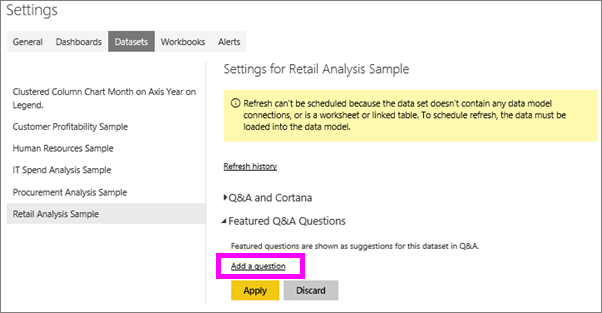
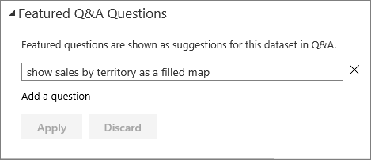
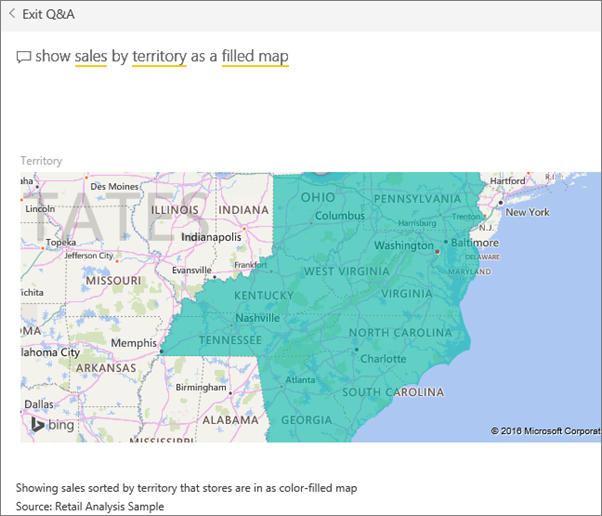

<properties
   pageTitle="建立 Power BI 問與答的精選的問題"
   description="如何建立 Power BI 問與答的精選的問題的文件"
   services="powerbi"
   documentationCenter=""
   authors="mihart"
   manager="mblythe"
   backup=""
   editor=""
   tags=""
   featuredVideoId="E1mIAyEXuF4"
   qualityFocus="no"
   qualityDate=""/>

<tags
   ms.service="powerbi"
   ms.devlang="NA"
   ms.topic="article"
   ms.tgt_pltfrm="NA"
   ms.workload="powerbi"
   ms.date="08/23/2016"
   ms.author="mihart"/>

# 建立 Power BI 問與答的精選的問題  

如果您擁有的資料集，您可以加入您自己的精選的問題該資料集。  而且 Power BI 問與答會顯示這些問題對同事誰使用您的資料集。  精選的問題讓您的同事可要求有關資料集類型的問題的想法。 您新增的精選的問題都是由您決定--新增熱門問題、 有趣的結果，顯示的問題或可能會很難片語的問題。

監看式將加入 Power BI 問與答的一些精選的問題，然後瀏覽他的資料集使用精選的問題。 然後遵循以下視訊，試試看您自己的逐步指示。
<iframe width="560" height="315" src="https://www.youtube.com/embed/E1mIAyEXuF4" frameborder="0" allowfullscreen></iframe>

本文使用 [零售分析範例](powerbi-sample-datasets.md)。

1.  問與答問題方塊選取。   請注意，問與答已經很有幫助顯示資料集中出現的字詞清單。

2.  若要新增至此清單，選取右上角的 Power BI 中的齒輪圖示。  
    

3.  選取 **設定** &gt; **資料集** &gt; **零售分析範例** &gt; **精選問與答問題**。  

4.  選取 **新增問題**。

    

5.  在文字方塊中輸入您的問題，然後選取 **套用**。   （選擇性） 選取 [新增另一個問題 **新增問題**。  
    

6.  零售分析範例中，瀏覽回到 Power BI 儀表板，並將游標放在問與答問題方塊中。   
    

7.  新功能的問題， **銷售領域為對應的**, ，在清單中第一次。 請選取它。  

8.  回應會顯示為已填滿的地圖視覺效果。  
    

## 另請參閱
[問與答 Power BI 中](powerbi-service-q-and-a.md)  
[教學課程︰ 介紹 Power BI 問與答](powerbi-service-tutorial-introduction-to-q-and-a.md)  
[Power BI-基本概念](powerbi-service-basic-concepts.md)  
更多的問題嗎？ [試用 Power BI 社群](http://community.powerbi.com/)
