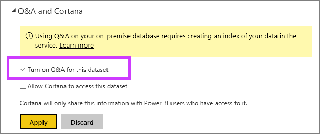

<properties
   pageTitle="使用 Power BI 閘道企業資料 （預覽） 中的問與答"
   description="使用直接查詢資料與企業閘道 」 資料的 Power BI 問與答自然語言查詢文件。"
   services="powerbi"
   documentationCenter=""
   authors="mihart"
   manager="mblythe"
   backup="fetiye"
   editor=""
   tags=""
   qualityFocus="no"
   qualityDate=""/>

<tags
   ms.service="powerbi"
   ms.devlang="NA"
   ms.topic="article"
   ms.tgt_pltfrm="NA"
   ms.workload="powerbi"
   ms.date="07/07/2016"
   ms.author="mihart"/>

# 啟用直接查詢 （預覽） 的問與答

##  什麼是內部部署資料閘道？  DirectQuery 是什麼？

Power BI 中的資料集可以匯入 Power BI，或者您可以建立連線至它們。 即時的連接的資料集通常稱為 「 內部 」。 使用管理即時連接 [閘道](powerbi-gateway-onprem.md) 和資料，以及查詢會傳送前或往後使用 DirectQuery。

##  問與答的內部部署資料閘道器的資料集

如果您想要使用問與答，您可以透過閘道存取的資料集，您必須先啟用它們。

啟用之後，Power BI 會建立資料來源的索引，並將該資料的子集上傳到 Power BI，以啟用詢問的問題。 可能需要幾分鐘的時間來建立初始的索引，Power BI 會維護並隨著資料變更會自動更新索引。 使用這些資料集的問答集與發行至 Power BI 資料行為相同。 在這兩種情況下，包括使用 Cortana 與使用資料來源支援完整的問與答經驗中可用的功能集。

您發問 Power BI 中，問與答決定最佳的視覺效果，建構或報表要用來使用您的資料集的索引問題答案的工作表。 在決定最佳的可能回應之後, 問與答 A 會使用 DirectQuery 資料來源擷取即時資料，透過 「 企業閘道 」 來填入圖表和圖形。 這可確保 Power BI 問與結果永遠會顯示最新的資料直接從基礎資料來源。

因為 Power BI 問答 A 會使用您的資料來源的文字和結構描述值來判斷如何查詢的基礎模型的解答，搜尋特定的新增或刪除文字值 （例如，要求與新加入的文字記錄相關的客戶名稱） 依賴索引掌握最新的值。 Power BI 會自動將文字和結構描述索引最新狀態的變更在 60 分鐘期間內。

如需詳細資訊，請參閱：

- 什麼是 [內部資料閘道](powerbi-gateway-onprem.md)？

- [介紹 Power BI 問與答](powerbi-service-q-and-a.md)

##  啟用問與答
設定 「 企業閘道之後，請從 Power BI 連接到您的資料。  建立使用您的內部資料的儀表板，或上傳使用內部部署資料的.pbix 檔案。  您可能也已經在儀表板、 報表和已與您共用的資料集的內部資料。

1.  在 Power BI 的右上角，選擇齒輪圖示  選擇 **設定**。

    

2.  選取 **資料集** 選擇資料集，以啟用的問與答。

    

3. 展開 **問與答與 Cortana**, ，選取核取方塊， **開啟此資料集的問與答** 選擇 **套用**。

    

##  哪些資料會快取，以及如何保護隱私權？

當您啟用問答集內部的資料時，您的資料子集會快取服務中。 這是為了要確保該問與答搭配合理的效能。 我們從快取中排除值超過 24 個字元。 當您停用問與答取消核取的幾個小時內刪除快取 **開啟此資料集的問與答**, ，或當您刪除您的資料集。

##  公用預覽期間的限制
這項功能的預覽階段，有幾項限制︰

- 一開始此功能只適用於 SQL Server 2016 Analysis Services 資料來源。 此功能已最佳化，使用表格式資料。 某些功能適用於多維度資料來源，但完整的問與答經驗尚未支援此資料集類型。 支援企業閘道的其他資料來源會在公用預覽期間推出。

- 無法一開始在公開預覽版本中使用 SQL Server Analysis Services 中定義的資料列層級安全性的完整支援。 在詢問問題的問答集，「 自動完成 」 的問題時輸入可以顯示字串值的使用者沒有存取權。 不過，將模型中定義的 RLS 遵守的報表和圖表的視覺效果，因此可以不公開任何基礎的數值資料。 選項來控制這個行為會在未來的更新中發行。

- 問答集不適用於 Power BI 閘道個人資料來源。

## 請參閱

[Power BI 快速了解](powerbi-service-auto-insights.md)

[最佳化 Power BI 快速了解您的資料](powerbi-service-auto-insights-optimize.md)

[Power BI-基本概念](powerbi-service-basic-concepts.md)

[在 Power BI 儀表板](powerbi-service-dashboards.md)

更多的問題嗎？ [試用 Power BI 社群](http://community.powerbi.com/)
