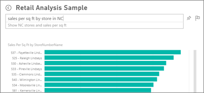

<properties
   pageTitle="問與答 Power BI 中"
   description="Power BI 問與答自然語言查詢的文件概觀主題。"
   services="powerbi"
   documentationCenter=""
   authors="mihart"
   manager="mblythe"
   backup=""
   editor=""
   tags=""
   qualityFocus="identified"
   qualityDate=""/>

<tags
   ms.service="powerbi"
   ms.devlang="NA"
   ms.topic="article"
   ms.tgt_pltfrm="NA"
   ms.workload="powerbi"
   ms.date="10/04/2016"
   ms.author="mihart"/>

# 問與答 Power BI 中
## 問答集是什麼？

有時候獲得解答您的資料，最快的方法是使用自然語言詢問問題。  例如，「 為何總銷售額去年。 」  使用問答集來瀏覽資料使用直覺式的自然語言功能，並獲得問題解答的圖表和圖形形式。 問與答搜尋引擎不同--問答集只會提供有關 Power BI 中資料的結果。

問︰ 只是開始而已。  有有趣經過您的資料修改或擴充您的問題，找出值得信任新資訊、 尋找詳細資料以及縮小更廣泛的檢視。 您將 delighted 由的深入資訊和您進行的探索。

...是真正的互動式體驗，而且快速 ！ 由記憶體中儲存體，回應幾乎是瞬間完成。

## 如需詳細資訊，Power BI 問與答︰

            [如何使用問與答](powerbi-service-how-to-use-q-and-a.md)︰ 逐步解說指示，說明如何使用 Q & 的並說明它的運作方式。

            [提示詢問問題的問答集](powerbi-service-q-and-a-tips.md)︰ 了解如何與問答集以取得最佳的結果。

            [加入您的資料集的精選的問題](powerbi-service-q-and-a-create-featured-questions.md) 和問答集將會建議給您的同事這些問題。

[啟用內部部署資料集的問與答](powerbi-service-q-and-a-direct-query.md)

            [教學課程︰ 使用 Power BI 問答零售範例](powerbi-service-tutorial-introduction-to-q-and-a.md)︰ 使用問與答在實際的業界的教學課程。

            [讓您的資料適用於問與答](powerbi-service-make-your-data-work-well-with-q-and-a.md)︰ 您會建立資料集和資料模型的人員？  然後這個主題適用於您。

## 請參閱

[Power BI-基本概念](powerbi-service-basic-concepts.md)

[開始使用 Power BI](powerbi-service-get-started.md)

[教學課程︰ 介紹 Power BI 問與答](powerbi-service-tutorial-introduction-to-q-and-a.md)

[讓您的資料適用於 Power BI 問與答](powerbi-service-tutorial-introduction-to-q-and-a.md)

更多的問題嗎？ [試用 Power BI 社群](http://community.powerbi.com/)
