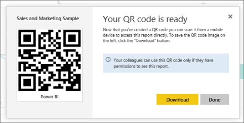

<properties
   pageTitle="建立報表的 QR 代碼"
   description="在 Power BI 中的 QR 代碼可以真實世界中的任何項目直接連接到 Power BI 行動應用程式中沒有所需的搜尋相關的商業情報資訊。"
   services="powerbi"
   documentationCenter=""
   authors="maggiesMSFT"
   manager="mblythe"
   backup=""
   editor=""
   tags=""
   qualityFocus="no"
   qualityDate=""/>

<tags
   ms.service="powerbi"
   ms.devlang="NA"
   ms.topic="article"
   ms.tgt_pltfrm="NA"
   ms.workload="powerbi"
   ms.date="10/03/2016"
   ms.author="maggies"/>

# 在 Power BI 中建立報表的 QR 代碼

在 Power BI 中的 QR 代碼可以真實世界中的任何項目直接連接到相關的商業情報資訊 & #151;沒有瀏覽或搜尋所需。

您可以建立的報表，您可以編輯 Power BI 服務 QR 代碼。 在機碼的位置，然後放置 QR 代碼。 比方說，您無法將它貼在電子郵件，或列印出與將它貼在特定位置。 

您已可以共用報表的同事到報表中，掃描 QR 代碼進行存取，直接從 [電話](powerbi-mobile-qr-code-for-tile.md)。 他們可以使用 Power BI 應用程式中的程式碼 QR 掃描器或安裝在電話上的任何其他 QR 掃描。 深入了解 [如何共用儀表板和報表](powerbi-service-how-should-i-share-my-dashboard.md)。

## 在 Power BI 服務中的報表中加入 QR 代碼

1. Power BI 服務中，開啟報表。

2. 在報表的左上角，選取 **編輯報表**。 

    >
            **秘訣**︰ 如果您沒有看到 **編輯報表**, ，則您沒有編輯權限的報表，因此您無法為它進行 QR 代碼。 請連絡報表擁有者權限。

2. 選取右上角中的省略符號 （...），然後選取 **產生 QR 代碼**。 

    

3. 使用 QR 代碼的對話方塊隨即出現。 

    

4. 您可以從這裡掃描 QR 代碼或下載並儲存它，以便您可以︰ 

     - 將它新增至電子郵件或其他文件，或 
     - 列印出來，並將它放在特定位置。 

## 列印 QR 代碼

Power BI 會產生 JPG 檔案，準備好要列印 QR 代碼。 

1. 選取 **下載**, ，然後開啟 [連接到印表機的電腦上的 JPG 檔案。  

    >
            **提示︰** JPG 檔案具有相同名稱的磚。 例如，「 銷售與行銷 Sample.jpg 」。

2. 列印在 100%或 「 實際大小 」 的檔案。  

3. 剪下邊緣 QR 代碼，並黏附至相關方塊的位置。 

### 請參閱

-  
            [在現實世界中連接至 Power BI 資料](powerbi-mobile-data-in-real-world-context.md) 使用行動應用程式
-  [掃描您的電話 Power BI QR 代碼](powerbi-mobile-qr-code-for-tile.md)
-  [Power BI-基本概念](powerbi-service-basic-concepts.md)
- 問題了嗎？ [請嘗試詢問 Power BI 社群](http://community.powerbi.com/)
