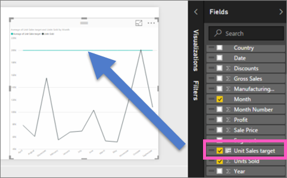

<properties
   pageTitle="在報表中的程式碼行參考"
   description="在報表中的程式碼行參考"
   services="powerbi"
   documentationCenter=""
   authors="mihart"
   manager="mblythe"
   backup=""
   editor=""
   tags=""
   featuredVideoId="zcAFP9U3d30"
   qualityFocus="no"
   qualityDate=""/>

<tags
   ms.service="powerbi"
   ms.devlang="NA"
   ms.topic="article"
   ms.tgt_pltfrm="NA"
   ms.workload="powerbi"
   ms.date="08/23/2016"
   ms.author="mihart"/>

# 在報表中的程式碼行參考
##  兩種方法可以建立參考程式碼行

許多圖表會追蹤對某些目標或目標，不只是比較不同類別之間的效能。 在這些情況下，繪製代表目標的一或多行很有用。 這些是 *參考線*。

參考程式碼行可以加入行，資料行，橫條圖、 區域、 瀑布和散佈圖。

有 2 種方式可以建立參考程式碼行。其中一個是因為您需要它們，另一個是使用 Power BI Desktop 建立可重複使用的欄位在資料集中加入參考線。

捲動到結尾，請參閱將 Power BI 服務中建立參考線。
<iframe width="560" height="315" src="https://www.youtube.com/embed/zcAFP9U3d30?#t-2m30s" frameborder="0" allowfullscreen></iframe>

## 您需要的時候，參考線

此範例使用零售分析範例。

 1. 使用您選取的圖表中選取 [小畫家圖示，以開啟 [格式] 窗格。

    

 2. 展開 **參考線** 區域和移動滑桿 **上**。

 3. 新增輸入參考線一下-$75 K  **-75000** 中 **值** 欄位。

      

## 可重複使用參考資料集內的行

使用 Power BI Desktop 資料集中建立新的欄位 （資料行）。 然後使用該資料集為基礎的視覺效果一再重複該欄位。

 在此範例中，您將新增欄位，以便 [財務範例](powerbi-sample-download-the-financial-sample-workbook.md)。

1. 開啟 **financials** 資料表。  這是您要在其中建立新的欄位 （欄）。

2.  選取要用於參考線為基礎的資料行。  在此範例中我們將使用參考線顯示 **Units Sold** 200000 以上。

2. 從功能區中，選取 **模型** > **新的資料行**。

    

3. 在公式列中，輸入下列命令︰

    **單位銷售目標 = 2000年**

    

    此導出資料行將傳回值 2000年無論使用的位置。  
            **單位銷售目標** 將顯示在欄位清單中，以及此資料集中，所有其他欄位，而且可以加入任何 visual 支援參考程式碼行。 

4. 銷售單位將目標加入至要顯示的任何數列與發生關聯到特定參考的線條的折線圖。    

    

    >[AZURE.NOTE] 請確定 **銷售單位目標** 不是，例如在彙總加總，或可計算。 在 **視覺效果** ] 窗格中，以滑鼠右鍵按一下 **銷售單位目標** ，然後選取 **平均**, ，**最小值**, ，**最大**, ，或 **適中**。

    

##  疑難排解

如果您使用的欄位值作為參考線條，而且未正確顯示，請確定它不彙總。  Power BI 會自動彙總的值，使其適合的方式在您要使用的值。 比方說，如果 Power BI 加總的值，您將得到 sloping 列。  請參閱前述步驟 4 的指示，說明如何設定適當的彙總的參考線。

##  請參閱
[深入了解導出資料行](powerbi-desktop-calculated-columns.md)

更多的問題嗎？ [試用 Power BI 社群](http://community.powerbi.com/)
